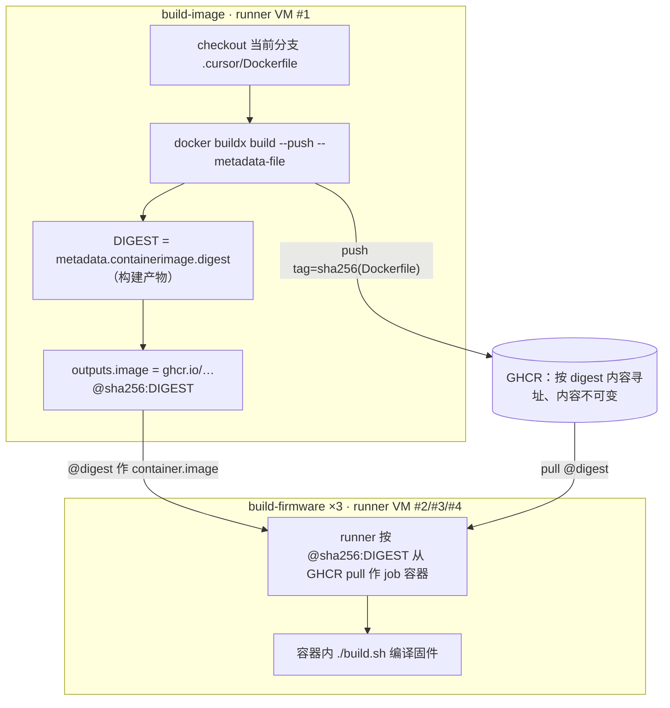

# Luckfox Pico SDK GitHub Actions 固件编译 CI 实施计划（Implementation Plan）

> **For agentic workers:** REQUIRED SUB-SKILL: Use superpowers:subagent-driven-development (recommended) or superpowers:executing-plans to implement this plan task-by-task. Steps use checkbox (`- [ ]`) syntax for tracking.

**Goal:** 新建一条 GitHub Actions 流水线，在托管 runner 上用 `.cursor/Dockerfile` 构建的容器交叉编译 Luckfox Pico Max/Ultra W 三个「硬件×介质」组合的全量固件，并把可烧录产物作为 artifact 上传。

**Architecture:** 两 job——`build-image`（在普通 runner 上 `docker build` 本仓 `.cursor/Dockerfile` → push GHCR → 输出**不可变 digest** 引用）；`build-firmware`（`needs: build-image`，以 `container:` 按 digest + `credentials` 拉镜像（兼容 public/private），`strategy.matrix` 跑 3 组合，`fail-fast: false`）。每组合流程：非交互 `lunch` → 全量 `./build.sh` → 磁盘/产物观测 → 按介质校验必需镜像 → `sha256` → 上传。buildroot 下载包经 `BR2_DL_DIR`（buildroot 树外）+ `actions/cache` 跨 run 复用。

**Tech Stack:** GitHub Actions（YAML）、Docker/Buildx、GHCR、`actions/checkout@v7`、`actions/cache@v6`、`actions/upload-artifact@v7`、`docker/login-action@v4`、Luckfox Pico `build.sh`（Buildroot 2023.02.6 交叉编译）、验证用 actionlint + shellcheck。

**关联 spec:** [`docs/superpowers/specs/2026-07-17-luckfox-github-actions-ci-design.md`](../specs/2026-07-17-luckfox-github-actions-ci-design.md)

> **⚠️ 阅读说明**：本 plan 的 **Architecture、Tech Stack 及下方 Task 1–6 的步骤/YAML** 是 **PR #2 首版 SDD 的历史实施记录**（例如 Task 2 仍写 `docker build`/`docker push`、旧权限）；**PR #3 的最终形态以「附录 A」（字节等同最终 workflow）+ 各 PR #3 专节（回归修复 / 镜像重建机制 / 移除 host sshd / build provenance）+ 上方 Global Constraints 为准**——含 `docker buildx build --metadata-file`、build provenance attest/verify、`id-token`/`attestations` 权限等。历史 Task 段仅作演进留存、不代表当前实现。

## Global Constraints

以下为 spec 的项目级约束，每个任务隐含适用（数值均照 spec 原样）：

- 分支：`cursor/luckfox-github-actions-ci-76b3`（原 CI PR #2 实施分支，起点 `dev`）；PR base = `dev`。（PR #3 的回归修复 / 强制重建 / 移除 sshd / build provenance 加固在分支 `cursor/fix-ci-persist-credentials-76b3`，见 spec 状态行/分支行与下方各 PR #3 专节：「回归修复」「镜像重建机制」「移除 host sshd」「build provenance attestation」）
- 交付代码改动：`.github/workflows/build-luckfox-pico-firmware.yml`（新建）、`.cursor/Dockerfile`（改：移除 host sshd）、删除孤立 gitlink `sysdrv/tools/board/ubuntu`。
- 矩阵 3 组合（均 Buildroot）：Pico Max/SD_CARD（`lunch` = `4␊0␊0`）、Pico Max/SPI_NAND（`4␊1␊0`）、Ultra W/EMMC（`5␊0␊0`）。
- 运行环境：`.cursor/Dockerfile`（`FROM ubuntu:24.04@sha256:4fbb8e6a8395de5a7550b33509421a2bafbc0aab6c06ba2cef9ebffbc7092d90`，无 `COPY`）→ build+push `ghcr.io/<小写owner>/luckfox-pico-ci:<Dockerfile内容hash>` → `container:` 按 **digest**（`ghcr.io/<小写owner>/luckfox-pico-ci@sha256:…`）引用 + `credentials`（`github.actor` + `GITHUB_TOKEN`）拉镜像（兼容 public/private，包当前 public）。
- 触发：`workflow_dispatch` + `push(dev)` + `schedule`（每月 1 日 UTC 00:00 强制重建 CI 镜像、仅重建镜像不编译固件，见 spec §4.2）+ `paths-ignore`（纯文档）；feature 分支首测用**临时 bootstrap**（把本分支临时加入 `push.branches`，注册/见分晓后移除）。
- 权限**按 job 最小化**：`build-image` = `{contents: read, packages: write, id-token: write, attestations: write}`（后二者供 `actions/attest` 生成/上传 build provenance）；`build-firmware` = `{contents: read, packages: read}`。
- 矩阵 `fail-fast: false`；`build-firmware` `timeout-minutes: 120`、`build-image` `timeout-minutes: 30`。
- 缓存：`BR2_DL_DIR=$GITHUB_WORKSPACE/.br-dl`（容器内挂载卷、buildroot **树外**，经 `GITHUB_ENV` 设置）；`actions/cache` `path: .br-dl`（相对 `GITHUB_WORKSPACE`、与前者同指）、key = `br-dl-buildroot-2023.02.6-<defconfig名>-<defconfig内容hash>` + `restore-keys` 同 defconfig 前缀回退。defconfig 映射：Pico Max（SD_CARD/SPI_NAND）→ `luckfox_pico_defconfig`；Ultra W（EMMC）→ `luckfox_pico_w_defconfig`。
- 产物：`output/image/` 全部**非隐藏**产物（隐藏 `.env.txt` 不纳入）+ `IMAGE/*_RELEASE_TEST/build_info.txt`；`upload-artifact` 设 `if-no-files-found: error`；artifact 名 `luckfox-pico-firmware_<board>-<medium>_on-ubuntu-24.04`。
- 观测：编译**前 / 后 / 中（后台每 60s 采样）** `df -h`；观测步骤 `if: always()` + `|| true` 守卫。
- 产物校验：`test -s` 公共必需（`update.img`、`boot.img`、`uboot.img`、`env.img`、`rootfs.img`、`idblock.img`、`download.bin`、`userdata.img`，即三组合共有的 8 个）+ 介质额外（SD_CARD:`sd_update.img`；SPI_NAND/EMMC:`oem.img`）+ 断言恰 1 个 `build_info.txt`。
- 零成本：**仅标准 runner**（`ubuntu-24.04`），禁用 larger runner。
- 首版**不加**磁盘释放（见分晓优先）；若爆盘，按 spec §7 R1 另起 B2 改造（不在本 plan 首版范围）。
- CI **不执行 `git commit`**：`allsave` 原地改写的 `hostapd`/`hostapd_cli`/`librkwifibt.so` 只随产物上传/丢弃，不入库。
- 提交信息：gitmoji + conventional（中文），如 `ci(github-actions): 👷 ...`。
- 验证手段：actionlint（+ shellcheck）静态校验每次改动；最终靠 GitHub 实跑「见分晓」。

---

## File Structure

- **Create:** `.github/workflows/build-luckfox-pico-firmware.yml` — 新增的 CI 主文件，承载两 job、触发、缓存、产物、附加增强的全部逻辑。CI 配置内聚于单文件，无需拆分。
- **Modify:** `.cursor/Dockerfile`（移除 host `openssh-server`，见 §7 R9）。
- **Delete:** 孤立 gitlink `sysdrv/tools/board/ubuntu`（根治 checkout exit 128，见 §7 R7）。
- **复用（不改动）：** `project/build.sh`（软链 `build.sh`，选板+编译入口）、`sysdrv/Makefile`（buildroot 目标）、`project/cfg/BoardConfig_IPC/*.mk`（板级配置）、`sysdrv/tools/board/buildroot/luckfox_pico*_defconfig`（缓存 key 依据）。

---

### Task 1: Workflow 骨架（触发 / 并发）+ 验证工具

**Files:**
- Create: `.github/workflows/build-luckfox-pico-firmware.yml`

**Interfaces:**
- Consumes: 无（首个任务）。
- Produces: 顶层 `name` / `on` / `concurrency`，供后续 job 挂载；`build-luckfox-pico-firmware.yml` 路径供 actionlint 校验。

- [x] **Step 1: 安装验证工具 actionlint + shellcheck**

Run:
```bash
sudo apt-get update && sudo apt-get install -y shellcheck
curl -fsSL https://raw.githubusercontent.com/rhysd/actionlint/main/scripts/download-actionlint.bash -o /tmp/dl-actionlint.bash
bash /tmp/dl-actionlint.bash latest /tmp
/tmp/actionlint -version
```
Expected: 打印 actionlint 版本号（二进制落 `/tmp/actionlint`、**不污染仓库根**）；`shellcheck --version` 可用（actionlint 会自动调用它检查 `run:` 块）。若下载脚本网络不通，退回 `go install github.com/rhysd/actionlint/cmd/actionlint@latest`（Go 已在多数环境可用）后，用其安装路径替换下文的 `/tmp/actionlint`。

- [x] **Step 2: 写入 workflow 骨架**

创建 `.github/workflows/build-luckfox-pico-firmware.yml`，内容：
```yaml
name: 构建 Luckfox Pico 固件

on:
  workflow_dispatch:
  push:
    branches:
      - dev
    paths-ignore:
      - '**.md'

concurrency:
  # group 含 event_name：不同触发事件各自独立并发组、避免跨事件互相取消（同事件内仍取消旧 run 省资源）
  group: ${{ github.workflow }}-${{ github.ref }}-${{ github.event_name }}
  cancel-in-progress: true

jobs: {}
```

- [x] **Step 3: actionlint 校验骨架**

Run: `/tmp/actionlint .github/workflows/build-luckfox-pico-firmware.yml`
Expected: 因 `jobs: {}` 为空，actionlint 可能报 "jobs section is empty"——这是预期占位错误，Task 2 加入 job 后消失。除该项外应无语法错误（`on` / `concurrency` 合法）。

- [x] **Step 4: 提交**

```bash
git add .github/workflows/build-luckfox-pico-firmware.yml
git commit -m "ci(github-actions): 👷 新增固件编译工作流骨架（触发+并发）"
```

---

### Task 2: `build-image` job — 构建/复用 CI 镜像并输出 digest

**Files:**
- Modify: `.github/workflows/build-luckfox-pico-firmware.yml`（把 `jobs: {}` 替换为含 `build-image` 的 `jobs:`）

**Interfaces:**
- Consumes: 顶层 `on`/`concurrency`（Task 1）；`.cursor/Dockerfile`（现有，无 `COPY`）。
- Produces: job 输出 `needs.build-image.outputs.image` = 完整已小写、按 digest 固定的镜像引用 `ghcr.io/<小写owner>/luckfox-pico-ci@sha256:<digest>`，供 `build-firmware` 的 `container.image` 消费。

- [x] **Step 1: 用 `build-image` 替换空 `jobs:`**

把 `jobs: {}` 整行替换为：
```yaml
jobs:
  build-image:
    name: 🐳 构建 CI 镜像
    runs-on: ubuntu-24.04
    timeout-minutes: 30
    permissions:
      contents: read
      packages: write
    outputs:
      image: ${{ steps.build.outputs.image }}
    steps:
      - name: 📤 检出仓库
        uses: actions/checkout@v7
        with:
          # 已清理孤立 gitlink（见本提交），checkout 不再对其 submodule foreach → 无 exit 128；
          # 故可安全启用 persist-credentials:false（构建期不在 .git 留存短期 GITHUB_TOKEN，纵深防御）
          persist-credentials: false

      - name: 🔐 登录 GHCR
        uses: docker/login-action@v4
        with:
          registry: ghcr.io
          username: ${{ github.actor }}
          password: ${{ secrets.GITHUB_TOKEN }}

      - name: 🐳 构建/复用镜像并输出 digest
        id: build
        shell: bash
        run: |
          set -euo pipefail
          OWNER=$(echo "${{ github.repository_owner }}" | tr '[:upper:]' '[:lower:]')
          IMAGE_REF="ghcr.io/${OWNER}/luckfox-pico-ci"
          TAG=$(sha256sum .cursor/Dockerfile | cut -c1-32)
          echo "镜像标签（Dockerfile 内容 hash）= ${TAG}"
          if docker buildx imagetools inspect "${IMAGE_REF}:${TAG}" >/dev/null 2>&1; then
            echo "✅ ${IMAGE_REF}:${TAG} 已存在，复用（不 rebuild）"
          else
            echo "🔨 构建并推送 ${IMAGE_REF}:${TAG}"
            docker build -f .cursor/Dockerfile -t "${IMAGE_REF}:${TAG}" .cursor
            docker push "${IMAGE_REF}:${TAG}"
          fi
          DIGEST=$(docker buildx imagetools inspect "${IMAGE_REF}:${TAG}" --format '{{json .Manifest.Digest}}' | xargs)
          echo "镜像 digest = ${DIGEST}"
          echo "image=${IMAGE_REF}@${DIGEST}" >> "$GITHUB_OUTPUT"
```

设计要点（照 spec §4.2 / §6）：
- `docker build -f .cursor/Dockerfile … .cursor`：`.cursor` 作最小上下文（Dockerfile 无 `COPY`，仅传几个小文件给 daemon，不影响镜像内容）。
- `TAG` = Dockerfile 内容 hash → 内容不变则命中既有 tag、跳过 rebuild（`imagetools inspect` 直查 registry，无需本地 pull）。
- **输出 digest 而非 tag**：tag 可变（跨分支并发 run 可能覆盖同名 tag 致 3 组合镜像不一致）；`ghcr.io/…@sha256:<digest>` 内容寻址、保证同一 run 内 3 组合字节一致（呼应 N2）。
- **digest 提取必须用 `{{json .Manifest.Digest}} | xargs`（勿用裸 `{{.Manifest.Digest}}`）**：`docker buildx imagetools inspect` 的 `--format` 有已知缺陷（[docker/buildx#1175](https://github.com/docker/buildx/issues/1175)、[#3363](https://github.com/docker/buildx/discussions/3363)）——非 `json`/`printf` 包裹时忽略 Go 模板、打印 `Name:/MediaType:/Digest:` 人类可读整块，裸 `{{.Manifest.Digest}}` 取不到纯 digest（会污染 `$GITHUB_OUTPUT`、使 `container.image` 非法）；`{{json .Manifest.Digest}}` 输出带引号值、`| xargs` 去引号与尾换行得 `sha256:…`。
- `OWNER` 经 `tr` 转小写（GHCR 引用必须全小写；当前账号 `yuangezhizao` 已小写，仍转以求稳）。

- [x] **Step 2: actionlint 校验**

Run: `/tmp/actionlint .github/workflows/build-luckfox-pico-firmware.yml`
Expected: 无错误（`outputs`/`steps`/表达式合法；`shell: bash` 的 run 块经 shellcheck 无告警）。若 shellcheck 报 `SC2086` 等，按提示加引号；上述脚本已全部引号化，预期干净。

- [x] **Step 3: 提交**

```bash
git add .github/workflows/build-luckfox-pico-firmware.yml
git commit -m "ci(github-actions): 👷 加 build-image job（docker build→GHCR→digest 输出）"
```

---

### Task 3: `build-firmware` job — 骨架 + 前置步骤（选板/缓存/自检）

**Files:**
- Modify: `.github/workflows/build-luckfox-pico-firmware.yml`（在 `build-image` 之后追加 `build-firmware`）

**Interfaces:**
- Consumes: `needs.build-image.outputs.image`（Task 2，完整 digest 引用）；`matrix.hw`/`matrix.media`/`matrix.br_defconfig`/`matrix.required_extra`/`matrix.board`/`matrix.medium`/`matrix.title`；`project/build.sh`、`sysdrv/tools/board/buildroot/<defconfig>`（现有）。
- Produces: `steps.dlkey.outputs.key`（buildroot 下载缓存 key）；已选板并完成缓存恢复、编译前 `df` 的 job 半成品，供 Task 4 追加编译/产物步骤。

- [x] **Step 1: 在 `build-image` job 之后追加 `build-firmware` job**

在 `build-image:` 整段之后（与 `build-image:` 同缩进层级）追加：
```yaml
  build-firmware:
    name: 🛠️ ${{ matrix.title }}
    needs: build-image
    runs-on: ${{ matrix.os }}
    timeout-minutes: 120
    permissions:
      contents: read
      packages: read
    env:
      BUILDROOT_VER: buildroot-2023.02.6
    container:
      image: ${{ needs.build-image.outputs.image }}
      credentials:
        username: ${{ github.actor }}
        password: ${{ secrets.GITHUB_TOKEN }}
    strategy:
      fail-fast: false
      matrix:
        include:
          - title: Luckfox Pico Max · SD_CARD
            os: ubuntu-24.04
            board: pro_max
            medium: sd_card
            hw: '4'
            media: '0'
            br_defconfig: luckfox_pico_defconfig
            required_extra: sd_update.img
          - title: Luckfox Pico Max · SPI_NAND
            os: ubuntu-24.04
            board: pro_max
            medium: spi_nand
            hw: '4'
            media: '1'
            br_defconfig: luckfox_pico_defconfig
            required_extra: oem.img
          - title: Luckfox Pico Ultra W · EMMC
            os: ubuntu-24.04
            board: ultra
            medium: emmc
            hw: '5'
            media: '0'
            br_defconfig: luckfox_pico_w_defconfig
            required_extra: oem.img
    steps:
      - name: 📤 检出仓库
        uses: actions/checkout@v7
        with:
          # 已清理孤立 gitlink（见本提交），checkout 不再对其 submodule foreach → 无 exit 128；
          # 故可安全启用 persist-credentials:false（构建期不在 .git 留存短期 GITHUB_TOKEN，纵深防御）
          persist-credentials: false

      - name: 🌳 设置 buildroot 下载目录（容器内 $GITHUB_WORKSPACE 下）
        run: echo "BR2_DL_DIR=$GITHUB_WORKSPACE/.br-dl" >> "$GITHUB_ENV"

      - name: 🔑 计算 buildroot 下载缓存 key
        id: dlkey
        shell: bash
        run: |
          set -euo pipefail
          VER="${BUILDROOT_VER}"
          DEFCONFIG_PATH="sysdrv/tools/board/buildroot/${{ matrix.br_defconfig }}"
          H=$(sha256sum "${DEFCONFIG_PATH}" | cut -c1-16)
          echo "key=br-dl-${VER}-${{ matrix.br_defconfig }}-${H}" >> "$GITHUB_OUTPUT"

      - name: 💾 buildroot 下载缓存
        uses: actions/cache@v6
        with:
          path: .br-dl
          key: ${{ steps.dlkey.outputs.key }}
          restore-keys: |
            br-dl-${{ env.BUILDROOT_VER }}-${{ matrix.br_defconfig }}-

      - name: 🖥️ 磁盘空间（编译前）
        if: always()
        run: df -h || true

      - name: 🎯 选板（非交互 lunch）
        run: printf '%s\n%s\n0\n' '${{ matrix.hw }}' '${{ matrix.media }}' | ./build.sh lunch

      - name: 🩺 依赖自检（信息性、不阻断）
        run: ./build.sh check || true

      - name: ℹ️ 构建信息
        run: ./build.sh info || true
```

设计要点：
- `container.image` 用 Task 2 的 digest 输出；`credentials` 拉镜像（兼容 public/private、与触发分支无关；`luckfox-pico-ci` 包当前为 public，credentials 保留以兼容两种可见性）。
- **两个 job 的 `checkout` 用 `persist-credentials: false` + 已清理孤立 gitlink（两全）**：`persist-credentials: false` 是官方推荐的纵深防御（构建期不在 `.git` 留存短期 `GITHUB_TOKEN`）。首次 `push(dev)`（run 29896916823）实测它与孤立 gitlink `sysdrv/tools/board/ubuntu` 冲突（`false` 使凭据清理提前进主 checkout 步骤、对该 gitlink `git submodule foreach` 报 `exit 128`、升级为 `error` 致失败）；本 PR **`git rm --cached` 根治该 gitlink**（官方遗留死条目、无 url、编译不用）→ checkout 不再 foreach → 无 128 → 保留 `false` 加固。既消 128 又留加固、两全（本仓 `build.sh` 无远端认证 git 操作、加固边际风险本就低，详见 spec §4.2 与 §7 R7）。
- `matrix` 用 `hw`/`media` 两个独立数字字段，`printf '%s\n%s\n0\n'` 拼选板三选（第三项系统恒 `0`=Buildroot），**避免** YAML 双引号对 `\n` 转义的坑。
- **`BR2_DL_DIR` 用容器内路径 `$GITHUB_WORKSPACE/.br-dl`（经 `GITHUB_ENV` 设置，非 `${{ github.workspace }}`）**：容器 job 里 `${{ github.workspace }}` 求值为宿主路径 `/home/runner/work/…`、`$GITHUB_WORKSPACE` 才是容器内挂载点 `/__w/…`（官方 actions/runner#2058、checkout#785），故用后者；`actions/cache` 的 `path` 用相对 `.br-dl`（相对 `GITHUB_WORKSPACE` 解析、与之同指一处）。放 buildroot **树外**的原因：`sysdrv/Makefile` 的 `buildroot` 目标以 `test -d source/buildroot/buildroot-2023.02.6 || 解包` 判定，若缓存 in-tree `dl/` 会预建版本目录→跳过解包→源码缺失；放树外则 `actions/cache` 既命中又不破坏解包。buildroot 以环境变量 `BR2_DL_DIR` 为最高优先级下载目录（全仓未设该变量，默认 `dl/`，故环境变量可覆盖）。
- 缓存 key 含 `BUILDROOT_VER` + defconfig 名 + defconfig **内容 hash**：内容变更即失效；两 Pico Max 同 `luckfox_pico_defconfig` → 同 key → 去重复用（2 套 vs 3 份）。
- `check`/`info` 加 `|| true`：`build_check()` 缺依赖仅打印、返回码恒 0，定位为信息性、不阻断（CI 镜像已由 `.cursor/Dockerfile` 装齐依赖）。
- **container 内 JS action 的 node 依赖**：`build-firmware` 为容器 job，`checkout`/`cache`/`upload-artifact` 是 JS action，依赖 runner 自动挂载的 `node24` externals（`checkout@v7`/`cache@v6`/`upload-artifact@v7`/`login-action@v4` 均 Node24 运行时、需 runner ≥ 2.327.1，hosted runner 已满足）；`ubuntu:24.04`（glibc 2.39）与 node24 兼容，无需在镜像装 node——JS action 用的是 **runner externals 的 node**（非容器内 node），故即便报 node 问题也**不能**靠在 `.cursor/Dockerfile` 装 `nodejs` 修复。

- [x] **Step 2: actionlint 校验**

Run: `/tmp/actionlint .github/workflows/build-luckfox-pico-firmware.yml`
Expected: 无错误（`needs`/`container`/`matrix`/`env`/表达式合法）。actionlint 能识别 `needs.build-image.outputs.image` 依赖与 matrix 变量。

- [x] **Step 3: 提交**

```bash
git add .github/workflows/build-luckfox-pico-firmware.yml
git commit -m "ci(github-actions): 👷 加 build-firmware 骨架与前置步骤（矩阵/缓存/选板/自检）"
```

---

### Task 4: `build-firmware` job — 编译、观测、产物校验与上传

**Files:**
- Modify: `.github/workflows/build-luckfox-pico-firmware.yml`（在 `build-firmware.steps` 末尾追加编译/观测/校验/上传步骤）

**Interfaces:**
- Consumes: Task 3 已选板、缓存恢复、`BR2_DL_DIR`（Task 3 经 `GITHUB_ENV` 设为 `$GITHUB_WORKSPACE/.br-dl`）；`matrix.required_extra`/`matrix.board`/`matrix.medium`；`GITHUB_WORKSPACE`。
- Produces: `output/image/`（含 `SHA256SUMS`）与 `IMAGE/*_RELEASE_TEST/build_info.txt`；命名规范的 artifact。

- [x] **Step 1: 在 `ℹ️ 构建信息` 步骤之后追加编译与产物步骤**

追加（与既有 `steps` 项同缩进）：
```yaml
      - name: 🛠️ 全量编译（allsave）
        shell: bash
        run: |
          set -euo pipefail
          mkdir -p "${BR2_DL_DIR}"
          ( while true; do echo "===== df / @ $(date -u +%H:%M:%S) ====="; df -h / | tail -1 || true; sleep 60; done ) &
          MON=$!
          set +e
          ./build.sh
          RC=$?
          set -e
          kill "${MON}" 2>/dev/null || true
          exit "${RC}"

      - name: 🖥️ 磁盘空间（编译后）
        if: always()
        run: df -h || true

      - name: 📏 产物清单与体积
        if: always()
        shell: bash
        run: |
          ls -lh output/image/ || true
          du -sh output/image/ IMAGE/ 2>/dev/null || true
          du -sh "${BR2_DL_DIR}" 2>/dev/null || true

      - name: ✅ 校验必需镜像齐全
        shell: bash
        run: |
          set -euo pipefail
          cd output/image
          for f in update.img boot.img uboot.img env.img rootfs.img idblock.img download.bin userdata.img '${{ matrix.required_extra }}'; do
            if [ -s "${f}" ]; then
              echo "✅ ${f}"
            else
              echo "❌ 缺少必需产物: ${f}"; exit 1
            fi
          done
          cd "${GITHUB_WORKSPACE}"
          n=$(find IMAGE -maxdepth 2 -path '*_RELEASE_TEST/build_info.txt' | wc -l)
          if [ "${n}" -ne 1 ]; then
            echo "❌ 期望恰有 1 个 build_info.txt，实际 ${n}"; exit 1
          fi
          echo "✅ build_info.txt 数量正确 (${n})"

      - name: 🔐 生成 SHA256 校验和
        shell: bash
        run: |
          set -euo pipefail
          cd output/image
          mapfile -t files < <(find . -maxdepth 1 -type f ! -name 'SHA256SUMS' ! -name '.*' -printf '%P\n' | sort)
          sha256sum -- "${files[@]}" > SHA256SUMS
          cat SHA256SUMS

      - name: 📦 上传固件产物
        uses: actions/upload-artifact@v7
        with:
          name: luckfox-pico-firmware_${{ matrix.board }}-${{ matrix.medium }}_on-${{ matrix.os }}
          if-no-files-found: error
          path: |
            output/image/
            IMAGE/*_RELEASE_TEST/build_info.txt
```

设计要点：
- 编译步骤内后台 `while … df -h / … sleep 60` 周期采样、逼近峰值（首末两次 `df` 无法捕获中间峰值）；用 `MON=$!` + `kill` 收尾，`set +e`/`RC` 保留 `build.sh` 真实退出码。ENOSPC/超时为强制终止时采样未必执行，故为「尽力」（spec 已明确非「保证」）。
- 观测步骤 `if: always()` + `|| true`：编译失败/爆盘也尽力留下磁盘证据。
- **校验必需镜像**：`test -s` 公共（`update.img`/`boot.img`/`uboot.img`/`env.img`/`rootfs.img`/`idblock.img`/`download.bin`/`userdata.img`，三组合共有的 8 个）+ 介质额外（`matrix.required_extra`）+ 恰 1 个 `build_info.txt`。⚠️ 若首测某组合缺某公共文件（如 SD_CARD 可能以 `sd_update.img` 为主而无 `update.img`），据首测 `ls` 输出在 Task 6 微调此清单（spec §4.5 已注「首测后微调」）。
- `sha256sum` 用 `mapfile` 精确取「非隐藏、排除 `SHA256SUMS` 自身」的文件（隐藏 `.env.txt` 不纳入），shellcheck 干净。
- `upload-artifact` `if-no-files-found: error`（缺产物即失败）；`path` 只收 `output/image/`（隐藏 `.env.txt` 因 `include-hidden-files` 默认 false 自动排除）+ 存档里的 `build_info.txt`（不含 `DEBUG_FILES/`、`IMAGES/`）。

- [x] **Step 2: actionlint + shellcheck 校验**

Run: `/tmp/actionlint .github/workflows/build-luckfox-pico-firmware.yml`
Expected: 无错误、无 shellcheck 告警。特别确认 `mapfile`/`sha256sum -- "${files[@]}"` 无 `SC2086`，后台子 shell 无告警。

- [x] **Step 3: 与「附录 A 最终完整文件」逐行核对**

对照本文件末尾「附录 A」通读一遍，确认 job 顺序、缩进、字段无缺漏或错位。

- [x] **Step 4: 提交**

```bash
git add .github/workflows/build-luckfox-pico-firmware.yml
git commit -m "ci(github-actions): 👷 build-firmware 加编译/磁盘观测/产物校验/sha256/上传"
```

---

### Task 5: 临时 bootstrap 首测（见分晓）

> ⚠️ 本任务会**真实推送并触发 GitHub Actions 运行**（消耗 Actions 分钟、推 GHCR 镜像）。执行前需用户确认。本环境 `gh` 为**只读**，无法用 `gh workflow run` 触发，故靠 **push 触发**、用 `gh run`（只读）观察。

**Files:**
- Modify: `.github/workflows/build-luckfox-pico-firmware.yml`（临时把本分支加入 `push.branches`）

**Interfaces:**
- Consumes: 完整 workflow（Task 1–4）。
- Produces: 首次 CI 运行结果（3 组合各自的 `df -h` 峰值、成败、产物体积），供判断是否爆盘、必需清单是否需微调。

- [x] **Step 1: 临时加宽触发以注册并跑起 feature 分支**

把 `on.push.branches` 段临时改为（新增本分支一行）：
```yaml
  push:
    branches:
      - dev
      - cursor/luckfox-github-actions-ci-76b3   # 临时 bootstrap：注册并触发 feature 分支首测，见分晓后移除
    paths-ignore:
      - '**.md'
```

- [x] **Step 2: actionlint 校验后提交并推送（触发首测）**

```bash
/tmp/actionlint .github/workflows/build-luckfox-pico-firmware.yml
git add .github/workflows/build-luckfox-pico-firmware.yml
git commit -m "ci(github-actions): 👷 临时 bootstrap 触发（首测后移除）"
git push -u origin cursor/luckfox-github-actions-ci-76b3
```
Expected: 推送成功；因改动是 `.github/workflows/`（非 `paths-ignore`），触发本分支的 workflow 运行。

- [x] **Step 3: 观察运行（只读）**

Run（用本次推送的 commit SHA 定位 run、避免手挑，兼容 API 注册延迟）：
```bash
SHA=$(git rev-parse HEAD)
until RUN_ID=$(gh run list --workflow=build-luckfox-pico-firmware.yml --commit "$SHA" --json databaseId --jq '.[0].databaseId' 2>/dev/null) && [ -n "$RUN_ID" ]; do
  echo "等待 run 注册…"; sleep 5
done
echo "RUN_ID=$RUN_ID"
gh run watch "$RUN_ID" --interval 30 || true
gh run view "$RUN_ID" --log        # 首测（尤其失败）看完整日志
```
重点核对（照 spec 目标）：
- `build-image` 成功推镜像并输出 digest；`build-firmware` 3 组合以该 digest 起容器。
- 每组合「编译前 / 中（60s 采样）/ 后」`df -h`：`/` 实际空闲与 buildroot 峰值的余量——**是否爆盘（ENOSPC）**，尤其最重的 Ultra W。
- 成功组合的 `📏 产物清单` 体积、`✅ 校验` 是否通过（若某公共文件缺失导致失败，记录实际 `ls` 清单）。
- 缓存首跑为冷、全量下载（预期）。

- [x] **Step 4: 记录首测结论并提交 spec**

把关键结论（各组合成败、`df` 峰值余量、产物体积、必需清单是否需微调）回填 spec 的相应位置（§2.2/§7 R1 的磁盘实测、§4.5 必需清单）。**本步只更新 spec 文档、不改 workflow。** 随后提交并推送 spec：

```bash
git add docs/superpowers/specs/2026-07-17-luckfox-github-actions-ci-design.md
git commit -m "docs(superpowers): 📝 回填 Luckfox Pico CI 首测实测结论"
git push -u origin cursor/luckfox-github-actions-ci-76b3
```

---

### Task 6: 首测收尾（移除 bootstrap / 依结果决策）

**Files:**
- Modify: `.github/workflows/build-luckfox-pico-firmware.yml`（移除临时分支触发；若首测暴露必需清单偏差则微调校验步骤）

**Interfaces:**
- Consumes: Task 5 首测结论。
- Produces: 恢复为 `workflow_dispatch` + `push(dev)` 的最终 workflow，PR 就绪。

- [x] **Step 1: 移除临时 bootstrap 触发**

把 `on.push.branches` 恢复为仅 `dev`（删除本分支那一行及其注释），回到「附录 A」的最终形态。

- [x] **Step 2:（条件）微调必需清单**

若 Task 5 显示某组合缺某公共必需文件（如 SD_CARD 无 `update.img`），据实际 `ls output/image/` 输出调整 Task 4「✅ 校验必需镜像齐全」的 `for f in …` 清单（例如把公共项收敛为各组合确有的交集，介质专属项保留在 `matrix.required_extra`）。若首测校验已通过，跳过本步。

- [x] **Step 3: actionlint 校验、提交并推送**

```bash
/tmp/actionlint .github/workflows/build-luckfox-pico-firmware.yml
git add .github/workflows/build-luckfox-pico-firmware.yml
git commit -m "ci(github-actions): 👷 移除临时 bootstrap 触发，恢复 workflow_dispatch+push(dev)"
git push -u origin cursor/luckfox-github-actions-ci-76b3
```

- [x] **Step 4: 若首测确认爆盘（仅核对，不再编辑文档）**

按 spec §7 R1：确认爆盘则另起 **B2 改造**（裸 runner + `docker run`，进容器前先跑 `jlumbroso/free-disk-space` 释放根盘预装 ~31GB；`easimon/maximize-build-space` 为辅、需判 `/mnt` 存在）——此为独立后续 PR/plan、不在首版范围。**本步只核对 Task 5 Step 4 已把首测结论（含是否爆盘）回填并提交 spec，不得在此再次编辑 spec**（避免在最终 plan 提交前留下未提交改动、破坏「工作区干净 + plan 最后提交」闭环）。

- [x] **Step 5: 最终收尾——提交 plan、统一推送、确认远端最终态**

按用户规则，plan 文档留到最后一次提交入库；并确认远端为最终态（无临时 trigger、含 spec 回填、含 plan）：

```bash
git add docs/superpowers/plans/2026-07-17-luckfox-github-actions-ci.md
git commit -m "docs(superpowers): 📝 Luckfox Pico CI 实施计划入库"
git push -u origin cursor/luckfox-github-actions-ci-76b3
git status                 # 应干净（工作区无残留改动）
git log --oneline -6       # 确认含「移除 trigger」「spec 回填」「plan 入库」，HEAD 不含临时 bootstrap trigger
```
最后在 GitHub 确认**本分支对应 PR**（`gh pr list --head cursor/luckfox-github-actions-ci-76b3` 定位）的最终 diff：workflow 无临时 bootstrap trigger、包含 spec 回填与 plan 文档。

---

## 附录 A：最终完整 `build-luckfox-pico-firmware.yml`（Task 6 收尾后形态，供核对）

```yaml
name: 构建 Luckfox Pico 固件

on:
  workflow_dispatch:
    inputs:
      force_rebuild:
        description: 强制重建 CI 镜像（吸收 apt 安全更新，跳过“已存在则复用”）
        type: boolean
        default: false
  schedule:
    # 北京每月 1 日 08:00（UTC 00:00）自动强制重建 CI 镜像以吸收 apt 安全更新；仅重建镜像、跳过固件编译
    - cron: '0 0 1 * *'
  push:
    branches:
      - dev
    paths-ignore:
      - '**.md'

concurrency:
  # group 含 event_name：push / schedule / workflow_dispatch 各自独立并发组，
  # 避免月度 schedule 重建与 push(dev) 固件构建跨事件互相取消（同事件内仍取消旧 run 省资源）
  group: ${{ github.workflow }}-${{ github.ref }}-${{ github.event_name }}
  cancel-in-progress: true

jobs:
  build-image:
    name: 🐳 构建 CI 镜像
    runs-on: ubuntu-24.04
    timeout-minutes: 30
    permissions:
      contents: read
      packages: write
      id-token: write       # actions/attest：Sigstore keyless 签名
      attestations: write   # actions/attest：上传 attestation 到 GH API
    outputs:
      image: ${{ steps.build.outputs.image }}
    steps:
      - name: 📤 检出仓库
        uses: actions/checkout@v7
        with:
          # 已清理孤立 gitlink（见本提交），checkout 不再对其 submodule foreach → 无 exit 128；
          # 故可安全启用 persist-credentials:false（构建期不在 .git 留存短期 GITHUB_TOKEN，纵深防御）
          persist-credentials: false

      - name: 🔐 登录 GHCR
        uses: docker/login-action@v4
        with:
          registry: ghcr.io
          username: ${{ github.actor }}
          password: ${{ secrets.GITHUB_TOKEN }}

      - name: 🐳 构建/复用镜像并输出 digest
        id: build
        shell: bash
        env:
          # schedule（月度）或手动 force_rebuild 时强制重建，吸收 Dockerfile apt 包的安全更新
          FORCE_REBUILD: ${{ github.event_name == 'schedule' || inputs.force_rebuild == true }}
          GH_TOKEN: ${{ secrets.GITHUB_TOKEN }}   # gh attestation verify 需
        run: |
          set -euo pipefail
          # 断言 digest 合法（sha256:<64hex>），否则 fail loud——防 jq 缺键返回字面量 null 静默下传（见 spec §7 R10）
          assert_digest() {  # $1=场景 $2=digest
            [[ "$2" =~ ^sha256:[0-9a-f]{64}$ ]] || { echo "❌ ${1}: 非法 digest '${2}'（期望 sha256:<64hex>）——中止（fail loud）"; exit 1; }
          }
          OWNER=$(echo "${{ github.repository_owner }}" | tr '[:upper:]' '[:lower:]')
          IMAGE_REF="ghcr.io/${OWNER}/luckfox-pico-ci"
          TAG=$(sha256sum .cursor/Dockerfile | cut -c1-32)
          echo "镜像标签（Dockerfile 内容 hash）= ${TAG}"
          REBUILT=false
          if [ "${FORCE_REBUILD}" = "true" ]; then
            echo "🔁 强制重建（schedule 月度 / 手动 force_rebuild）：--no-cache 重跑 apt、跳过复用"
            # 一步 build+push，digest 取自构建产物（buildx metadata 的 containerimage.digest），
            # 绝不再按 mutable tag 二次 inspect——消除 push→inspect 之间被重指 tag 的 TOCTOU（见 spec §7 R10）
            docker buildx build --no-cache --push -f .cursor/Dockerfile -t "${IMAGE_REF}:${TAG}" --metadata-file /tmp/bx-meta.json .cursor
            REBUILT=true
            DIGEST=$(jq -er '."containerimage.digest" // empty' /tmp/bx-meta.json) \
              || { echo "❌ force_rebuild: buildx metadata 缺 containerimage.digest——中止（fail loud）"; exit 1; }
            assert_digest "force_rebuild" "${DIGEST}"
          elif INSPECT_OUT=$(docker buildx imagetools inspect "${IMAGE_REF}:${TAG}" 2>&1); then
            echo "✅ ${IMAGE_REF}:${TAG} 已存在——先验证 build provenance 再复用（防 GHCR 复用投毒，见 spec §7 R10）"
            DIGEST=$(docker buildx imagetools inspect "${IMAGE_REF}:${TAG}" --format '{{json .Manifest.Digest}}' | xargs) \
              || { echo "❌ 复用: imagetools inspect 取 Manifest.Digest 失败——中止（fail loud）"; exit 1; }
            assert_digest "复用/inspect" "${DIGEST}"
            # 验证 build provenance：signer 与 source 均锁定受保护的 dev 分支——feature 分支签发的 attestation 不被信任，
            # 防具写权限者从自有分支 dispatch 签恶意镜像绕过；单次验证、失败即 fail loud（不对瞬时故障重试，理由见 spec §9 Q15）
            # 保障边界见 spec §7 R10 / §9 Q13：本验证防 registry 层投毒，不含防回滚/新鲜度、不替代 dev 分支治理
            # 用 --format json：CI 非 TTY 下 gh「成功即静默」，唯 --format json 有输出；成功打印 jq 格式化的
            # verificationResult（完整解析结果：证书身份 + Rekor 时间戳 + statement，无 base64 bundle 噪音）
            if OUT=$(gh attestation verify "oci://${IMAGE_REF}@${DIGEST}" \
                  --repo "${{ github.repository }}" \
                  --source-ref refs/heads/dev \
                  --signer-workflow "${{ github.repository }}/.github/workflows/build-luckfox-pico-firmware.yml@refs/heads/dev" \
                  --bundle-from-oci --format json 2>&1); then
              echo "✅ provenance 验证通过（signer/source=dev），复用（被验证的 digest 即下游所用）；验证详情："
              echo "${OUT}" | jq '.[].verificationResult' 2>/dev/null || echo "${OUT}"
            else
              # 失败：打印 gh 报错 + 宽松复验（仅 --repo 作信任锚、不绑 signer/source）的完整 verificationResult，打印实际 signer/source 供对比
              echo "❌ 复用镜像 build provenance 强验证（signer/source=dev）未通过——疑似复用投毒或验证服务不可用，拒绝使用并中止（fail loud）。gh 报错："
              echo "${OUT}"
              echo "  ↳ 宽松复验（仅 --repo 作信任锚、不绑 signer/source）该 digest attestation 的完整解析结果（对比实际 signer/source）："
              gh attestation verify "oci://${IMAGE_REF}@${DIGEST}" --repo "${{ github.repository }}" --bundle-from-oci --format json 2>/dev/null \
                | jq '.[].verificationResult' 2>/dev/null \
                || echo "  （未取到 attestation：无签名，或 Sigstore/Rekor/GHCR 暂不可达）"
              exit 1
            fi
          else
            # inspect 非零：tag 不存在，或 registry 网络/鉴权/5xx 等故障——一律回退可信重建（重建当前 checkout 的 Dockerfile、不放行未验证镜像）；打印 inspect 输出、不静默
            echo "⚠️ imagetools inspect 未成功（tag 不存在，或 registry/网络/鉴权故障），回退到可信重建；inspect 输出如下："
            echo "${INSPECT_OUT}"
            echo "🔨 构建并推送 ${IMAGE_REF}:${TAG}"
            # 同上：一步 build+push + metadata digest，消除 push→inspect 的 TOCTOU
            docker buildx build --push -f .cursor/Dockerfile -t "${IMAGE_REF}:${TAG}" --metadata-file /tmp/bx-meta.json .cursor
            REBUILT=true
            DIGEST=$(jq -er '."containerimage.digest" // empty' /tmp/bx-meta.json) \
              || { echo "❌ 首建: buildx metadata 缺 containerimage.digest——中止（fail loud）"; exit 1; }
            assert_digest "首建" "${DIGEST}"
          fi
          echo "镜像 digest = ${DIGEST}"
          {
            echo "image=${IMAGE_REF}@${DIGEST}"
            echo "image_name=${IMAGE_REF}"
            echo "digest=${DIGEST}"
            echo "rebuilt=${REBUILT}"
          } >> "$GITHUB_OUTPUT"

      - name: 🔏 生成 build provenance attestation（仅新建镜像时；复用镜像的 provenance 已在上步验证）
        if: steps.build.outputs.rebuilt == 'true'
        uses: actions/attest@v4
        with:
          subject-name: ${{ steps.build.outputs.image_name }}
          subject-digest: ${{ steps.build.outputs.digest }}
          push-to-registry: true

  build-firmware:
    name: 🛠️ ${{ matrix.title }}
    needs: build-image
    # schedule（月度）只重建 CI 镜像、跳过固件编译；push(dev)/workflow_dispatch 才跑完整 3 组合
    if: github.event_name != 'schedule'
    runs-on: ${{ matrix.os }}
    timeout-minutes: 120
    permissions:
      contents: read
      packages: read
    env:
      BUILDROOT_VER: buildroot-2023.02.6
    container:
      image: ${{ needs.build-image.outputs.image }}
      credentials:
        username: ${{ github.actor }}
        password: ${{ secrets.GITHUB_TOKEN }}
    strategy:
      fail-fast: false
      matrix:
        include:
          - title: Luckfox Pico Max · SD_CARD
            os: ubuntu-24.04
            board: pro_max
            medium: sd_card
            hw: '4'
            media: '0'
            br_defconfig: luckfox_pico_defconfig
            required_extra: sd_update.img
          - title: Luckfox Pico Max · SPI_NAND
            os: ubuntu-24.04
            board: pro_max
            medium: spi_nand
            hw: '4'
            media: '1'
            br_defconfig: luckfox_pico_defconfig
            required_extra: oem.img
          - title: Luckfox Pico Ultra W · EMMC
            os: ubuntu-24.04
            board: ultra
            medium: emmc
            hw: '5'
            media: '0'
            br_defconfig: luckfox_pico_w_defconfig
            required_extra: oem.img
    steps:
      - name: 📤 检出仓库
        uses: actions/checkout@v7
        with:
          # 已清理孤立 gitlink（见本提交），checkout 不再对其 submodule foreach → 无 exit 128；
          # 故可安全启用 persist-credentials:false（构建期不在 .git 留存短期 GITHUB_TOKEN，纵深防御）
          persist-credentials: false

      - name: 🌳 设置 buildroot 下载目录（容器内 $GITHUB_WORKSPACE 下）
        run: echo "BR2_DL_DIR=$GITHUB_WORKSPACE/.br-dl" >> "$GITHUB_ENV"

      - name: 🔑 计算 buildroot 下载缓存 key
        id: dlkey
        shell: bash
        run: |
          set -euo pipefail
          VER="${BUILDROOT_VER}"
          DEFCONFIG_PATH="sysdrv/tools/board/buildroot/${{ matrix.br_defconfig }}"
          H=$(sha256sum "${DEFCONFIG_PATH}" | cut -c1-16)
          echo "key=br-dl-${VER}-${{ matrix.br_defconfig }}-${H}" >> "$GITHUB_OUTPUT"

      - name: 💾 buildroot 下载缓存
        uses: actions/cache@v6
        with:
          path: .br-dl
          key: ${{ steps.dlkey.outputs.key }}
          restore-keys: |
            br-dl-${{ env.BUILDROOT_VER }}-${{ matrix.br_defconfig }}-

      - name: 🖥️ 磁盘空间（编译前）
        if: always()
        run: df -h || true

      - name: 🎯 选板（非交互 lunch）
        run: printf '%s\n%s\n0\n' '${{ matrix.hw }}' '${{ matrix.media }}' | ./build.sh lunch

      - name: 🩺 依赖自检（信息性、不阻断）
        run: ./build.sh check || true

      - name: ℹ️ 构建信息
        run: ./build.sh info || true

      - name: 🛠️ 全量编译（allsave）
        shell: bash
        run: |
          set -euo pipefail
          mkdir -p "${BR2_DL_DIR}"
          ( while true; do echo "===== df / @ $(date -u +%H:%M:%S) ====="; df -h / | tail -1 || true; sleep 60; done ) &
          MON=$!
          set +e
          ./build.sh
          RC=$?
          set -e
          kill "${MON}" 2>/dev/null || true
          exit "${RC}"

      - name: 🖥️ 磁盘空间（编译后）
        if: always()
        run: df -h || true

      - name: 📏 产物清单与体积
        if: always()
        shell: bash
        run: |
          ls -lh output/image/ || true
          du -sh output/image/ IMAGE/ 2>/dev/null || true
          du -sh "${BR2_DL_DIR}" 2>/dev/null || true

      - name: ✅ 校验必需镜像齐全
        shell: bash
        run: |
          set -euo pipefail
          cd output/image
          for f in update.img boot.img uboot.img env.img rootfs.img idblock.img download.bin userdata.img '${{ matrix.required_extra }}'; do
            if [ -s "${f}" ]; then
              echo "✅ ${f}"
            else
              echo "❌ 缺少必需产物: ${f}"; exit 1
            fi
          done
          cd "${GITHUB_WORKSPACE}"
          n=$(find IMAGE -maxdepth 2 -path '*_RELEASE_TEST/build_info.txt' | wc -l)
          if [ "${n}" -ne 1 ]; then
            echo "❌ 期望恰有 1 个 build_info.txt，实际 ${n}"; exit 1
          fi
          echo "✅ build_info.txt 数量正确 (${n})"

      - name: 🔐 生成 SHA256 校验和
        shell: bash
        run: |
          set -euo pipefail
          cd output/image
          mapfile -t files < <(find . -maxdepth 1 -type f ! -name 'SHA256SUMS' ! -name '.*' -printf '%P\n' | sort)
          sha256sum -- "${files[@]}" > SHA256SUMS
          cat SHA256SUMS

      - name: 📦 上传固件产物
        uses: actions/upload-artifact@v7
        with:
          name: luckfox-pico-firmware_${{ matrix.board }}-${{ matrix.medium }}_on-${{ matrix.os }}
          if-no-files-found: error
          path: |
            output/image/
            IMAGE/*_RELEASE_TEST/build_info.txt
```

---

## Self-Review（写完后自查记录）

- **Spec coverage：** F1（3 组合非交互 lunch+全量）→ Task 3/4；F2（Dockerfile→GHCR→container credentials）→ Task 2/3；F3（触发+paths-ignore）→ Task 1；F4（buildroot dl + 镜像缓存）→ Task 2/3；F5（产物+排除+if-no-files-found）→ Task 4；F6（df 前后中+清单+sha256+介质校验）→ Task 4；F7（check+info）→ Task 3。N1 零成本（标准 runner）/N2 digest 一致/N3 fail-fast:false/N4 不污染 → Global Constraints + 各 job 配置。附加增强（concurrency/sha256/info/emoji/check）→ Task 1/3/4。
- **Placeholder 扫描：** 无 TBD/TODO；每个 `run:`/YAML 均为可直接执行的完整内容；Task 6 Step 2/4 为**条件性**步骤（依首测结果），已明确触发条件与「否则跳过」，非占位。
- **类型一致性：** job output 名 `image`（Task 2 定义 `steps.build.outputs.image` → job `outputs.image`；Task 3 消费 `needs.build-image.outputs.image`）一致；缓存 `path: .br-dl`（相对 `GITHUB_WORKSPACE`）与 `BR2_DL_DIR=$GITHUB_WORKSPACE/.br-dl` 同指容器内一处；`matrix` 字段（`title/board/medium/hw/media/br_defconfig/required_extra`）定义与引用一致。

---

## 执行结果（Execution Result · 2026-07-21）

**执行方式**：subagent-driven-development——每个实现 Task 派 implementer 子代理 + 独立 reviewer（spec 合规 + 代码质量）双门禁；最终 whole-branch review 判定 **Ready to merge = Yes**（无 Critical/Important）。上方各 Task 步骤 checkbox 均已勾选完成。

**Task 完成情况**：
- Task 1–4：workflow 逐步实现，每步 actionlint + shellcheck 零告警、reviewer Approved。
- Task 5：临时 bootstrap 首测——GitHub Actions run 29827465865 **三组合全绿**（build-image 2.6min；SPI_NAND 44min / SD_CARD 46min / Ultra W 76min，均 < 120min timeout）。
- Task 6：移除 bootstrap、回填 spec、plan 入库；其中 **Step 4（爆盘处理）因未爆盘无需执行；Step 2（必需清单）无需收窄**（首测三组合公共文件齐全、SD_CARD 确产 `update.img`），另把 `rootfs.img`/`idblock.img`/`download.bin`/`userdata.img` **4 项作加固扩充**纳入公共清单（公共门禁 **4→8**）——三组合首测均产出并生成 sha256，但这 **4 项的显式 `test -s` 门禁** bootstrap 版均未含；现已由 fix 分支 `workflow_dispatch` 端到端预验证通过（含 4→8 门禁全过），合并后的 `push(dev)` 仅作合并态确认。

**首测实测**：container 根盘 `overlay` 实测 145G，Ultra W 峰值 74G/51%、余量 ≥71G，**未爆盘**——B1 容器方案在标准 runner 上无需磁盘释放；产物 zip：Ultra 180MB / SPI_NAND 118MB / SD_CARD 99MB。

**提交整理**：**本节记录的是原始 CI 实现 PR（#2，已合并入 `dev`）**——该 PR 原含 22 个分步提交（spec 多轮 review + workflow 分步实现 + 首测回填），最终整理为 **2 个提交**（`ci(github-actions): 👷 …workflow` 保留首次提交时间 2026-07-17 + `docs(superpowers): …spec 与 plan`）。**其后的回归修复 / 强制重建 / 移除 host sshd / build provenance 属另一个 PR（#3），为 4 个提交，见下方对应专节**；本 plan 与 spec 随各 PR 同步更新、与最终 workflow 逐字一致。

> 说明：上方各 Task 内的 `git commit` / `git push` 步骤是**实施计划的执行指令**（当时按 SDD 分步落地）；PR 合入前已按「开发 + 文档」两个提交重新整理，故 git 历史为 2 个提交而非逐 Task 提交——这是有意的历史整理，不影响计划内容与最终交付的一致性。

---

## 回归修复（Regression Fix · 2026-07-22）

**触发**：PR #2 合并入 `dev`（merge commit `b28401481`）触发首个**最终版** `push(dev)` run 29896916823——`build-image` 的 checkout 步骤 **失败**（`exit 128`），`build-firmware`（`needs: build-image`）因此未执行、整个 run 失败。

**根因**：收尾 review 阶段给两 job 的 `checkout` 加的 `persist-credentials: false`，与仓库中孤立 gitlink `sysdrv/tools/board/ubuntu`（mode 160000、无 `.gitmodules` 条目）交互——`persist-credentials: false` 使 `actions/checkout` 的凭据清理（`Removing auth`）从 **Post 阶段提前进主 checkout 步骤内**，对该 gitlink 执行 `git submodule foreach` 报 `fatal: No url found for submodule path … exit 128`，由 bootstrap 首测的 Post 阶段**良性 warning 升级为主步骤 `##[error]`**、致步骤失败。bootstrap 首测（run 29827465865）用默认 `persist-credentials: true`、128 落 Post 阶段=warning，故当时三组合全绿、**未暴露此差异**——这正印证了历轮 review 反复提示的「最终合并版与 bootstrap 的差异之一是 `persist-credentials: false`、未经端到端验证」。

**修复（本 PR·根治两全）**：**根治孤立 gitlink + 恢复 `persist-credentials: false`**——`git rm --cached sysdrv/tools/board/ubuntu` 移除官方遗留死条目（无 url、编译不用、Ubuntu 官方已弃），checkout 不再对其 `submodule foreach` → 无 exit 128；两处 checkout 保留 `persist-credentials: false`（纵深防御、不留 token）。同步更新 spec §4.2/§6/§7 R7、plan（设计要点 + 附录 A）。既消除 128、又保住 token 加固，实现两全（升级自最初「移除 false 回避」的方案——趁本 PR 未合并 `dev`、rebase 到 fix 提交内落地）。

**验证**：`gitlink 删 + persist-credentials: false` 是**全新组合**，已按 §4.3 用 `workflow_dispatch` 对本 fix 分支（`cursor/fix-ci-persist-credentials-76b3`）端到端实测全绿——checkout **无 exit 128**（4 job 零 128 annotation）、三组合固件全绿（「所合即所测」，避免又一次「未验证即合并」）。（验证结果表见本 PR 评论；**验证 run** 只引用分支、不写进文档，以免 amend/重跑后对应不上；历史引用的失败 run、merge commit 等不可变事实照常标注。）

---

## 镜像重建机制（apt 安全更新 · 2026-07-23）

**背景**：`build-image` 以 `.cursor/Dockerfile` 内容 hash 为 tag、默认「已存在则复用」，故 Dockerfile 字节不变时其 `RUN apt-get install` 的包不会自动吸收 Ubuntu 24.04 安全补丁（run 29935595371 实测复用同 digest、未 rebuild）。经 brainstorming + grilling 定稿如下方案（当前 PR 一并实现，属 `feat`）。

- **触发**：新增 `workflow_dispatch` 的 `force_rebuild` boolean input（手动按需）+ `schedule: '0 0 1 * *'`（北京每月 1 日 08:00 = UTC 00:00，自动兜底）。
- **build-image**：`FORCE_REBUILD = (github.event_name=='schedule') || (inputs.force_rebuild==true)`；为真时跳过「已存在则复用」、用 buildx 无缓存重建、推送并从构建 metadata 取不可变 digest（重跑 apt、覆盖同 tag；旧 digest 变未标记 package version、按需清理即可）。
- **build-firmware**：`if: github.event_name != 'schedule'`——schedule 只重建镜像、跳过 3 组合固件（每月约 3min）；push(dev)/dispatch 仍跑完整。
- **base image**：保留 `FROM …@sha256` digest pin（供应链不可变、可审计）；不加 `--pull`（对 pin digest 无实际作用）、不引入 Dependabot（避免每月约 1 条 bump digest 的提交噪音）；base 底层需要时手动 bump digest（低频、经 PR）。
- **关键澄清**：buildroot 2023.02.6 由 Luckfox SDK 固定、**不在 CI 镜像内**（`build.sh` 编译时下载源码 tarball），不属本机制；本机制只更新 Dockerfile 显式安装的 host 编译工具的安全补丁。

设计依据（强制重建触发、`--no-cache` 重跑 apt、base digest pin 的取舍等）见 spec §4.2「CI 镜像更新」与 §7 R8。

---

## 移除 host sshd（消除镜像 host key 泄露 · 2026-07-23）

**背景**：`.cursor/Dockerfile` 原装 `openssh-server`（+ `ssh` 元包），postinst 于 `docker build` 生成 `/etc/ssh/ssh_host_*_key` 烘焙进 **public** 镜像层——任何人 pull 可提取该主机私钥，下游启 sshd 会共享身份、可 MITM（同 CVE-2025-32755 类）。经 brainstorming + grilling（方案 A/B/C）定为**方案 A：移除 host sshd**。

- **改动**：`.cursor/Dockerfile` apt 清单去 `ssh` 元包 + `openssh-server`、仅留 `openssh-client`（供 git SSH 提交签名等 client 用途）——镜像不再生成/含 host key。
- **前提已核实**：CI 编译（`build.sh` grep 无 ssh/sshd 调用）与 Cloud Agent（`environment.json` 无 ssh 配置、无 sshd 进程在跑、平台连容器走 exec-daemon）**均不需 sshd**。
- **⚠️ 不影响开发板 sshd**（host/target 两条链独立，图见 spec §4.2）：目标固件 sshd 由 buildroot `BR2_PACKAGE_OPENSSH`（`luckfox_pico_defconfig:65` / `luckfox_pico_w_defconfig:97` 均已启用）从源码交叉编译进 target rootfs，与 host 镜像无关，删 host sshd 后开发板仍可远程登录。
- **连带效果**：改 Dockerfile 使其内容 hash 变 → build-image 的 tag 变 → 下次 `push(dev)`/`dispatch` 自动 rebuild 出不含 host key 的新镜像。

设计依据与 host/target 区分图见 spec §4.2 与 §7 R9。

---

## build provenance attestation（防 GHCR 复用投毒 · 2026-07-24）

**背景**：`build-image` 以 `TAG=sha256(.cursor/Dockerfile)` 命名、「tag 已存在则复用」；tag/digest 只保证「同一 run 内 3 组合用同一镜像」，**非来源证明**。具 `packages:write` 者（仓库主 / 泄露 token / 恶意协作者）若把恶意镜像推到该 tag，复用路径会将其作 `build-firmware` 容器执行（跑 `build.sh` 任意代码 + 持 `GITHUB_TOKEN`）。本仓 public（匿名仅 pull）、写权限受控、`force_rebuild` 可复原，风险低但非零。经 brainstorming + grilling 定为**方案 A（build provenance + 复用验证，闭环）**（当前 PR 一并实现，属独立 `feat`）。

- **生成**（新建镜像时）：`actions/attest@v4`（浮动 major、与现有 action 同步）以 `subject-name`（全限定、不含 tag）+ `subject-digest` + `push-to-registry: true` 生成 SLSA build-provenance、Sigstore keyless 签名、附在 GHCR 镜像旁；`if: steps.build.outputs.rebuilt == 'true'` 仅在真正 build（force_rebuild / 首建）后运行。**`subject-digest` 取自 `docker buildx build --push --metadata-file` 的 `containerimage.digest`（构建产物本身），不按 mutable tag 二次 `imagetools inspect`——杜绝「push→回读」间 tag 被重指、为恶意 digest 签发合法 provenance 的 TOCTOU。**
- **验证**（复用镜像前）：`gh attestation verify oci://<image>@<digest> --repo <本仓> --source-ref refs/heads/dev --signer-workflow <本仓>/.github/workflows/build-luckfox-pico-firmware.yml@refs/heads/dev --bundle-from-oci`；**单次验证、失败即 `exit 1`（fail loud**：宁显式报警感知投毒，不自愈掩盖；不对瞬时故障重试，理由见 spec §9 Q15——低频 `push(dev)` + 重跑可恢复）。
- **验证位置**：放 `build-image` 复用路径——`build-firmware` 是 container job、镜像在 job 启动即被 runner 拉取、无「进容器前」步骤，无法 job 内先验证；故在 build-image 决定「复用 vs rebuild」处拦截。
- **权限**：`build-image` 加 `id-token: write`（Sigstore 签名）+ `attestations: write`（上传 GH API），叠加原 `contents: read` + `packages: write`。
- **信任断言**：`--signer-workflow …yml@refs/heads/dev` + `--source-ref refs/heads/dev` **锁定受保护的 dev 分支**——不仅防本仓其他 workflow 误签，更防「具写权限者在自有 feature 分支放同名 workflow、`workflow_dispatch` 签恶意镜像」被复用验证接受（`gh` 的 `--signer-workflow` 按正则匹配，不带 `@ref` 会接受任意 ref 签发的 attestation）。**代价**：build-image 由非 dev ref 触发时生成的 attestation（signer=该 ref）不被复用验证信任——日常镜像生成本就随 `push(dev)`/dev 上 `schedule` 发生（signer=dev）、符合预期。
- **bootstrap / 重签（signer 绑 dev 后必需）**：早前已由 fix 分支 `force_rebuild=true` dispatch 为当前 Dockerfile 的 tag/digest 生成过 attestation，但其 signer=feature ref、**绑定 dev 后不再被复用验证信任**；故本加固**合并进 dev 后须在 dev 上再跑一次 `force_rebuild=true`**（`workflow_dispatch`，signer=dev）重签，之后 Dockerfile 不变则 `push(dev)` 复用验证直接通过；未来 Dockerfile 变→新 tag 走 build+attest 自动生成（由 dev 触发即 signer=dev）。
- **signer 标志选型（`--signer-workflow` vs `--cert-identity`）**：本轮保留 `--signer-workflow …@refs/heads/dev`（正则、官方主推、兼容 reusable）+ `--source-ref refs/heads/dev`（精确兜底）；`--cert-identity`（精确锁 SAN 整串）更精准但更脆、且 fix 分支无法预验证，**推迟**到 dev 首个强 verify 绿灯后再作独立加固评估。场景对比与完整理由见 spec §9 Q12。
- **保障边界（诚实声明，完整范围见 spec §9 Q13）**：本机制防 **registry 层投毒**（有 `packages:write` 但无法在 dev 产生合法 OIDC 签名者）；**不含**防回滚/新鲜度（attestation 绑 digest 不绑 tag，可被重指到另一 dev 合法签名的旧/异构 digest）、**不替代** dev 分支治理（信任根=谁能改 dev；当前 ruleset 0 必需审批、无 CODEOWNERS）。强化：另存期望 digest 或核验 source-commit Dockerfile 哈希（复杂且脆、暂不做）；CODEOWNERS+必需审批 或 独立 reusable「trusted builder」。

方案 A vs B（SLSA L3 `slsa-github-generator`）、fail loud vs 自愈、验证位置等设计依据见 spec §4.2 与 §7 R10。

### 镜像来源与两条路径安全模型（force_rebuild vs 复用）

**镜像如何从 `build-image` 传到 `build-firmware`**：二者是独立 job、跑在不同 runner VM，故镜像必经 GHCR 中转、由 `build-firmware` 的 runner 按**不可变 `@digest`** 拉取（非本地镜像传递）。故「固件编译用的是从 GHCR pull 回来的镜像、不是 build-image 的本地镜像」：



**两条路径威胁模型不同、各有防御**：

| 路径 | 触发 | 镜像来源 | 信任根 | 防御 |
|---|---|---|---|---|
| **force_rebuild / 首建** | `force_rebuild=true` / tag 不存在 | 本次 `buildx build` 的构建产物（`@digest` 传下游） | 「仓库当前 checkout 的 Dockerfile」 | `@digest` 内容寻址 + 构建即所用（无 TOCTOU）；**无需 verify** |
| **复用** | tag 已存在且非 force_rebuild | tag 上**已存在的外来镜像**（可能被投毒） | 「该镜像是否由可信 CI 构建」 | **provenance verify（signer/source=dev）**：无 dev keyless 签名者拒绝、fail loud |

- **force_rebuild 为何无需 verify**：它不复用外来镜像，而是重新构建当前分支代码；digest 来自 buildx metadata、`build-firmware` 按 `@digest` 拉——GHCR 上该 digest 内容不可变，攻击者无法在 push 与 pull 之间替换；信任等价于「信任当前分支代码」。
- **攻击者在自有 feature 分支 force_rebuild：拿不到 dev 代码执行，最坏是可用性 DoS**：改 Dockerfile → `tag=sha256(改后)` 与 dev tag 不同、不覆盖 dev；不改 Dockerfile → tag 与 dev 相同，会用 feature 签名的镜像覆盖该共享 tag（内容虽同源，但 attestation signer=feature），使后续 dev 复用 verify fail loud。
- **真正的投毒面在复用**：具 `packages:write` 者**手动** `docker push` 恶意镜像到 `tag=sha256(dev Dockerfile)` → dev 的 `push(dev)` 复用会拉到它 → 由 verify（signer/source=dev）拦截（该镜像无 dev 分支 workflow OIDC 签发的 Sigstore attestation）。
- **即便攻击者 force_rebuild 覆盖 dev 的 tag**（相同 Dockerfile）：其 attestation signer=feature ref → dev 复用 verify 因 signer≠dev 失败（**fail loud = DoS 报警，非代码执行**），dev 重签即恢复；攻击者伪造不了 dev 的 keyless 签名。
