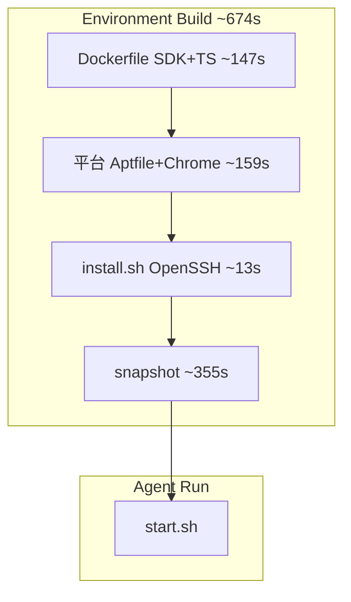

# Luckfox Pico Cloud Agent Tailscale 远程接入实施计划（Implementation Plan）

> **For agentic workers:** REQUIRED SUB-SKILL: Use superpowers:subagent-driven-development (recommended) or superpowers:executing-plans to implement this plan task-by-task. Steps use checkbox (`- [ ]`) syntax for tracking.

**Goal:** 在 Luckfox Pico Cursor Cloud Agent 中以 Tailscale kernel 模式持久化远程接入，使 Mac 可通过 tailnet 使用 OpenSSH、noVNC、TigerVNC 和 Agent 网络代理，同时保留单活动 Pod 子网宣告与知情接受的 exit node 宣告。

**Architecture:** `.cursor/Dockerfile`（活动 Ubuntu 24.04 / Noble）与 `.cursor/Dockerfile.luckfox_pico`（备选官方 Ubuntu 22.04 / Jammy）均在公开基础镜像层安装当时的 Tailscale 稳定版并配置 `ubuntu` 免密 sudo；Dockerfile `RUN apt-get` 只写当前 FROM digest 的 dpkg 中不存在、且属于本仓需求集合的包（Spec §2.3.1），不以平台 Aptfile 为取舍。`.cursor/install.sh` 在私有 Build 快照中安装 OpenSSH；无 `/etc/ssh/.cursor-hostkeys-generated` 时删除现有 `ssh_host_*`、执行 `ssh-keygen -A` 并落 stamp，使同一快照再次 install 时指纹不变，并替换备选 FROM 已烘焙的共享 host key。`.cursor/start.sh` 在每个 Agent Run 内以 fail-fast 顺序启动 kernel-mode `tailscaled`、收敛 Serve、注入 SSH 公钥并启动 sshd，不检测、不重新生成 host key。`.cursor/environment.json` 只保留 `bash .cursor/install.sh` 与 `bash .cursor/start.sh`。`AGENTS.md` 不重复 Tailscale 运维、端口表与验收入口；Secrets、路由批准与 exit node 启用留在 Cursor/Tailscale 管理面。

**Tech Stack:** Cursor Cloud Agent Dockerfile/Build/`environment.json`、Ubuntu 24.04、Bash、Tailscale CLI/LocalAPI/Serve/kernel TUN、OpenSSH 9.6p1、MagicDNS、macOS Tailscale、Luckfox Pico SDK `./build.sh`。

**Spec:** [`docs/superpowers/specs/2026-08-30-luckfox-cloudagent-tailscale-design.md`](../specs/2026-08-30-luckfox-cloudagent-tailscale-design.md)

## Global Constraints

- 使用现有分支 `cursor/luckfox-cloudagent-tailscale-spec-5ff8`，PR #8 base 为 `dev`；直接使用当前工作树，不创建 worktree。
- 仅修改 `.cursor/Dockerfile`、`.cursor/Dockerfile.luckfox_pico`、`.cursor/environment.json`、`.cursor/install.sh`、`.cursor/start.sh`、`AGENTS.md`、执行回填时的本 plan、Tailscale spec，以及环境 spec `2026-07-13-luckfox-cloudagent-env-design.md` 的嵌套 Docker 段落（§2.3 / Q5 / §9）与 `install` 指针（§4.1 / Q4 / §10 / §13 各一句）；不改 07-13 的 SDK 写入包表、07-13 plan 或文首状态；不修改 `./build.sh`、板上固件、Tailscale policy/ACL/grants 或 Cursor 平台脚本。
- Tailscale 目标态固定为 kernel 模式：`tailscaled` 不带 `--tun=userspace-networking`，必须存在 `/sys/class/net/tailscale0`；userspace 只作为故障回退，不在本 plan 实现。
- Tailscale 通过对应 Ubuntu 代号的官方 stable apt 仓库安装执行时的稳定版，不锁定版本：活动镜像用 Noble，备选官方 22.04 镜像用 Jammy；验证证据必须记录 `tailscale version` 与 `tailscale version --daemon`。
- Dockerfile apt：需求集合按 Spec §2.3.1（SDK 官方清单含 `python-is-python3` + buildroot 硬需 + `sudo`/`curl`/`ca-certificates`/`locales` + `iproute2`/`jq`/`tcpdump`/`htop`/`neofetch`）；写入 `RUN` 的包名只看锁定 digest 的 FROM dpkg，FROM 已有的不写，**不得**按 `/usr/local/share/vnc-desktop.Aptfile`「已有就不写」去重或省略。不把桌面 Aptfile 栈（XFCE/VNC/字体等）写进镜像。禁止写入包名 `which` 或 `gnu-which`，不另加 CI/静态 grep。`openssh-server` 只在 `install.sh`。SDK/工具 RUN 与 Tailscale 层均 `--no-install-recommends`。复核：`docker run --rm --entrypoint dpkg-query <image@digest> -W`；当前 VM 无 docker CLI 时按环境 spec §2.3 临时安装嵌套 Docker，禁止写入本仓 Dockerfile。
- Cursor Secrets 固定为 `TAILSCALE_AUTHKEY` 和 `SSH_AUTHORIZED_KEYS`，两者不得进入 git、日志、plan 或提交信息；hostname 使用 bcId UUID 第一段，来源优先 `CURSOR_CONVERSATION_ID`，否则 `/run/agent-store-fuse/self-store-id`；两者皆空时轮询最多 30 秒，超时非零退出。
- Auth key 使用 Reusable + 非 Ephemeral；用户身份节点的 node key 默认 180 天到期，重新认证前轮换 Auth key，或提前在 Admin Console 关闭该节点的 node key expiry。
- `tailscaled` 保留 `127.0.0.1:1054` HTTP 与 `127.0.0.1:1055` SOCKS5 出站代理；Serve 目标态只能包含 5901、1054、1055 三个 TCP 转发。
- OpenSSH 仅允许 `ubuntu` 公钥登录，`PasswordAuthentication no`、`PermitRootLogin no`；不配置 Tailscale SSH，不配置 Serve :22。`install.sh` 无 `/etc/ssh/.cursor-hostkeys-generated` 时旋转 host key 一次；不在 `start.sh` 中生成缺失的 host key。
- 所有 Agent 均宣告 `172.30.0.0/24`，但同一时间只批准一个 Agent 的该路由；多 Agent 并发访问使用各自 MagicDNS hostname/Tailscale IP，当前不实现 4via6。
- 节点宣告 `0.0.0.0/0` 与 `::/0`，但 Cursor 官方不支持本用法；只验收 `offers exit node` 和 Admin Console 启用状态，不承诺 exit node 数据面成功。
- 当前不配置 ACL/grants；接受获准 tailnet 设备可连接 Agent 上监听 `0.0.0.0`/`*` 的 Docker API 和 Cursor 平台端口，以及经 Serve 使用 1054/1055 代理的风险。
- 当前工作树存在无关的 kernel/toolchain 修改和未跟踪文件；每次 `git add`、`git diff --check`、提交与状态核对都必须限定到本任务路径。
- 执行 plan 时只允许在「Environment Build install 流水」「最终验证证据」和「与计划的偏离及原因」中回填可复现命令与实测值；不在 Spec、AGENTS 或提交信息中写操作流水。已完成 Task 只保留步骤与文件目录，落地以仓库文件为准，不重复脚本正文。未完成 Task 保留完整命令。Spec 设计章节保持完整；Build 安装时间表只写本 plan 流水章。
- Cursor Environment Build 在各仓库 default branch 上 clone 再执行 `install`；功能分支 Agent 复用当前 active Build 磁盘再 checkout。推送本分支不会让 Configuration change Build 使用本 PR 的 Dockerfile。对本分支镜像/`install` 的验收必须用 `refs` 指向 `cursor/luckfox-cloudagent-tailscale-spec-5ff8` 的 draft Build。平台 git 装配为 `reuse_then_checkout`：`start` 在 `git reset --hard FETCH_HEAD` 之前执行 snapshot 工作树中的 `.cursor/start.sh`。验收平台自动 start 必须把新 Agent 的 `cloud_requested_environment_build_id` 设为 snapshot 已含当前 `start.sh`（含 bcId 30 秒等待）的 SUCCEEDED draft Build；不得用更早、无等待循环的 Build。若当前 Agent 启动自旧 Build，则在运行 `start` 前于该 VM 执行与 Dockerfile 相同的 Tailscale 与 sudoers 安装命令。
- 所有多命令验证块以 `set -euo pipefail` 开头；负向检查写成 `if cmd; then exit 1; fi`（bash 对 `! cmd` 不触发 `set -e`）。
- `git cz` 提交主题使用仓库既有格式 `type(scope): <gitmoji> subject`；body 用 `- ` 并列 why，末尾只留一个 `详见 spec §X` 指针。
- 本 PR 相对 `origin/dev` 恰好两个提交：实现（`.cursor/*`、`AGENTS.md`）在前，superpowers 文档在最后。改实现合进第一个提交并保留其 AuthorDate；改文档 amend 最后一个提交并保留其 AuthorDate。作者使用 Cursor Agent，以免 GitHub Unverified。

---

## File Structure

| 文件 | 责任 |
| --- | --- |
| `.cursor/Dockerfile` | 在活动 Ubuntu 24.04 镜像中按 §2.3.1 只安装 FROM digest 没有的需求包，安装浮动稳定版 Tailscale（Noble 仓库），并固化 `ubuntu` 的 NOPASSWD sudo；不安装 OpenSSH server |
| `.cursor/Dockerfile.luckfox_pico` | 在备选官方 Ubuntu 22.04 镜像中按 §2.3.1 只安装 FROM digest 没有的需求包，安装浮动稳定版 Tailscale（Jammy 仓库），并固化 `ubuntu` 的 NOPASSWD sudo；不安装 OpenSSH server |
| `.cursor/environment.json` | `install` / `start` 分别调用 `bash .cursor/install.sh` 与 `bash .cursor/start.sh` |
| `.cursor/install.sh` | Build 期下载 grilling skill、以 `--force-confold` 安装 OpenSSH server；无 stamp 时旋转 host key 并写入 `/etc/ssh/.cursor-hostkeys-generated` |
| `.cursor/start.sh` | 每个 Agent Run 执行 Secret 门禁、hostname 解析、forwarding、tailscaled、`tailscale up`、Serve、authorized_keys 与 sshd 启动链 |
| `AGENTS.md` | 保持交叉编译与环境入口说明（含 `install.sh`/`start.sh`、备选镜像与嵌套 Docker 指针）；不重复 Tailscale 运维、端口表与验收入口（见 spec） |
| `docs/superpowers/specs/2026-08-30-luckfox-cloudagent-tailscale-design.md` | 完整设计规格（表格、图、命令形态、验证判据）；实施完成且 V1–V10 闭合后只更新生命周期状态，不写评审或修订过程 |
| `docs/superpowers/specs/2026-07-13-luckfox-cloudagent-env-design.md` | 嵌套 Docker 的完整安装步骤与默认不写入本仓 Dockerfile 的约束（§2.3 / Q5 / §9）；`install` 在 §4.1 / Q4 / §10 / §13 各一句指向 `install.sh` 与 08-30 OpenSSH 约束；不改 SDK 写入包表、07-13 plan 或文首状态 |
| `docs/superpowers/plans/2026-08-30-luckfox-cloudagent-tailscale.md` | 已完成 Task 为步骤/文件目录；未完成 Task 保留完整命令；Environment Build install 流水；最终验证证据与偏离 |

### Task 1: 实现 Cloud Agent 镜像与生命周期配置（已完成）

**落地文件（以仓库为准，不在此重复脚本正文）：**

- Modify: `.cursor/Dockerfile`（Noble Tailscale + `ubuntu` NOPASSWD sudoers；不装 `openssh-server`）
- Modify: `.cursor/Dockerfile.luckfox_pico`（Jammy Tailscale + 同一套 sudoers；不装 `openssh-server`）
- Modify: `.cursor/environment.json`（`install`/`start` 分别为 `bash .cursor/install.sh` 与 `bash .cursor/start.sh`）
- Create: `.cursor/install.sh`（grilling SKILL + `DEBIAN_FRONTEND=noninteractive` 与 dpkg `--force-confold` 安装 `openssh-server`；无 `/etc/ssh/.cursor-hostkeys-generated` 时 `ssh-keygen -A`）
- Create: `.cursor/start.sh`（Secret 门禁、bcId 最多 30 秒、kernel `tailscaled`、Serve 5901/1054/1055、ubuntu 公钥 sshd）

**Interfaces:** 消费 Cursor `install`/`start` 与 Secrets `TAILSCALE_AUTHKEY`/`SSH_AUTHORIZED_KEYS`；产出 `tailscale0`、Serve、`0.0.0.0:22`。fail-fast 与命令形态见 Spec §2.2–§2.6。

- [x] **Step 1:** 活动 `.cursor/Dockerfile` 的 SDK/工具 apt（FROM dpkg，不以 Aptfile 去重）与 Noble Tailscale / sudoers 层
- [x] **Step 1b:** 备选 `.cursor/Dockerfile.luckfox_pico` 同步 Jammy Tailscale / sudoers
- [x] **Step 2:** 写入 `.cursor/install.sh` 并缩短 `environment.json.install`
- [x] **Step 3:** 写入 `.cursor/start.sh` 并缩短 `environment.json.start`（无 `--tun=userspace-networking`，禁止 `set -x`）
- [x] **Step 4:** 静态验证 Dockerfile、JSON、shell 与 Secret 边界
- [x] **Step 5:** 提交运行时配置（实现提交 `d961db6cb`）

### Task 2: 更新 Cloud Agent 运维说明（未按原文执行）

**Files:** `AGENTS.md`

原文 Step 1–3 要把 Tailscale kernel、Secrets、hostname、端口表与 Subnet/exit node 写入 `AGENTS.md`。按 Spec N3 未执行：`AGENTS.md` 只保留交叉编译与环境入口（`install.sh`/`start.sh`、备选镜像与嵌套 Docker 指针）。Tailscale 用途、端口表与验收入口以 Spec §2、§4、§7 为准。不要再把原文章节写入 `AGENTS.md`。详见「与计划的偏离及原因」。

- [ ] **Step 1–3:** 未执行（N3）

### Task 3: 验证 Build、启动门禁与 Agent 本机目标态（已完成）

**Files:** 验证 `.cursor/Dockerfile`、`.cursor/environment.json`；回填本 plan。

- [x] **Step 1:** 对本分支触发 draft Build；验收 Agent 绑定 snapshot 已含当前 `start.sh` 的 Build（`reuse_then_checkout`）
- [x] **Step 2:** 负向门禁——缺失 Secret 时无 forwarding / `tailscaled` / sshd 副作用
- [x] **Step 3:** forwarding、kernel TUN、LocalAPI 与版本
- [x] **Step 4:** 本地代理与 Serve 声明式收敛
- [x] **Step 5:** OpenSSH、sudo 与路由宣告（Admin 批准未做，见 Task 4 Step 1）

通过标准见 Spec §7；命令名与实测值见「最终验证证据」；Build 时间表见「Environment Build install 流水」。

### Task 4: 验证 Mac 入站、单活动 Subnet 与 SDK 回归

**Files:**

- Verify: `AGENTS.md`
- Modify after V1–V10 pass: `docs/superpowers/specs/2026-08-30-luckfox-cloudagent-tailscale-design.md`
- Backfill after execution: `docs/superpowers/plans/2026-08-30-luckfox-cloudagent-tailscale.md`

**Interfaces:**

- Consumes: Task 3 的目标 Agent hostname/Tailscale IP；Mac 已加入同一 tailnet。V2/V4 出站与 Serve 代理固定使用 tailnet 中持久存在的 `http://llm`，不在目标 Agent 上另起 HTTP。V10 的 `SUBNET_TEST_TARGET` / `SUBNET_TEST_URL` 必须落在 `172.30.0.0/24` 且不是 Agent 本机地址；`http://llm` 解析到 tailnet MagicDNS，不能替代。当前 Pod 无稳定邻居时按 Step 3 在 `172.30.0.3` 建临时隔离端点。
- Produces: Spec V4、V6–V7、V9–V10 的跨节点证据和最终范围检查。

- [ ] **Step 1: 在 Admin Console 固化单活动路由与 exit node 状态**

在 Tailscale Admin Console 的 Machines 页面打开目标 Agent 的 route settings：启用其 `172.30.0.0/24` 和 **Use as exit node**；逐个检查其他 Cloud Agent，确保相同 `/24` 均未启用。Expected: 只有目标 Agent 是该前缀的活动 subnet router；多个 Agent 可同时保留各自 hostname/Tailscale IP。

- [ ] **Step 2: 从 Mac 验证 SSH host key、公钥登录、VNC/noVNC 与代理**

先在可信 Agent 会话记录 `sudo ssh-keygen -lf /etc/ssh/ssh_host_ed25519_key.pub` 的预期指纹；再在 Mac 执行：

```bash
set -euo pipefail
: "${TAILSCALE_HOST:?Set TAILSCALE_HOST to the actual MagicDNS hostname}"
TAILSCALE_PROXY_TEST_URL=http://llm
SSH_KNOWN_HOSTS="$(mktemp)"
trap 'unlink "$SSH_KNOWN_HOSTS" 2>/dev/null || true' EXIT
ssh-keyscan "$TAILSCALE_HOST" > "$SSH_KNOWN_HOSTS"
ssh-keygen -lf "$SSH_KNOWN_HOSTS"
ssh -o BatchMode=yes -o StrictHostKeyChecking=yes -o UserKnownHostsFile="$SSH_KNOWN_HOSTS" "ubuntu@${TAILSCALE_HOST}" true
test "$(nc -w 5 "$TAILSCALE_HOST" 5901 | head -c 4)" = 'RFB '
curl --fail --silent --show-error --output /dev/null --noproxy '' --proxy "http://${TAILSCALE_HOST}:1054" "$TAILSCALE_PROXY_TEST_URL"
curl --fail --silent --show-error --output /dev/null --noproxy '' --proxy "socks5h://${TAILSCALE_HOST}:1055" "$TAILSCALE_PROXY_TEST_URL"
nmap -sT -Pn -p 22,1054,1055,2375,5901,26053-26055,26058,26500,50052 "$TAILSCALE_HOST"
```

人工确认 `ssh-keygen` 指纹与 Agent 端一致，并在浏览器打开 `http://${TAILSCALE_HOST}:26058`；Expected: SSH、RFB、两种代理和 noVNC 成功，扫描结果与 Spec §4 的天然可达/Serve 端口边界一致。动态 Peer API TCP 端口和 WireGuard UDP 端口只记录“存在动态端口”，不固化数值。

- [ ] **Step 3: 验证单活动 Subnet 的 kernel 数据面**

`http://llm` 是 tailnet MagicDNS 上持久存在的 HTTP 服务，Step 2 / Spec V2、V4 用它验收出站代理与 Serve 数据面，不在目标 Agent 上创建临时 HTTP。它不在 `172.30.0.0/24` 内，不能作为 V10 Subnet 数据面目标。

当前 Pod 的 `172.30.0.0/24` 内，除 Agent `172.30.0.2` 外没有稳定应答主机（网关 `172.30.0.1` ARP 可达但不响应 ICMP/HTTP）。V10 仍须在目标 Agent 创建临时隔离端点（主网络命名空间不把 `172.30.0.3` 配成本地地址）：

```bash
set -euo pipefail
ip netns add ts-v10
ip link add veth-v10h type veth peer name veth-v10n
ip link set veth-v10n netns ts-v10
ip addr add 169.254.249.1/30 dev veth-v10h
ip link set veth-v10h up
ip netns exec ts-v10 ip addr add 169.254.249.2/30 dev veth-v10n
ip netns exec ts-v10 ip addr add 172.30.0.3/32 dev lo
ip netns exec ts-v10 ip link set lo up
ip netns exec ts-v10 ip link set veth-v10n up
ip netns exec ts-v10 ip route add default via 169.254.249.1
ip route add 172.30.0.3/32 via 169.254.249.2
ip netns exec ts-v10 python3 -m http.server 80 --bind 172.30.0.3 >/tmp/ts-v10-http.log 2>&1 &
echo $! > /tmp/ts-v10-http.pid
curl --fail --silent --show-error --output /dev/null --noproxy '*' http://172.30.0.3/
ip -o route get 172.30.0.3
```

Expected: 本机经转发访问 `http://172.30.0.3/` 成功；`ip -o route get 172.30.0.3` 的出口不是把 `172.30.0.3` 显示为本机地址。导出 `SUBNET_TEST_TARGET=172.30.0.3`、`SUBNET_TEST_URL=http://172.30.0.3/`。

在目标 Agent 准备抓包：

```bash
set -euo pipefail
: "${SUBNET_TEST_TARGET:?Set a non-local target inside 172.30.0.0/24}"
egress_dev="$(ip -o route get "$SUBNET_TEST_TARGET" | awk '{for (i=1;i<=NF;i++) if ($i=="dev") {print $(i+1); exit}}')"
test -n "$egress_dev"
capture_dir="$(mktemp -d)"
sudo timeout 30 tcpdump -ni tailscale0 "host ${SUBNET_TEST_TARGET}" -w "${capture_dir}/tailscale0.pcap" &
tailscale_capture_pid=$!
sudo timeout 30 tcpdump -ni "$egress_dev" "host ${SUBNET_TEST_TARGET}" -w "${capture_dir}/egress.pcap" &
eth0_capture_pid=$!
printf '%s\n' "$capture_dir" "$tailscale_capture_pid" "$eth0_capture_pid" "$egress_dev"
```

在 30 秒内从 Mac 执行：

```bash
set -euo pipefail
: "${SUBNET_TEST_TARGET:?Set the same target used on the Agent}"
: "${SUBNET_TEST_URL:?Set the complete stable test URL on that target}"
route -n get "$SUBNET_TEST_TARGET" | grep -E 'interface: +utun[0-9]+'
curl --noproxy '*' --fail --silent --show-error --output /dev/null "$SUBNET_TEST_URL"
```

回到 Agent：

```bash
set -euo pipefail
wait "$tailscale_capture_pid" || test "$?" = 124
wait "$eth0_capture_pid" || test "$?" = 124
sudo tcpdump -nn -r "${capture_dir}/tailscale0.pcap" "host ${SUBNET_TEST_TARGET}"
sudo tcpdump -nn -r "${capture_dir}/egress.pcap" "host ${SUBNET_TEST_TARGET}"
sudo unlink "${capture_dir}/tailscale0.pcap"
sudo unlink "${capture_dir}/egress.pcap"
rmdir "$capture_dir"
kill "$(cat /tmp/ts-v10-http.pid)" 2>/dev/null || true
ip route del 172.30.0.3/32 || true
ip link del veth-v10h || true
ip netns del ts-v10 || true
```

Expected: Mac 路由经 Tailscale utun 且请求成功；同一请求在目标 Agent 的 `tailscale0` 与 `ip route get` 给出的出口接口均可见，证明由该 Agent 内核转发。访问 Agent 自身 `172.30.0.2` 不计为通过。

- [x] **Step 4: SDK 快速回归（已完成）**

非交互 `printf '4\n0\n0\n' | ./build.sh lunch` 后 `./build.sh kernel`；不跑全量 rootfs/`allsave`。实测见「最终验证证据」V7。

- [x] **Step 5: 回填证据（已完成）**

见文末「最终验证证据」与「与计划的偏离及原因」。Spec 状态为已实施；V4、V6 与完整 V10 待过。

---

## Environment Build install 流水

来源 draft Build [`bld-20260906-a344b2e4-98f2-411d-86fa-d45b6dfa20cb`](https://cursor.com/dashboard/cloud-agents/builds/bld-20260906-a344b2e4-98f2-411d-86fa-d45b6dfa20cb)（UTC 2026-09-06 16:36–16:47，墙钟约 674s / 11min14s，commit `d5445d17`，全部退出码 0）。设计分层见 Spec §2.3；本表只记录该次 Build 日志里实际发生的顺序、耗时与磁盘增量。覆盖 Docker 镜像 + 平台 install + 用户 `install.sh` + snapshot，**不含** `start.sh`（Tailscale / sshd 在 Agent Run 才跑）。



### 墙钟与磁盘

| 层 | 内容 | 新装/升级 | 磁盘增量 | 约耗时 |
| --- | --- | --- | --- | --- |
| Dockerfile | `ubuntu:24.04` → SDK apt → Tailscale 1.102.3 + iptables → sudoers → `git safe.directory` | SDK 200 新装 + 9 升级；Tailscale 7 新装 | SDK +696MB；TS +79MB | SDK ~52s；TS ~7s；含 clone/export 合计 ~147s |
| 平台 Aptfile | exec-daemon → VNC/XFCE → Chrome 152.0.7977.82 → locale/字体/WhiteSur/git/gh/fuse | VNC 408 新装 + 13 升级；Chrome 1 | VNC +737MB；Chrome +457MB | VNC ~97s；Chrome ~13s；平台合计 ~159s |
| `install.sh` | curl grilling SKILL.md（1987 B）→ `apt-get install -y openssh-server` | 42 新装 + 2 升级 | +40MB | ~13s |
| snapshot | draft；Warming skipped | — | — | ~355s |

墙钟构成：Dockerfile 147s（21.8%）· 平台 159s（23.6%）· `install.sh` 13s（1.9%）· snapshot 355s（52.7%）。

### 按时间顺序的命令

| UTC | 来源 | 命令 | 装了 / 做了什么 | 秒 |
| --- | --- | --- | --- | --- |
| 16:36:19 | Dockerfile | `git clone` → `/workspace`（Docker Build） | 检出仓库，供镜像上下文 | 28 |
| 16:36:51 | Dockerfile | `FROM ubuntu:24.04@sha256:4fbb8e6a…` | 基础层 29.74 MB（Noble 24.04.4） | 1 |
| 16:36:52 | Dockerfile | `apt-get install --no-install-recommends` SDK 清单 | 9 升级 + 200 新装；归档 186 MB；磁盘 +696 MB；含 `openssh-client`、无 server | 52 |
| 16:37:43 | Dockerfile | curl Tailscale keyring + `apt install tailscale` | tailscale 1.102.3 + iptables 等 7 新装；+79.1 MB | 7 |
| 16:37:50 | Dockerfile | `sudoers.d/ubuntu` NOPASSWD + `visudo -cf` | 免密 sudo；未装 `openssh-server` | 0 |
| 16:37:50 | Dockerfile | `git config --system --add safe.directory '*'` | 避免 dubious ownership | 0 |
| 16:37:50 | Dockerfile | export docker image + cache | 层：ubuntu 29.7 / SDK 252 / Tailscale 39.5 MB | 28 |
| 16:38:43 | 平台 | `git clone` → `/workspace`（Workspace Setup） | 安装阶段工作树 | 28 |
| 16:39:11 | 平台 | install-exec-daemon | S3 解压 exec-daemon-x64 | 3 |
| 16:39:15 | 平台 | install-cloud-agent-assets | 升级 coreutils/gzip/tar；写入 Aptfile 与 Chrome 脚本 | 6 |
| 16:39:21 | 平台 | capture-vnc-user-env | 记录 VNC 环境，无新包 | 0 |
| 16:39:21 | 平台 | install-vnc-desktop-apt-packages | 13 升级 + 408 新装；XFCE4 + TigerVNC + 字体；+737 MB | 97 |
| 16:40:58 | 平台 | install-google-chrome | google-chrome-stable 152.0.7977.82-1；+457 MB | 13 |
| 16:41:11 | 平台 | configure-google-chrome | Chrome 策略 | 0 |
| 16:41:11 | 平台 | install-locales | `locale-gen en_US.UTF-8` | 1 |
| 16:41:13 | 平台 | cleanup-vnc-desktop-apt | apt 清理 | 1 |
| 16:41:13 | 平台 | install-fonts-and-fontconfig | fc-cache：Noto / JetBrains Mono / WQY 等 | 5 |
| 16:41:18 | 平台 | install-and-configure-themes | WhiteSur 图标主题 | 2 |
| 16:41:20 | 平台 | install-remote-vnc-setup | 远程 VNC 脚本 | 0 |
| 16:41:21 | 平台 | configure-os-display | 1920×1200 @ 96 DPI | 0 |
| 16:41:21 | 平台 | configure-git / link-gh / fuse | git 身份、gh 软链、agent-store-fuse | 1 |
| 16:41:22 | `install.sh` | `bash .cursor/install.sh` | grilling SKILL.md + `openssh-server` 42 新装。Build 里 `policy-rc.d` 禁止启动 sshd | 13 |
| 16:41:36 | 平台 | Creating snapshot… Snapshot ready | draft；Warming skipped | 355 |

### Agent Run（不在上述 Build 日志）

绑定该 draft 冷启动后，平台执行 `bash .cursor/start.sh`（Spec §2.3 顺序）：Secret 门禁 → bcId 最多等 30 秒 → sysctl forwarding → kernel `tailscaled`（1054 HTTP / 1055 SOCKS5，无 `--tun=userspace-networking`）→ `tailscale up` → `serve reset` 与 TCP 5901/1054/1055 → `ubuntu` 公钥与 sshd。脚本原文与 fail-fast 细节以仓库 `.cursor/start.sh` 与 Spec §2.2–§2.6 为准。

## Execution Handoff

剩余工作仅为 Task 4 Step 1–3（Admin Console、Mac 入站、完整 V10）。已完成 Task 不再派发施工子代理。执行前确认 Mac 已加入目标 tailnet，且目标 Agent 已绑定 snapshot 含当前 `start.sh` 的 draft Build。V2/V4 使用持久 `http://llm`；V10 使用本 plan 的 `172.30.0.3` 隔离端点，不得用 `http://llm` 替代。

## 最终验证证据

以下结果来自分支 `cursor/luckfox-cloudagent-tailscale-spec-5ff8`，未记录任何 Secret 内容。

- draft Environment Build [`bld-20260905-16b0ffd7-cbcf-4346-aec0-e03ae21cfd0b`](https://cursor.com/dashboard/cloud-agents/builds/bld-20260905-16b0ffd7-cbcf-4346-aec0-e03ae21cfd0b) 状态为 `SUCCEEDED`；`install` 退出码 0（含 `openssh-server`），snapshot ready。
- 新 Agent Run `bc-3656f5d6-f3f5-5fb7-9202-399345263e7c` 从该 Build cold boot。`environment.json` 的 `install`/`start` 分别为 `bash .cursor/install.sh` 与 `bash .cursor/start.sh`。PID 1 有 Secrets，无 `CURSOR_CONVERSATION_ID`。`/run/agent-store-fuse/self-store-id` 与会话 `CURSOR_CONVERSATION_ID` 字节相同。
- 平台 `start` 退出码 1，错误为 `CURSOR_CONVERSATION_ID or /run/agent-store-fuse/self-store-id is required`。`start-user.log` mtime 早于 `self-store-id` 约 3 秒。当时无 `tailscale0`、无 LocalAPI socket、无 `tailscaled`/`sshd`。同一脚本在 Agent 会话中退出码 0。
- Run `bc-5ca5fe8a-3f21-5a16-bb17-b1807e462712` 仍从同一 Build cold boot。git reflog 为 clone → checkout `de79781c9`（snapshot 中的 `start.sh` 无等待循环）→ 平台 `start` 以 `... is required` 在约 0.4s 失败（`/tmp/cursor/start-user/start-user.status=1`）→ `git reset --hard FETCH_HEAD` 到含等待循环的 `845217871`。HEAD 的 `start.sh` mtime 晚于平台 start 日志约 7s；fuse 晚于 start 日志约 3s。同一脚本在会话中退出码 0，hostname `cursor-agent-5ca5fe8a`。
- draft Environment Build [`bld-20260906-f9aaad5d-617a-4751-a0ec-8c742f335628`](https://cursor.com/dashboard/cloud-agents/builds/bld-20260906-f9aaad5d-617a-4751-a0ec-8c742f335628) 状态为 `SUCCEEDED`；`install` 退出码 0（含 `openssh-server`），snapshot ready。snapshot 工作树的 `.cursor/start.sh` 含 `bcid_deadline`。
- draft Environment Build [`bld-20260906-a344b2e4-98f2-411d-86fa-d45b6dfa20cb`](https://cursor.com/dashboard/cloud-agents/builds/bld-20260906-a344b2e4-98f2-411d-86fa-d45b6dfa20cb) 状态为 `SUCCEEDED`；`install` 退出码 0（grilling 1987B + `openssh-server`）。完整命令时间表、墙钟与磁盘增量见本 plan「Environment Build install 流水」。
- Run `bc-2efb83c0-a71e-51a6-b902-450621d446d7` 从该 Build cold boot，`gitSetup=reuse_then_checkout`。PID 1 无 `CURSOR_CONVERSATION_ID`。平台产物为 `/tmp/cursor/start-user/start-user.status=0` 与同目录 `start-user.log`（不存在扁平 `/tmp/cursor/start-user.status`）。日志无 `... is required` 与 `was not available within 30 seconds`。`self-store-id` mtime 晚于 `start` 开始约 3 秒；status 在 fuse 可读后写 0，随后 `git reset --hard FETCH_HEAD` 到 `a3908f5d7`。
- 该 Run 平台自动 start 下 V1 kernel：`net.ipv4.ip_forward=1`，`net.ipv6.conf.all.forwarding=1`；存在 `/sys/class/net/tailscale0` 与 `/var/run/tailscale/tailscaled.sock`；`tailscaled` 命令行为 `--outbound-http-proxy-listen=localhost:1054 --socks5-server=localhost:1055`，不含 `--tun=userspace-networking`。client/daemon `1.102.3`（daemon `1.102.3-t9329c3677-ga522f65e9`）。hostname `cursor-agent-2efb83c0`，MagicDNS `cursor-agent-2efb83c0.tail093f.ts.net.`，Tailscale IPv4 `100.120.34.66`，`Online=true`。缺失 `TAILSCALE_AUTHKEY` 或 `SSH_AUTHORIZED_KEYS` 时 `start.sh` 非零退出且 `tailscaled`/`sshd` 计数、sysctl、Serve 不变。
- V2：在 `bc-2efb83c0-…` 上 `curl` 经 `127.0.0.1:1054` HTTP 与 `127.0.0.1:1055` SOCKS5 访问 `http://llm/` 均退出码 0。
- §4.2 端口复测：Run `bc-a112ace4-…` 绑定 `bld-20260906-a344b2e4-…`，`ss -tlnp` 与表一致的有 22、1054、1055、2375（Docker/29.1.4，无 CLI）、26053、26054、26500、50052；Peer API 为动态端口。未见 `127.0.0.1:5901` TigerVNC 与 `26055` cursor-server；`26058` 随 `desktop-init` 出现且可能随后消失。Serve 在 Tailscale IP 额外监听 5901/1054/1055。
- V3：该 Run 的 Serve 仅 5901/1054/1055 三个 TCP 转发。
- V5 Agent 侧：该 Run 上 `/home/ubuntu/.ssh` 为 `700 ubuntu:ubuntu`，`authorized_keys` 为 `600 ubuntu:ubuntu` 且非空；`/run/sshd` 为 `755 root:root`；`sshd -T` 含 `passwordauthentication no` 与 `permitrootlogin no`；`0.0.0.0:22` 监听。
- V8：该 Run 上 `su - ubuntu -c 'sudo whoami'` 输出 `root`。
- V7 以 `printf '4\n0\n0\n' | ./build.sh lunch && ./build.sh kernel` 复现：Pico Max、SD card、Buildroot 选板成功，kernel 构建退出码为 0，生成 `output/image/boot.img`（3,652,096 bytes），随后 `git status --short` 无输出。
- V9 Agent 侧该 Run 已宣告 `--advertise-routes=172.30.0.0/24` 与 `--advertise-exit-node`；`tailscale status` 无 `offers exit node`；Admin Console 批准未执行。
- V10 的 Agent 本地前置端点此前已创建并可 `curl http://172.30.0.3/`；Mac 路径未执行。
- draft Environment Build [`bld-20260907-c2f2a5ef-b111-43dd-addd-f5defb5800e8`](https://cursor.com/dashboard/cloud-agents/builds/bld-20260907-c2f2a5ef-b111-43dd-addd-f5defb5800e8) 状态为 `SUCCEEDED`；`install` 退出码 0。Build 日志：`openssh-server` postinst 生成 ED25519 `SHA256:2msmzjMUyDs+5iEWpWAr9HNVPWPeLn0zerOejdzdH2k` 后出现 `ssh-keygen: generating new host keys: RSA ECDSA ED25519`。Run `bc-f2dd30c9-b23f-58d0-84cb-5adf1d144a89` 绑定该 Build 冷启动：`/etc/ssh/.cursor-hostkeys-generated` 为 `0644 root:root`；当前 ED25519 `SHA256:hMLHOS6DUiyZW3U2CJIvH3bs63tNfviuDQqaQ3svE7U`，与 postinst 及官方镜像 `SHA256:4ytbaE+P1YCiIer6IzLsQ+VzK8T+4uOaovTow+TwH9s` 均不同。重跑 stamp 块未进入 `ssh-keygen -A`，三枚指纹不变。`start.sh` 不含 host key 生成。`/tmp/cursor/start-user/start-user.status` 为 `0`。
- 本机 Docker 28.5.2（`Storage Driver: fuse-overlayfs`）以 `.cursor` 为 context 构建 `.cursor/Dockerfile.luckfox_pico` 得 `luckfox-pico-alt:stamp-test`。容器内 Ubuntu 22.04.3，FROM 烘焙 ED25519 `SHA256:4ytbaE+P1YCiIer6IzLsQ+VzK8T+4uOaovTow+TwH9s`（mtime 2023-11-11）。无 `--force-confold` 时 `apt-get install -y openssh-server` 将 `1:8.9p1-3ubuntu0.4` 升到 `ubuntu0.17`，并在已修改的 `/etc/ssh/sshd_config` conffile 提问处挂起。加上 `DEBIAN_FRONTEND=noninteractive` 与 dpkg `--force-confold` 后两次 `install.sh` 均退出码 0：首次旋转 ED25519 为 `SHA256:PQuaCNftBFWXvFCkPX07y4dCYEXBAByfnB7DlfhRt2M`，stamp 为 `0644 root:root` 空文件；第二次输出 `openssh-server is already the newest version`，三枚指纹不变。保留的 `sshd_config` 仍有 `Include /etc/ssh/sshd_config.d/*.conf` 与显式 `PermitRootLogin yes`。

验收汇总：绑定含等待循环的 draft Build 后，平台自动 start 与 V1（含负向门禁）、V2、V3、V5 Agent 侧、V8 通过；V7 此前 kernel 回归通过；V9 仅完成宣告、未获 Admin 批准（`offers exit node` 未出现）；V4、V6、完整 V10 未执行。Spec 状态为已实施；V4、V6 与完整 V10 待过。host key stamp 已由 `bld-20260907-c2f2a5ef-…`（Noble）与本机备选 Dockerfile 容器闭合。

## 与计划的偏离及原因

- 平台执行 `start` 时不提供 `CURSOR_CONVERSATION_ID`，且 `/run/agent-store-fuse/self-store-id` 可能尚未出现（`bc-3656f5d6-…` / `bc-2efb83c0-…` 上均晚约 3 秒）。`start.sh` 在副作用前轮询最多 30 秒。平台 git 装配为 `reuse_then_checkout`，`start` 使用 Build snapshot 工作树，随后才 `git reset --hard FETCH_HEAD`。用早于等待循环的 Build（`bld-20260905-16b0ffd7-…`，snapshot 对应 `de79781c9`）验收时，平台 start 执行无等待旧脚本并以 `... is required` 立即失败。绑定 snapshot 已含等待循环的 `bld-20260906-f9aaad5d-…` 后，`/tmp/cursor/start-user/start-user.status=0`。等待留在 `start.sh`，不内联进 `environment.json.start`。
- 当前执行环境不是 Mac，且没有 Tailscale Admin Console 访问能力，因此 Task 4 Step 1 的单活动 `172.30.0.0/24` 批准与 **Use as exit node** 启用状态无法核对，Task 4 Step 2 的 Mac SSH host key、公钥登录、RFB、HTTP/SOCKS5 代理、nmap 与 noVNC 浏览器检查未执行。
- V10 仅完成隔离 HTTP 端点的 Agent 本地访问和路由判据；没有 Mac 的 `utun` 路由、跨 tailnet curl 或 `tailscale0`/出口接口抓包，故保持未通过。
- SDK 回归依计划只执行非交互 `lunch` 与 `./build.sh kernel`，未执行全量 rootfs/`allsave`；构建未改写 `project/app/wifi_app/` 下的跟踪二进制，无需恢复。
- 容器内 Tailscale 报告 connmark/CONNMARK 不受支持；kernel TUN、Serve 与本地代理检查仍通过。
- 备选官方 22.04 镜像 `.cursor/Dockerfile.luckfox_pico` 同步安装 Jammy stable Tailscale 与 `ubuntu` 免密 sudo，使切换 `environment.json` 的 `dockerfile` 后仍走同一套 `install.sh` / `start.sh`；活动验收仍针对 Noble 的 `.cursor/Dockerfile`。
- `start.sh` 每个大步骤完成后用英文 `printf` 打一行进度/失败，并由平台把 stdout/stderr 收入 `start-user.log`；`tailscale up` 后打印一行摘要（hostname、BackendState、IPv4、MagicDNS、`tailscale0`）再打印 version 与 `tailscale status`。命令自身的 stdout 照常显示。脚本不打开该日志文件，也不使用 `set -x`。
- 2026-09-06 复测 `/usr/local/share/vnc-desktop.Aptfile`：`sha256sum` 仍为 `819987b7fef06af920bd9313347e05ca2fb0cd32ab4ad1e32a2a045238e4abb8`，58 个包与 Dockerfile 注释清单一致。`procps` 在 Aptfile；`iproute2`/`jq`/`tcpdump`/`neofetch` 不在。
- apt 清单只以锁定 digest 的 FROM `dpkg` 为准（与 Aptfile 无关）：不在 FROM 则显式装，已在 FROM 则从 Dockerfile 移除。2026-09-06 在本 Cloud Agent 按 Cursor Running Docker 文档安装 `docker-ce=5:28.5.2-1~ubuntu.24.04~noble`（`fuse-overlayfs` + `iptables-legacy`，未写入本仓 Dockerfile）后执行：`docker run --rm --entrypoint dpkg-query ubuntu:24.04@sha256:4fbb8e6a8395de5a7550b33509421a2bafbc0aab6c06ba2cef9ebffbc7092d90 -W` → amd64 92 个包，有 `procps`/`bash`/`coreutils`/`gzip`/`tar`/`findutils`/`sed`/`passwd`，活动 Dockerfile 不再写这些名字；无 `iproute2`/`curl`/`ca-certificates`/`locales`/`sudo`/`jq`/`tcpdump`/`htop`/`neofetch`/`wget`/`patch` 等则显式安装。`docker run --rm --entrypoint dpkg-query luckfoxtech/luckfox_pico:1.0@sha256:915d44588085826cbeda4b969dbbe7d5e54bf779ba36cda3c5072ee9533e0417 -W` → amd64 366 个包，已含 SDK apt 清单与 `wget`/`patch`/`ca-certificates`/`procps`/`vim`/`less`/`file`/`openssh-server`，备选 Dockerfile 只补 `sudo`/`curl`/`locales`/`iproute2`/`jq`/`tcpdump`/`htop`/`neofetch`。两份 FROM 都没有与 digest 绑定的官方包文档。活动 Dockerfile 的 43 个显式包与备选的 8 个显式包均与对应 FROM 无交集。`openssh-server` 仍只在 `install.sh`，不进公开 Dockerfile 层。活动路径 postinst 与备选 FROM 烘焙密钥都会先出现一轮；`install.sh` 在无 `/etc/ssh/.cursor-hostkeys-generated` 时旋转一次并落 stamp，`start.sh` 仍不重生。`bld-20260907-c2f2a5ef-…` 上快照指纹与 postinst 不同，stamp 再跑幂等。备选 Jammy 镜像升级已修改的 `sshd_config` 时必须 dpkg `--force-confold`，仅 `DEBIAN_FRONTEND` 会在 conffile 提问处挂起。
- 环境 spec 保留嵌套 Docker 完整安装步骤；§2.3 的 `dpkg-query` 用途不反向引用 Tailscale spec。`install` 在 §4.1 / Q4 / §10 / §13 各一句对齐 `bash .cursor/install.sh`（grilling 仍在脚本内；`openssh-server` 约束见 08-30）。07-13 的 SDK 写入包表、plan 与文首状态不改；现行 Dockerfile `RUN` 以 Tailscale spec §2.3.1 为准。
- `AGENTS.md` 不承载 Tailscale 远程接入副本（kernel、Secrets、hostname、端口表、Subnet/exit node）；那些内容已在 Tailscale spec §2/§4/§7。AGENTS 只保留交叉编译说明与环境入口（`install.sh`/`start.sh`、备选镜像与嵌套 Docker 指针）。
