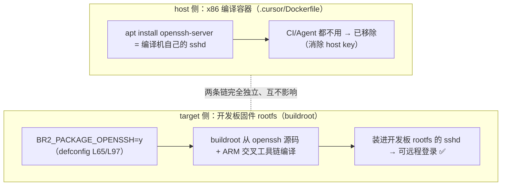

# Luckfox Pico SDK GitHub Actions 固件编译 CI 设计规格（Design Spec）

- **日期**：2026-07-17
- **状态**：原 CI（PR #2）已实现并首测通过（run 29827465865 三组合全绿，2026-07-21）；本 PR（#3）在其上追加**回归修复（清理孤立 gitlink 根治 checkout exit 128）+ CI 镜像强制重建 + 移除 host sshd + build provenance 复用验证**，代码/文档均已实现——其中 **provenance 的 dev 绑定复用验证待合并 `dev` 后 `force_rebuild` 重签实测**；**因合并后再改 spec/plan 须另开 PR、成本不划算，dev 实测结论改回填至 PR #3 评论区（以合并后标题「合并后最终验证结论」的评论为准）、本 spec/plan 不为补 run 号单独更新**（详见 §7 R10、§9 Q16 与 plan「build provenance」段）
- **分支**：`cursor/fix-ci-persist-credentials-76b3`（PR #3，起点 `dev`；原 CI 为 PR #2 分支 `cursor/luckfox-github-actions-ci-76b3`，已合并 `dev`）
- **主题**：为 luckfox-pico SDK 引入 GitHub Actions，在托管 runner 上交叉编译并产出可烧录固件 artifact
- **关联代码文件**：`.github/workflows/build-luckfox-pico-firmware.yml`（PR #2 创建；PR #3 加固：镜像强制重建 + build provenance，并保留 persist-credentials:false，详见 §4.2 / §7 R7/R8/R10）、`.cursor/Dockerfile`（PR #3 移除 host sshd）、`sysdrv/tools/board/ubuntu`（PR #3 `git rm --cached` 清理孤立 gitlink）
- **关联计划**：[`docs/superpowers/plans/2026-07-17-luckfox-github-actions-ci.md`](../plans/2026-07-17-luckfox-github-actions-ci.md)（计划文档已完成；原 CI 已实现并首测通过；PR #3 的 provenance **生成/attest 路径已由 `force_rebuild` 重建路径实测通过**，仅**复用路径的 dev 绑定 verify 待合并 `dev` 后重签实测**，结论回填 PR #3 评论、见上方状态行与 §9 Q16）

---

## 1. 概述与目标

为 luckfox-pico SDK 配置一条 GitHub Actions 流水线：在 GitHub 托管 runner 上用 `./build.sh` 交叉编译目标固件，并将 `output/image/` 与 `IMAGE/*_RELEASE_TEST/` 产物作为 artifact 上传，整体对标本作者既有 ESP-IDF 项目（ESP-Pocket2 / WT9932P4-TINY）的 CI 风格。首版聚焦作者手上的两块实体板——Pico Max 与 Ultra W——共 3 个「硬件 × 介质 × 系统」组合。

目标：

- 每个组合走全量 `allsave` 产出完整可烧录固件（`update.img` / `sd_update.img` / 各分区 `img`）。
- 复用仓库既有的「配置即代码」资产：直接用 `.cursor/Dockerfile`（Ubuntu 24.04 + 全套编译依赖）构建 CI 编译环境，保证与本地/Cloud Agent 环境一致。
- 借第一次 CI 探明「全量 buildroot 编译在磁盘余量紧张的 runner 上是否会爆盘」这一未知数（标称 14GB 为承诺下限、实际空闲 ~20–29GB，详见 §2.2；首版有意不加磁盘释放，见 §7 R1）。
- 产物验证：编译前后 + 编译中周期采样 `df -h`（首末两次不足以捕获峰值，故编译中后台周期采样、尽力观测；观测步骤均加 `if: always()`）、编译后打印产物清单与体积、生成 `sha256` 校验和、按介质 `test -s` 断言必需镜像齐全。

非目标（首版不做）：实体板上电启动 / 外设功能回归（无硬件，无法在 CI 完成）；Ubuntu 多版本 matrix；PR 触发；磁盘释放优化（留待首次 CI 见分晓后按需引入）。

## 2. 背景与参考

### 2.1 参考 CI（同类实践）

- ESP-Pocket2 `.github/workflows/build-esp-idf-project.yml`：`workflow_dispatch` + `push(dev)`；matrix（稳定版 `release-v5.5` 一个 + 一个 `latest` experimental）；步骤 `checkout → build → show size → image_info → upload-artifact`；emoji 步骤名；artifact 名带 os/version。
- WT9932P4-TINY `.github/workflows/build-esp-idf-project.yml`：在上者基础上加 `pull_request(dev)` 与依赖拉取步骤，`checkout@v7` / `upload-artifact@v7`。
- 共性风格（本设计沿用）：`workflow_dispatch` + `push(dev)`；env 定义产物路径；matrix 结构（但本设计以 `fail-fast: false` 替代 ESP 的 experimental/`continue-on-error` 容错，见 §4.6）；emoji 步骤名；`build → 展示信息 → upload-artifact`；artifact 名含目标与 os。
- 提交信息风格：gitmoji + conventional（中文），如 `ci(github-actions): 👷 ...`、`fix(ci): 💚 ...`（type 小写、scope 为功能域、冒号后单 emoji，与本仓既有 `docs(superpowers): 📝 …` 惯例一致）。

### 2.2 Luckfox Pico 编译特点与 runner 约束（本设计的硬约束来源）

- Luckfox Pico 全量编译远重于 ESP-IDF：一次 `allsave` 含 U-Boot + kernel 5.10.160 + buildroot 2023.02.6（首次/clean 后需联网下载 105–153 个包，Ultra W 更多、含多媒体）+ Rockchip 媒体库 + IPC 应用；单组合约 26–49min（旧/本地估算、含下载；**CI 冷编实测更久**，见 §7 R1：SPI_NAND 44min / SD_CARD 46min / Ultra W 76min）。
- ARM 交叉工具链 `arm-rockchip830-linux-uclibcgnueabihf`（gcc 8.3.0）已随仓库内置于 `tools/linux/toolchain/`，`build.sh` 选板后自动入 `PATH`，CI 无需安装。
- GitHub 托管 runner 磁盘：`/` = 84GB OS 盘（`df` 根分区 ~73G），预装工具占用后**实际空闲通常 ~20–29GB**（GitHub 仅承诺 14GB 下限）；另有 `/mnt` 临时盘 14GB（可用 ~9GB）。全量 buildroot 中间产物（buildroot build 树 + 工具链 + SDK output 等，远大于最终 rootfs）可能逼近/超过 `/` 的实际空闲——原判为首版最大风险（见 §7 R1）。**⚠️ 首测实测（2026-07-21）更新**：container job 内 `df` 显示根盘 `overlay` 实为 **145G**（远超上述旧预估），Ultra W（最重组合）编译峰值仅用 74G/**51%**、Avail 始终 ≥71G，三组合全绿**未爆盘**——当前托管 runner 磁盘充裕，B1 无需磁盘释放。
- 计费：公开仓库 + 标准 runner 的 Actions 使用「净额 $0」（毛额被 100% 折扣抵消），GHCR 容器镜像当前免费——故本方案零成本（详见 §9 QA）。

## 3. 需求

### 3.1 功能需求

| 编号 | 需求 |
| --- | --- |
| F1 | 对 3 个组合（Pico Max/SD_CARD、Pico Max/SPI_NAND、Ultra W/EMMC，均 Buildroot）各执行非交互 `lunch` + 全量 `./build.sh`，产出 `output/image/*.img`。 |
| F2 | CI 编译环境用 `.cursor/Dockerfile`（Ubuntu 24.04）构建的镜像：`docker build` → push GHCR → `build-firmware` 以 `container:` + `credentials`（`GITHUB_TOKEN`）拉取（镜像当前为 **public**，`credentials` 兼容 public/private）。 |
| F3 | 触发：`workflow_dispatch`（手动）+ `push(dev)`（`paths-ignore` 纯文档）+ `schedule`（每月 1 日强制重建 CI 镜像、仅重建镜像不编译固件，见 §4.2）。 |
| F4 | 缓存 buildroot 下载包与 GHCR 镜像，加速后续 run。 |
| F5 | 产物 artifact 覆盖 `output/image/` 全部**非隐藏**烧录产物（隐藏的 `.env.txt` 为 env 分区配置、非烧录件，不纳入）+ `IMAGE/*_RELEASE_TEST/` 存档（排除 `DEBUG_FILES/` 与重复的 `IMAGES/`，仅留 `build_info.txt` 溯源）；`upload-artifact` 实际启用（本设计新写、启用态）、设 `if-no-files-found: error`（缺产物即失败、不静默）。 |
| F6 | 编译前后 + 编译中周期采样打印 `df -h`、编译后打印产物清单/体积（`ls -lh` / `du -sh`，观测步骤均加 `if: always()`），并对 `output/image/` 非隐藏产物生成 `sha256`（落 `SHA256SUMS` 文件、随产物上传）；另按介质 `test -s` 断言必需镜像齐全（见 §4.5）。 |
| F7 | 编译前执行 `./build.sh check`（信息性依赖自检、需先 `lunch`；仅打印缺失提示、返回码恒 0、不阻断）与 `./build.sh info`。 |

### 3.2 非功能需求

| 编号 | 需求 |
| --- | --- |
| N1 | 零成本：公开仓库 + 标准 runner + GHCR，净额 $0；不得使用 larger runner（larger runner 即便公开仓库也计费）。 |
| N2 | 环境一致/可复现：CI 编译环境的**定义**字节级来自 `.cursor/Dockerfile`（基底 `ubuntu:24.04` tag+digest 双锁）；同一 run 内 3 组合复用同一镜像 digest（注：apt 包版本未固定，镜像非跨时间字节可复现）。 |
| N3 | 首版 `fail-fast: false`（完整看到各组合是否爆盘）；流水线稳定后可切 `true` 走「见错即停」。 |
| N4 | 不污染仓库：编译会原地改写 `hostapd`/`librkwifibt.so` 等预编译件，CI 不提交，无影响（见 §7 R3）。 |

## 4. 关键设计决策（对应 grilling 问题 1–7）

> 本节 7 项决策对应 brainstorming 阶段逐个 grilling 确认的 7 个问题，依次由 §4.1–4.7 承接：**① 编译范围**（哪些「硬件×介质×系统」组合）、**② 运行环境**（容器/裸装、Ubuntu 版本）、**③ 触发方式**、**④ 编译粒度 + 缓存**、**⑤ 产物**（文件/命名/保留）、**⑥ 矩阵并行与容错**、**⑦ 附加增强**。

### 4.1 编译范围 —— 3 组合（问题 1）

覆盖作者两块实体板的实际用法：Pico Max（有 SD 卡槽、硬件无 WiFi/蓝牙）取 SD_CARD 与板载 SPI_NAND 两种介质；Ultra W（无卡槽、板载 eMMC、带 WiFi/蓝牙）取 EMMC。系统统一 Buildroot（完整根文件系统）。介质可选性由 `build.sh` 的 `range_*` 分组决定：`range_sd_card_spi_nand=(1 2 3 4)` 含 Pico Max（菜单 `[4]`），故其可编 SD_CARD 与 SPI_NAND；`range_emmc=(5 6 7 8)` 含 Ultra（`[5]`），仅 EMMC。详见 §5。

> 关于 Pico Max 的 WiFi：官方参数表明确「Wi-Fi+蓝牙：无」。其 SPI_NAND 版 BoardConfig 虽含 `RK_ENABLE_WIFI=y`（+ wifibt-firmware overlay），但属不完整冗余、非真实支持——缺 `RK_ENABLE_WIFI_CHIP` 与 `rv1106-bt.config`（对比真机带 WiFi 的 Ultra 两者俱全）；该组件即使编入 rootfs 也无对应硬件、无实际功能。

### 4.2 运行环境 —— B1-全：`docker build` + push GHCR + `container:` 凭据拉取（问题 2）

选用 `.cursor/Dockerfile`（Ubuntu 24.04）作为 CI 编译环境，且采用「真正 build 镜像并经 GHCR 引用」的 **B1-全**形态，而非仅复用其 apt 清单。理由：作者要求字节级复用该 Dockerfile 的一致性；`container:` 语法只接受现成镜像、不能直接 build Dockerfile，故需先 build+push GHCR 再引用。（术语：**B1** = job 用 `container:` 引用现成镜像；**B1-全** = 真正 `docker build` + push GHCR 后再引用；**B2** = 裸 runner + `docker run`，便于进容器前先跑 `free-disk-space`，见 §7 R1。）

- 两个 job：`build-image`（`docker build` → push `ghcr.io/<owner>/luckfox-pico-ci:<tag>`）→ `build-firmware`（`needs: build-image`，`container:` 引用该镜像）。
- **拉取主路径 = `container.credentials`（兼容 public/private）**：`build-firmware` 用 `container.credentials`（`username: ${{ github.actor }}`、`password: ${{ secrets.GITHUB_TOKEN }}`）拉取——此为官方文档化、同仓库 scoped 包可靠、无论镜像 public/private 都能拉。**本仓 `luckfox-pico-ci` 包当前为 public**（GHCR 新推包默认 private，本包已手动设为 public 便于复用）；仍保留 `credentials`，使 public/private 两种可见性都能稳定拉取，无需依赖「用 `GITHUB_TOKEN` 经 REST 自动改包可见性为 public」这一对**个人账号**并无稳定官方端点的路径（组织包 404、用户包多需 PAT classic、官方称无此端点）。credentials 拉取**与触发分支无关**（同仓库 scoped 包 + 本仓 `GITHUB_TOKEN` 即可读）；首测的真正门槛在「触发注册」（`workflow_dispatch` 需工作流先落默认分支才能派发），见 §4.3。
- **当前镜像已 public 供复用**：为让镜像被他人 / AI / Cursor Cloud Agent 匿名复用，已在 web UI 把该 GHCR 包设为 public（**非 CI 运行依赖**，因 CI 用 credentials 拉取、public/private 均可）。安全边界：该 CI 镜像仅由公有 apt 包构建、**不含任何密钥/凭据**（无 `GITHUB_TOKEN`、无 git/SSH 授权私钥、无 X.509 私钥，**亦无 SSH 主机私钥**——已移除 host `openssh-server`，见下）；public 后任何人（含外部 fork）可匿名 pull/依赖它、无敏感信息。GHCR 容器镜像存储对公私皆免费，故 public 与否都零成本。（注：公开包通常不能直接改回 private，如确需私有须换包名。）
- **移除 host sshd 以消除 SSH host key 泄露**（详见 §7 R9）：原 `.cursor/Dockerfile` 装 `openssh-server`（+ `ssh` 元包依赖它），其 postinst 在 `docker build` 时生成 `/etc/ssh/ssh_host_*_key` 并烘焙进 **public** 镜像层——任何人 pull 即可提取该主机私钥，下游若用此镜像启 sshd 会共享同一身份、可 MITM（同 CVE-2025-32755 类）。因 CI 编译与 Cloud Agent **均不需 sshd**（`build.sh` 无 ssh/sshd 调用、平台连容器走 exec-daemon 非 sshd），故去掉 `ssh` 元包 + `openssh-server`、仅留 `openssh-client`（供 git SSH 提交签名等 client 用途）——镜像不再生成/含 host key。**⚠️ 与开发板 sshd 完全无关**：目标固件的 sshd 由 buildroot `BR2_PACKAGE_OPENSSH`（`luckfox_pico_defconfig`/`luckfox_pico_w_defconfig` 均已启用）从源码**交叉编译**进 target rootfs，是与 host 镜像独立的另一条链，删 host sshd 不影响开发板远程登录：

- 权限（**按 job 最小化**，不在顶层统一给 write）：`build-image` = `{contents: read, packages: write, id-token: write, attestations: write}`（`checkout` + 推镜像；`actions/attest` 生成/上传 build provenance 需 `id-token`（Sigstore keyless 签名）+ `attestations`（上传 GH API），见 §7 R10）；`build-firmware` = `{contents: read, packages: read}`（`checkout` + 用 `GITHUB_TOKEN` credentials 拉镜像仅需读）——避免 3 个固件 job 持有多余的 GHCR 写权限，符合最小权限原则；均用内置 `GITHUB_TOKEN`，无需额外 secret。
- 镜像已含 `git`（Dockerfile 的 apt 安装块已装 `git`），便于容器内常规 git 操作；`checkout` 用常规模式即可——仓库根目录无 `.gitmodules`、无真子模块，编译所需的 lvgl 等均为普通 vendored 目录；仓库曾从官方继承一个与本 3 个 Buildroot 组合无关的**孤立 gitlink**（`sysdrv/tools/board/ubuntu`，mode 160000、无 `.gitmodules` 映射、指向已弃用的 Ubuntu rootfs），常规 checkout 对它仅留空目录、不影响编译——**本 PR 已 `git rm --cached` 清理**（见下）。**⚠️ CI 实测（关键·严重度随 `persist-credentials` 而异）**：`actions/checkout` 的凭据清理步（`Removing auth`）会对该孤立 gitlink 执行 `git submodule foreach`，因无 `.gitmodules` 登记 URL 而报 `fatal: No url found for submodule path 'sysdrv/tools/board/ubuntu' in .gitmodules` → git 退出码 128。**该 128 的严重度取决于 `persist-credentials`**：默认 `persist-credentials: true` 时凭据清理延后到 **Post 阶段**执行、128 仅是**一条良性 `warning` annotation**（每 job 一条，bootstrap 首测 4 条）、**非致命、不阻断**（三组合 run 全绿、artifact 正常）；但设 `persist-credentials: false` 时凭据清理**提前进主 checkout 步骤内**、同一 128 即成 `##[error]` **致 checkout 步骤失败、job 失败**（`dev` 首次 `push(dev)` run 29896916823 的 `build-image` 实测：checkout 完成后紧接 `Removing auth` 的 `submodule foreach` → exit 128 → 步骤失败、后续 matrix job 因 `needs` 未执行）。**本 PR 已 `git rm --cached sysdrv/tools/board/ubuntu` 根治该孤立 gitlink**（它是官方「删 `.gitmodules` 却漏删 gitlink 条目」的遗留死条目：无 url、工作区仅空目录、编译不用、Ubuntu 支持官方早已删除，见 §9 QA）——清理后 checkout 不再对任何 gitlink 执行 `submodule foreach` → **无 128**，故两处 `checkout` **安全启用 `persist-credentials: false`**（构建期不在 `.git` 留存短期 `GITHUB_TOKEN` 的纵深防御），**既消除 128、又保住加固，两全其美**（详见 §7 R7）。
- Ubuntu 版本用 24.04：`ubuntu-24.04` 为当前 GA 的 `ubuntu-latest`；本仓 `.cursor/Dockerfile` 已实测 24.04 编译成功两板（host gcc13/glibc2.39）——目标固件 ABI 由内置交叉工具链（`arm-rockchip830` uClibc）决定、目标二进制不链接 host glibc，但 buildroot 构建期仍用 host gcc/libc 编译大量 HOSTCC 工具、host 工具链仍是构建依赖（故非跨时间字节可复现，见 N2）。超出官方仅支持的 22.04，但实测可编、风险可控。
- **首版不加磁盘释放**：见分晓优先（§7 R1）。
- **CI 镜像更新（吸收 apt 安全补丁）**：`build-image` 的 tag = `.cursor/Dockerfile` 内容 hash、默认「tag 已存在则复用、不 rebuild」，故 Dockerfile 字节不变时其 `RUN apt-get install` 的包（`git`/`gcc`/`openssl`/`openssh` 等）不会自动吸收 Ubuntu 24.04 后续安全补丁。为此加**强制重建机制**：`workflow_dispatch` 的 `force_rebuild` input（手动按需）或 `schedule`（北京每月 1 日 08:00 = UTC `0 0 1 * *`，自动兜底）触发时 `FORCE_REBUILD` 为真 → 跳过复用判断、用 buildx 无缓存重建、推送并从构建 metadata 取不可变 digest（重跑 apt 拿最新、覆盖同 tag；旧 digest 变未标记 package version、按需清理即可）；`schedule` 仅重建镜像、`build-firmware` 以 `if: github.event_name != 'schedule'` 跳过固件编译（每月成本约 3min）。base 层由 `FROM …@sha256` digest pin 固定（保供应链不可变、不加 `--pull`、不引入 Dependabot 以免提交噪音），需要时手动 bump digest（低频、经 PR）。详见 §7 R8。
- **CI 镜像来源验证（build provenance，防复用投毒）**：`build-image` 的 tag 是「内容 hash 缓存键」、非来源证明，复用路径若被推入恶意镜像会被 `build-firmware` 直接执行。故新建镜像时以 `actions/attest@v4` 生成 SLSA build-provenance（Sigstore keyless 签名、`push-to-registry` 附镜像旁；**被签名的 digest 取自 `docker buildx build --push --metadata-file` 的 `containerimage.digest`（构建产物本身），不按 mutable tag 二次 inspect，杜绝「push→回读」间 tag 被重指的 TOCTOU**），**复用镜像前**用 `gh attestation verify`（`--repo` + **`--source-ref refs/heads/dev` + `--signer-workflow …yml@refs/heads/dev`**，把 signer 与 source 锁定到受保护的 dev 分支，使 feature 分支签发的 attestation 不被信任、防具写权限者从自有分支 dispatch 签恶意镜像绕过 + `--bundle-from-oci`）验证来源，**单次验证、失败即 `exit 1`（fail loud）**（不对 Sigstore/Rekor/GHCR 瞬时故障重试，遇验证服务抖动手动重跑，理由见 §9 Q15）。验证放 `build-image`（`build-firmware` 是 container job、无法 job 内先验证）。**⚠️ 因 signer/source 绑定 dev：合并前 feature 分支上已生成的 attestation（signer=feature ref）复用验证会 `exit 1`，须合并后在受保护 dev 上 `force_rebuild` 重签，之后 Dockerfile 不变则 `push(dev)` 复用验证直接通过**（未来 Dockerfile 变→新 tag 走 build+attest 自动生成）。详见 §7 R10；**保障边界（防得住谁/防不住谁）见 §9 Q13**。

### 4.3 触发方式（问题 3）

`workflow_dispatch` + `push(dev)` + `schedule`（月度强制重建 CI 镜像、仅重建镜像不编译固件，见 §4.2；⚠️ 因本仓为 fork，该月度 schedule 可能不自动触发、见 §7 R8）+ `paths-ignore`（仅 `**.md`，忽略任意层级的 Markdown 文档——`**` 跨 `/` 故覆盖 `docs/` 子目录下的 spec/plan；`*.md` 只匹配仓库根、不适用），对齐 ESP-Pocket2 习惯；因编译重，纯 Markdown 文档提交不触发全量编。**取舍**：仅忽略 `**.md`，故非 Markdown 的纯文档/配置改动（如 `LICENSE`、`.gitignore` 等）在 `push(dev)` 时仍会触发一次全量编译；鉴于公开仓库净额 $0 且此类提交罕见，接受该取舍（不再扩大 `paths-ignore`，以免误伤真正需要编译的改动）。PR 触发首版不加（3 板全量在 PR 上翻倍消耗，不划算）。

> **首测注册（bootstrap）**：`workflow_dispatch` 需工作流文件**先存在于默认分支**才能派发（本设计 `push` 仅 `push(dev)`，推 feature 分支既不触发、也不注册）——故合入 `dev` 前，工作流在本 feature 分支「未注册、无从手动派发」，这**并非** GHCR 权限问题（credentials 拉取与分支无关）。**首测策略采用临时 bootstrap**：临时给工作流加一个 feature 分支会触发的事件（如临时把本分支加进 `push.branches`、或加 `pull_request`），推送即在本分支跑起首测、同时完成注册（⚠️ `gh workflow run <file> --ref <feature>` 属 `workflow_dispatch`，需工作流先合入**默认分支**方可派发、合入 `dev` 前不可用，且本环境 `gh` 只读、无法 `workflow run`——首测仅靠上述 push 触发）；**首测「见分晓」通过后移除临时触发**、恢复为 `workflow_dispatch` + `push(dev)` 随 PR 合入 `dev`。

### 4.4 编译粒度 + 缓存（问题 4）

- 粒度：每组合 `printf … | ./build.sh lunch → ./build.sh check → ./build.sh info → ./build.sh`（默认 `allsave` 全量）。分步（uboot/kernel/rootfs）不产完整固件、不适用。
- 缓存：`actions/cache` 缓存 buildroot 下载包——须把 `BR2_DL_DIR` 重定向到 buildroot **树外**的固定路径。**关键原因**：`sysdrv/Makefile` 的 `buildroot` 目标以 `test -d $(BUILDROOT_DIR)/$(BUILDROOT_VER) || (解包 tarball)` 判定（版本号 `buildroot-2023.02.6` 硬编码、路径本身其实稳定），若把 in-tree `dl/` 纳入缓存，restore 会**预建该版本目录 → `test -d` 为真 → 跳过 tarball 解包 → 源码缺失、构建失败**；故 `dl` 必须放树外，`actions/cache` 才能既命中又不破坏解包。container job 下须选**容器内挂载卷**的路径：用环境变量 `$GITHUB_WORKSPACE/.br-dl`（⚠️ 非 `${{ github.workspace }}` 上下文——后者在容器内求值为宿主路径 `/home/runner/work/…`，`$GITHUB_WORKSPACE` 才是容器内挂载点 `/__w/…`），经 `GITHUB_ENV` 设置；`actions/cache` 的 `path` 用相对 `.br-dl`（相对 `GITHUB_WORKSPACE` 解析、与之同指），勿用 workspace 父目录。缓存 key 按 **buildroot defconfig** 区分：3 组合共 **2 套**下载集——两 Pico Max 共用 `luckfox_pico_defconfig`（≈105 包）、Ultra 用 `luckfox_pico_w_defconfig`（≈153 包，后者多出蓝牙/音频/SDL2/mpv 等多媒体包）——收益为**跨 run 复用 + 缓存去重（2 份 vs 3 份）**（并行冷缓存下两 Pico Max 仍各自下载一次）。key 应对 defconfig **文件内容** + `BUILDROOT_VER`（`buildroot-2023.02.6`，源自 `sysdrv/Makefile` 的 `BUILDROOT_VER ?=`）取 hash（而非仅文件名）；workflow 内该版本号以 **job env `BUILDROOT_VER`** 统一定义（`dlkey` 计算与 `restore-keys` 共用、改一处即可），使 defconfig 内容变更能正确失效缓存；具体键名/路径在 plan 落实。GHCR 镜像按 `.cursor/Dockerfile` 内容 hash 复用（未变则不 rebuild、直接拉取既有 tag）。首次 CI 无缓存命中、全量下载，正好用于「见分晓」。**缓存分支作用域**：`actions/cache` 按分支隔离，父/默认分支读不到子分支缓存（详见 §7 R4），故合并入 `dev` 后的首次 `dev` 构建仍为冷下载、并新建 `dev` 缓存（`actions/cache` 仅在 job 成功时保存，须首个成功的 `dev` run 之后方命中）。

### 4.5 产物（问题 5）

- 内容：`output/image/` 全部**非隐藏**产物（`update.img`、`rootfs.img`、`boot.img`、`uboot.img`、`env.img`、`userdata.img`、`idblock.img`、`download.bin` 等；隐藏的 `.env.txt` 是 env 分区配置、非烧录件，`*` glob 与 `upload-artifact` 默认均不含、不纳入；`oem.img` 仅 SPI_NAND/EMMC 组合有、SD_CARD 组合无；SD_CARD 另有 `sd_update.img`；SPI_NAND 的 `rootfs.img` 为 UBI）+ `IMAGE/<板>_RELEASE_TEST/` 存档但**排除 `DEBUG_FILES/` 与重复的 `IMAGES/`**（`build_save` 会把 `output/image/*` 复制进 `IMAGES/`、与前者重复；`DEBUG_FILES/` 含 `vmlinux`/media/app 等调试大文件、烧录用不到；故存档仅保留 `build_info.txt` 作构建溯源，`PATCHES/` 在 allsave 路径下为空目录、不计）。存档真实目录名形如 `IMAGE/IPC_<介质>_BUILDROOT_<板>_<YYYYMMDD.HHMM>_RELEASE_TEST/`（`build_save` 对整名 `tr` 转**全大写**，如 `IPC_SD_CARD_BUILDROOT_RV1106_LUCKFOX_PICO_PRO_MAX_…_RELEASE_TEST`；此处示例用混合大小写仅为可读），plan 采集用通配 `IMAGE/*_RELEASE_TEST/` 匹配（大写同样匹配）。
- 产物完整性校验（防「缺文件仍上传成功」）：上传前按介质 `test -s` 断言必需镜像齐全——**公共必需**（`update.img`、`boot.img`、`uboot.img`、`env.img`、`rootfs.img`、`idblock.img`、`download.bin`、`userdata.img`）、**SD_CARD 专属** `sd_update.img`、**SPI_NAND/EMMC 专属** `oem.img`，并断言恰有一个 `IMAGE/*_RELEASE_TEST/build_info.txt`；任一缺失即 job 失败（配合 `upload-artifact` 的 `if-no-files-found: error`）。**首测实测（run 29827465865）产物清单**：三组合各产出 **11 个非隐藏文件**——**9 个镜像**（三组合**共有 8 个**：`update.img`、`boot.img`、`uboot.img`、`env.img`、`rootfs.img`、`idblock.img`、`download.bin`、`userdata.img`；+ **介质专属 1 个**：SD_CARD→`sd_update.img`、SPI_NAND·EMMC→`oem.img`）+ **2 个升级说明文本**（`sd_update.txt`、`tftp_update.txt`，非隐藏、随 artifact 上传；隐藏 `.env.txt` 不计）。据此公共必需清单由 **bootstrap 首测版的 4 个**（`update.img`/`boot.img`/`uboot.img`/`env.img`）**收尾扩为 8 个共有镜像**（新增 `rootfs.img`、`idblock.img`（IDBlock/前置 loader）、`download.bin`（量产 loader）、`userdata.img`（用户分区）共 **4 项**——三组合均稳定产出，缺任一即说明打包异常）。
- 上传：`upload-artifact` **启用**上传（ESP 参考本就启用上传整个 `build/`、仅注释掉冗余的显式 bin 路径；本设计同样启用、覆盖 `output/image/` 非隐藏产物 + `IMAGE` 存档），并设 `if-no-files-found: error`（缺产物即失败、不静默）。因仓库为公开仓库，Actions artifact 存储对公开仓库免费（官方：public repo 无 artifact 存储费；500MB 配额仅约束私有仓库、且与 Packages 共享额度亦仅私有）、GHCR 镜像免费，故上传零成本（详见 §9 QA）。
- 命名：`luckfox-pico-firmware_<board>-<medium>_on-ubuntu-24.04`（`ubuntu-24.04` 由 `matrix.os` 提供、与 `build-firmware` 的 `runs-on` 同源；3 个分别为 `…pro_max-sd_card…` / `…pro_max-spi_nand…` / `…ultra-emmc…`）。
- 保留：GitHub 默认 90 天（可后续按需缩短）。
- 编译**前后**各打印 `df -h`，并在编译**过程中**后台周期采样 `df -h`（首末两次无法捕获中间峰值，故周期采样、尽力逼近峰值），编译后 `ls -lh output/image/` + `du -sh output/image/ IMAGE/`；这些观测步骤均加 `if: always()`（失败也执行）、各命令用 `|| true` 守卫（目录未生成也不阻断），尽力在爆盘/超时失败时仍拿到磁盘证据（离下限的余量、卡在哪）；注：ENOSPC/超时为强制终止时，后台采样与 `if: always()` 步骤未必都能执行，故为「尽力」而非「保证」。
- **产物文件性质与存档细节（首测实证）**：
  - `sd_update.txt` / `tftp_update.txt`：U-Boot **现场升级命令脚本**（非镜像），由 `project/scripts/mk-tftp_sd_update.sh` 按分区表逐分区生成——`sd_update.txt` 用 `fatload mmc 1` 从 SD/FAT 取镜像、`tftp_update.txt` 用 `tftp` 从网络取镜像，再按介质 `mmc write` / `mtd write spi-nand0` / `nand write` 写入各分区（供无 PC 工具时经 U-Boot 命令行升级；growup `-` 分区如 SD_CARD 的 rootfs 不含在内）。两文本非隐藏、随 artifact 上传。
  - `.env.txt`（隐藏、**不上传**）：U-Boot env 明文源，经 `mkenvimage` 生成 `env.img`；3 行 = 分区表（`blkdevparts`/`mtdparts`）+ `sys_bootargs=` + `sd_parts=`。
  - `IMAGE/<STUB>_RELEASE_TEST/`（`build_save` 存档，**仅 `build_info.txt` 被上传**）目录树：`IMAGES/`（`output/image/*` 副本、与产物重复）、`DEBUG_FILES/`（**目录固定创建**——`build.sh` 无条件 `mkdir -p` 其 `kernel/`、`uboot/` 子目录；**内部调试归档件才按输出条件生成**，各 `test -f/-d` 判断：`kernel/vmlinux.tar.bz2`、`media_out.lib.tar`、`app_out.tar`、`uboot/uboot.debug.tar.bz2` 等烧录用不到的大调试件）、`PATCHES/`（allsave 下空）、`build_info.txt`。
  - `build_info.txt` 内容：`BUILD-ID: <host>:<user>` + `build_info()` 输出（`Target cfg` 的 BoardConfig 路径、**非空且已导出的 `RK_*`** 环境变量、`sysdrv`/`media`/`app` 各 `make info` 配置输出、电源域检查（**可能无输出**））——构建溯源快照。
  - 存档目录命名 `IPC_<介质>_<系统>_<硬件>_<YYYYMMDD.HHMM>_RELEASE_TEST`（全大写）：`build_save` 从 BoardConfig 文件名解析出 `IPC`（应用名）/`<系统>`（如 `BUILDROOT`）/`<硬件>`（如 `RV1106_LUCKFOX_PICO_PRO_MAX`），叠加 `RK_BOOT_MEDIUM`（介质）与编译时间戳（`date +%Y%m%d.%H%M`）拼成；**`_RELEASE_TEST` 为固定后缀**、时间戳每次编译不同（故校验/采集用通配 `IMAGE/*_RELEASE_TEST/` 匹配）。

### 4.6 矩阵容错（问题 6）

**首版 `fail-fast: false`**：让 3 组合各自独立跑完、互不取消——首版核心目标是完整看到每个组合（尤其最重的 Ultra W）是否爆盘，`false` 才能保证不因某组合先失败而连带取消其余；且「省额度」在公开仓库不成立（净额 $0）。不设 `continue-on-error`（如实暴露成败）；3 组合默认并行，不限制 `max-parallel`。待流水线稳定后可切回 `fail-fast: true` 走「见错即停」。另给 `build-firmware` 设 `timeout-minutes`（默认 6h 过长；单组合约 26–49min 为旧/本地估算、CI 冷编实测更久见 §7 R1（最重 Ultra W 76min），建议 ≥90、如 120），避免某组合 hang（如 buildroot 下载卡住）在 `fail-fast: false` 下空耗至 6h；`build-image` 亦设较短 `timeout-minutes`（如 30，防 GHCR 推送卡住）；具体值 plan 定。

### 4.7 附加增强（问题 7）

`concurrency`（group 按 分支+事件 隔离、取消同组旧 run） · 产物 `sha256` 校验和 · `./build.sh info` · 步骤 emoji 命名 · `./build.sh check`（先 `lunch`，作者要求保留：官方推荐的编译前依赖自检，成本仅数秒；**信息性、返回码恒 0、缺依赖仅打印提示不阻断**——非「早失败」门禁，因 CI 镜像已由 `.cursor/Dockerfile` 装齐全部依赖，check 主要作可读日志）。

## 5. 编译矩阵（3 组合）

| # | 硬件（菜单序号） | 介质 | 系统 | 非交互选板 | BoardConfig |
| --- | --- | --- | --- | --- | --- |
| 1 | Pico Max（Pro_Max，`[4]`） | SD_CARD | Buildroot | `printf '4\n0\n0\n'` | `BoardConfig-SD_CARD-Buildroot-RV1106_Luckfox_Pico_Pro_Max-IPC.mk` |
| 2 | Pico Max（Pro_Max，`[4]`） | SPI_NAND | Buildroot | `printf '4\n1\n0\n'` | `BoardConfig-SPI_NAND-Buildroot-RV1106_Luckfox_Pico_Pro_Max-IPC.mk` |
| 3 | Ultra W（Ultra，`[5]`） | EMMC | Buildroot | `printf '5\n0\n0\n'` | `BoardConfig-EMMC-Buildroot-RV1106_Luckfox_Pico_Ultra-IPC.mk` |

板型能力与配置的对应（佐证选板正确）：Ultra 含 `RK_ENABLE_WIFI=y` + `RK_ENABLE_WIFI_CHIP=AIC8800DC` + `rv1106-bt.config`（真实 WiFi/蓝牙）与 RGB overlay（显示器），dts `rv1106g-luckfox-pico-ultra.dts`；**Pico Pro Max 硬件无 WiFi/蓝牙**（官方参数表「Wi-Fi+蓝牙：无」）——其 SPI_NAND 版 BoardConfig 虽有 `RK_ENABLE_WIFI=y` 但缺 `RK_ENABLE_WIFI_CHIP`/`rv1106-bt.config`、属不完整冗余、非真实支持，dts `rv1106g-luckfox-pico-pro-max.dts`；两者均配摄像头 IQ 文件。

## 6. Workflow 结构

文件：`.github/workflows/build-luckfox-pico-firmware.yml`。

- **job `build-image`**：checkout（`persist-credentials: false`；孤立 gitlink 已 `git rm --cached` 清理故无 128 冲突、构建期不留 token，见 §4.2 与 §7 R7）→ 登录 GHCR（`GITHUB_TOKEN`）→ 计算 tag（`sha256sum .cursor/Dockerfile` 前 32 位）、owner 用 `tr` 转小写 → 按 `force_rebuild` / tag 是否存在**分三路取不可变 digest**（三处均过 `assert_digest` 断言 `^sha256:<64hex>$`、fail-closed；tag 存在性用 `imagetools inspect` 探测，inspect 非零——tag 不存在或 registry/网络/鉴权故障——一律回退可信重建并打印 inspect 输出、不静默）：**① force_rebuild / ② 首建**（tag 不存在）用 `docker buildx build --push --metadata-file`（**最小构建上下文 + `-f .cursor/Dockerfile`**，该 Dockerfile 无 `COPY`、勿用整仓作上下文），digest 取自构建产物的 `containerimage.digest`（`jq -er '… // empty'`）——**不再 push 后按 mutable tag 二次 inspect**，消除「push→回读」间 tag 被重指的 TOCTOU（见 §7 R10）；**③ 复用**（tag 已存在）先 `docker buildx imagetools inspect "<ref>" --format '{{json .Manifest.Digest}}' | xargs`（⚠️ 勿用裸 `{{.Manifest.Digest}}`——buildx 已知缺陷 #1175/#3363 下非 `json`/`printf` 包裹会忽略 Go 模板、打印人类可读整块、取不到纯 digest）取 digest，**再 `gh attestation verify`（signer/source 锁定 dev、单次 fail-loud）验证 build provenance 后方可复用**（防 registry 复用投毒，见 §7 R10 / §9 Q13/Q15）。**新建镜像（①②）** 另以 `actions/attest@v4`（`push-to-registry`、`if: rebuilt=='true'`）生成 SLSA build-provenance + Sigstore keyless 签名附镜像旁。**镜像引用必须经 job outputs 传递、以不可变 digest 为准**：拼出**完整已小写、按 digest 固定的引用** `ghcr.io/<小写owner>/luckfox-pico-ci@sha256:<digest>` 声明为 job output（`outputs.image`）。**为何用 digest 而非仅 tag**：tag 可变，跨分支并发 run 可能同时 rebuild 并覆盖同名 tag，导致 3 个 matrix job 拉到不一致镜像；digest 内容寻址、保证同一 run 内 3 组合字节一致（呼应 N2）。⚠️ **不可**让 `build-firmware` 的 `container.image` 直接调 `hashFiles`（在 checkout 前于 host 求值得空串）或直接拼 `github.repository_owner`（遇大写 owner 失败），二者都会致镜像引用非法（当前账号 `yuangezhizao` 已全小写，但仍应经 output 传完整 digest 引用以求稳）。
- **job `build-firmware`**（`needs: build-image`，`container: ${{ needs.build-image.outputs.image }}`（完整已小写、按 digest 固定的镜像引用）且配 `container.credentials`（`github.actor`+`GITHUB_TOKEN`）拉镜像（兼容 public/private），`permissions: {contents: read, packages: read}`，`strategy.matrix` 3 组合，`fail-fast: false`）步骤流：

  📤 `checkout`（常规，无 `recursive`；`persist-credentials: false`——孤立 gitlink 已清理、无 128，构建期不留 token，见 §7 R7） → 💾 恢复 buildroot `dl` 缓存（`actions/cache`） → 🖥️ `df -h`（编译前） → 🎯 非交互 `lunch` → 🩺 `./build.sh check`（信息性、不阻断） → ℹ️ `./build.sh info` → 🛠️ `./build.sh`（`allsave`；**编译中后台周期 `df -h` 采样**逼近峰值） → 🖥️ `df -h`（编译后，`if: always()`） → 📏 `ls -lh output/image/` + `du -sh output/image/ IMAGE/`（`if: always()` + `|| true` 守卫） → ✅ 按介质 `test -s` 校验必需镜像齐全（公共 + SD 的 `sd_update.img` / SPI_NAND·EMMC 的 `oem.img` + 恰一个 `build_info.txt`；缺则失败） → 🔐 `sha256sum` 对 `output/image/` 非隐藏产物生成 `> output/image/SHA256SUMS`（随产物上传） → 📦 `upload-artifact`（启用，`if-no-files-found: error`，`IMAGE/` 排除 `DEBUG_FILES/` 与重复的 `IMAGES/`）。

- 权限**按 job 最小化**（不在顶层给 write）：`build-image` = `{contents: read, packages: write, id-token: write, attestations: write}`（后二者供 `actions/attest` 签名/上传 provenance，见 §7 R10）、`build-firmware` = `{contents: read, packages: read}`；`concurrency`（group 含分支名 + 事件名，`cancel-in-progress: true`——按事件隔离，避免 `schedule`/`push`/`workflow_dispatch` 跨事件互相取消，见 §4.7）。

具体 YAML（含 actions 版本、`BR2_DL_DIR` 设置、**完整已小写镜像引用**的 job outputs 传递、`container.credentials` 拉取、缓存 key）在关联 plan 中给出。

## 7. 风险与权衡

| 编号 | 风险 | 权衡 / 缓解 |
| --- | --- | --- |
| R1 | **磁盘爆盘**：`/` 实际空闲 ~20–29GB（GitHub 承诺下限 14GB）vs 全量 buildroot 峰值（推断 15–25GB+，Ultra W 因多媒体最重）+ B1 的 `container:` 编译镜像约 1GB（同占预算）——**余量紧张、峰值可能逼近/超过实际空闲**（尤 Ultra W），首跑结果**以首次 `df -h` 为准**。首版有意不加磁盘释放。 | 首次 CI 见分晓：`fail-fast: false` + 编译前后及编译中周期采样 `df -h`（`if: always()`）尽力在爆盘/超时失败时拿到磁盘证据（ENOSPC/超时为强制终止时未必都能执行，故「尽力」非「保证」）；编译失败则后续校验/`sha256`/上传步骤跳过（均无 `if: always()`）、不会用产物掩盖失败，仅 `df`/产物清单等 `always()` 观测步骤仍执行。**若确认爆盘，即按 B2（裸 runner + `docker run`）扩容、不反复空跑**：**以 `jlumbroso/free-disk-space`（释放根盘预装 ~31GB、不依赖 `/mnt`）为主**，`easimon/maximize-build-space`（合并 `/`+`/mnt` 成 LVM）为辅（注：`/mnt` 仅 ~14GB/可用 ~9GB 单独不足，且 GitHub 正推进单盘 runner、`/mnt` 可能缺失，用前需判其存在）；或精简产物。plan 可预置该后续路径。**【首测实测 2026-07-21·全绿】** run 29827465865 三组合全部 success（build-image 2.6min；SPI_NAND 44min / SD_CARD 46min / Ultra W 76min，均 < 120min timeout）；container 根盘 `overlay` 实为 **145G**（非旧估 84GB），Ultra W 编译峰值 74G/**51%**、余量 ≥71G，**未爆盘**——B1 在当前 runner 完全可行、**无需磁盘释放**（B2/`free-disk-space` 暂不启用，保留为 runner 缩配后备）；产物 zip：Ultra 180MB / SPI_NAND 118MB / SD_CARD 99MB；SD_CARD 确产 `update.img`；`rootfs.img` 为收尾加固扩充、纳入公共必需清单（三组合首测均产出并生成 sha256，但 bootstrap 版未含显式 `test -s rootfs.img` 门禁）——「必需清单无需微调」指无需**收窄**（无组合缺公共文件），该 rootfs 等 4→8 门禁已由 fix 分支 `workflow_dispatch` 端到端预验证通过，合并后的 `push(dev)` 仅作合并态确认。 |
| R2 | **buildroot `dl` 缓存需正确放置**：`buildroot` 目标以「`test -d` 版本目录、不存在才解包 tarball」判定（版本号硬编码、路径本稳定），若把 in-tree `dl/` 纳入 `actions/cache`，restore 会预建版本目录 → 跳过解包 → 源码缺失、构建失败。 | 把 `BR2_DL_DIR` 重定向到 buildroot **树外**、且用容器内挂载路径 `$GITHUB_WORKSPACE/.br-dl`（环境变量，非 `${{ github.workspace }}` 上下文；后者容器内为宿主路径）经 `GITHUB_ENV` 设置、`actions/cache` `path` 用相对 `.br-dl`，再用 `actions/cache`；并在 plan 验证该变量能透传到 buildroot。 |
| R3 | **编译污染**：`allsave` 原地改写 `hostapd`/`hostapd_cli`/`librkwifibt.so` 三个被 git 跟踪的预编译件。 | CI 不执行 `git commit`，产物只上传/丢弃，无污染；无需 `git checkout` 复原。 |
| R4 | **首次编译慢**：无缓存命中需全量下载 + `docker build`。 | 属预期（见分晓）；缓存自**首个成功**的 run 保存后生效。注：`actions/cache` 默认仅在 job **成功**时保存，故首测**爆盘失败**的组合其下载包不落缓存、重试仍全量下载（成功组合正常缓存）。**⚠️ 缓存按分支作用域隔离**：GitHub Actions 缓存只能被同分支或其子分支的 run 读取，父/默认分支**读不到**子分支缓存；本次首测的 2 个缓存均属 feature 分支 `cursor/luckfox-github-actions-ci-76b3`，故合并到 `dev` 后的**首次** `dev` 构建仍为冷下载并新建 `dev` 缓存，须**首个成功**的 `dev` run 保存缓存后、后续 `dev` run 方命中（`actions/cache` 仅在 job 成功时保存，失败/取消不落缓存）。 |
| R5 | **GHCR「currently free」政策可能变化**。 | GitHub 承诺变更前至少 1 个月通知；公开包与 Actions 工作流内 push/pull 带宽长期免费，实际影响极小。 |
| R6 | **GHCR 个人账号无稳定的「自动 public 化」端点**（组织包 404、用户包多需 PAT classic、官方称无端点）；且 `workflow_dispatch` 需工作流先在默认分支才能派发——本 feature 分支首测前工作流未注册、无从手动派发（**非** GHCR 权限问题）。 | CI 拉取用 `container.credentials`（`GITHUB_TOKEN`）拉镜像（兼容 public/private）、**与触发分支无关**；首测经「临时加宽触发做 bootstrap 注册」在本分支跑（见 §4.3），通过后移除、恢复 `workflow_dispatch`+`push(dev)`；「对外 public 复用」为可选手动、非 CI 依赖。 |
| R7 | **`persist-credentials: false` 曾与孤立 gitlink 交互致 checkout 失败（本 PR 已根治）**：收尾曾给两 job 的 `checkout` 加 `persist-credentials: false`（不在构建期 `.git` 留存 `GITHUB_TOKEN` 的纵深防御）。但 `dev` 首次 `push(dev)`（run 29896916823）实测：`false` 使 `actions/checkout` 的凭据清理从 Post 阶段**提前进主 checkout 步骤内**，对孤立 gitlink `sysdrv/tools/board/ubuntu` 执行 `git submodule foreach` 报 `fatal … exit 128`、由良性 warning **升级为致命 error**，`build-image` checkout 失败、整个 run 失败（bootstrap 首测用默认 `persist-credentials: true`、128 落 Post=warning 故当时全绿、未暴露；机理见 §4.2）。 | **根治孤立 gitlink + 保留 `persist-credentials: false`（两全）**：本 PR `git rm --cached sysdrv/tools/board/ubuntu` 移除这个官方遗留死条目（无 url、工作区空目录、编译不用、Ubuntu 官方已弃）——checkout 不再 foreach 到任何 gitlink → **既消除 128、又保住 `false` 的纵深防御**（构建期不留短期 `GITHUB_TOKEN`）。`build.sh` 全程无远端认证 git 操作（唯一 github.com 是 `wget` 下 riscv tarball、无凭据且 RV1106 不触发），加固边际风险本就低；根治后零 128、零 warning、有加固，实现两全。**已经 `workflow_dispatch` 对新组合（gitlink 删 + `false`）端到端实测全绿**（4 job checkout 零 exit 128、零 128 warning annotation，三组合固件全绿；run 见 PR 评论）。 |
| R8 | **CI 镜像不自动吸收 apt 安全补丁**：`build-image` 以 Dockerfile 内容 hash 为 tag、「已存在则复用」，Dockerfile 字节不变时 `RUN apt-get install` 的包（`git`/`openssl`/`openssh`/`gcc` 等）长期停留在首次 build 版本、不吸收 Ubuntu 24.04 后续安全补丁（run 29935595371 实测复用同 digest、未 rebuild）。 | 加**强制重建机制**（详见 §4.2）：手动 `force_rebuild` input + 月度 `schedule`（`0 0 1 * *`）触发 buildx 无缓存重建（重跑 apt）并推送覆盖同 tag（tag 不堆积；旧 digest 变未标记 package version、按需清理）；`schedule` 只重建镜像、跳过固件（`if: github.event_name != 'schedule'`）。base 层保留 `@sha256` digest pin（供应链不可变、可审计），不加 `--pull`/不引入 Dependabot（避免每月提交噪音），需要时手动 bump digest。**⚠️ fork 限制**：本仓为 fork（`isFork=true`），GitHub 默认停用 fork 的 scheduled workflow，故月度 `schedule` 兜底**可能不自动触发**——apt 安全更新实际主要靠手动 `force_rebuild`；如需月度自动兜底，须在仓库 Actions 页确认 scheduled workflow 已启用、且保持活跃（GitHub 对 60 天无提交的仓库自动禁用 schedule）。注：buildroot 2023.02.6 由 SDK 固定、不在镜像内（`build.sh` 编译时下载），不属本机制。 |
| R9 | **CI 镜像烘焙 SSH host key（public 泄露）**：原 `.cursor/Dockerfile` 装 `openssh-server`（+ `ssh` 元包），postinst 于 `docker build` 生成 `/etc/ssh/ssh_host_*_key` 烘焙进 **public** 镜像层，任何人 pull 可提取；下游用此镜像启 sshd 会共享同一主机身份、可 MITM（同 CVE-2025-32755 类）。 | **移除 host sshd**：CI 编译与 Cloud Agent 均不需 sshd（`build.sh` 无 ssh/sshd 调用、平台走 exec-daemon 非 sshd），去 `ssh` 元包 + `openssh-server`、仅留 `openssh-client`（git SSH 提交签名等）——镜像不再含 host key。**不影响开发板 sshd**：目标固件 sshd 由 buildroot `BR2_PACKAGE_OPENSSH`（两 defconfig 已启用）独立交叉编译（host/target 区分详见 §4.2 图）。改 Dockerfile 使其内容 hash 变 → 下次 build-image 自动 rebuild 出不含 host key 的新镜像。 |
| R10 | **GHCR 镜像 tag 是「内容 hash 缓存键」、非来源证明——复用路径存投毒风险**：`build-image` 以 `TAG=sha256(.cursor/Dockerfile)` 命名、「tag 已存在则复用」；tag/digest 只保证「同一 run 内 3 组合用同一镜像」，**不证明**镜像由本仓 Dockerfile + 可信 CI 构建。具 `packages:write` 者（仓库主 / 泄露 token / 恶意协作者）若把恶意镜像推到该 tag，复用路径会将其作 `build-firmware` 容器执行（跑 `build.sh` 任意代码 + 持 `GITHUB_TOKEN`）。本仓 public（匿名仅可 pull）、写权限受控、`force_rebuild` 可复原，风险低但非零。 | **build provenance + 复用验证（方案 A·闭环）**：新建镜像时 `actions/attest@v4` 生成 SLSA build-provenance（Sigstore keyless 签名、`push-to-registry` 附镜像旁；**被签名的 digest 取自 `docker buildx build --push --metadata-file` 的 `containerimage.digest`（构建产物），不按 mutable tag 二次 inspect——杜绝 push→回读间 tag 被重指的 TOCTOU**）；**复用镜像前** `gh attestation verify --repo <本仓> --source-ref refs/heads/dev --signer-workflow <本仓 CI workflow>@refs/heads/dev --bundle-from-oci` 验证——signer/source 锁定受保护的 dev 分支（`--signer-workflow` 按正则匹配、不带 `@ref` 会接受任意 ref 签发的 attestation，故显式绑 dev，防具写权限者从自有 feature 分支 dispatch 签恶意镜像绕过），攻击者无法伪造 Sigstore 签名 + dev 分支 workflow 身份，投毒镜像必验证失败 → **单次验证、失败即 `exit 1`（fail loud，宁显式报警不自愈掩盖；不对 Sigstore/Rekor/GHCR 瞬时故障重试，理由见 §9 Q15）**。验证放 `build-image`（`build-firmware` 是 container job、镜像在 job 启动即拉取、无法 job 内先验证）。**因 signer 绑 dev：早前 fix 分支生成的 attestation（signer=feature ref）合并后不被信任，须在 dev 上再跑一次 `force_rebuild` 重签**（未来 Dockerfile 变→新 tag 走 build+attest 自动生成）；权限加 `id-token: write` + `attestations: write`。**保障边界（诚实声明）**：防 registry 层投毒（有 `packages:write` 但无 dev 合法签名者）；**不含**防回滚/新鲜度（attestation 绑 digest 不绑 tag，可被重指到另一 dev 合法签名的旧/异构 digest）、**不替代** dev 分支治理（信任根=谁能改 dev；当前 ruleset 0 必需审批、无 CODEOWNERS）——强化路径见 §9 Q13。 |

## 8. 交付物清单（Deliverables）

| 文件 | 作用 |
| --- | --- |
| `.github/workflows/build-luckfox-pico-firmware.yml` | CI 主文件：两 job（build-image → build-firmware matrix）、触发、缓存、产物、附加增强 |
| `.cursor/Dockerfile`（改） | CI 镜像定义：本 PR 移除 host `openssh-server`（消除 SSH host key 泄露，见 §7 R9） |
| `sysdrv/tools/board/ubuntu`（删） | 清理官方遗留的孤立 gitlink（根治 checkout exit 128，见 §7 R7） |
| 本 spec | 设计规格与决策依据 |
| 关联 plan | 逐任务、含完整 YAML 的实施计划 |

（`.cursor/Dockerfile` 之外的既有文件——`project/build.sh`、`sysdrv/Makefile`、板级配置等——直接被 CI 复用、不改动。）

## 9. QA（设计澄清 Q&A）

本节汇总本次设计会话中作者提出的设计决策 / 约束澄清疑问及其回答（依据仓库源码与 GitHub 官方文档查证）。

**Q1：当前 SDK 支持哪些「系统」？**
A：**实际可用仅两类**——`Buildroot`（完整根文件系统，默认）与 `Busybox`（FASTBOOT 快启变体，仅个别 BoardConfig）。`LF_TARGET_ROOTFS` 实际可用值为 `buildroot`/`busybox`（另有取值 `custom`：`lunch` 菜单 `LF_SYSTEM` 仅列 `Buildroot`/`Custom` 两项、`busybox` 不经菜单而由 Busybox 版 BoardConfig 直接设；但 `custom` 无对应 BoardConfig、且其 `Makefile` 目标所需的 `tools/board/custom/custom.tar.gz` 本仓也缺，故不可用）。**不支持 Ubuntu**（全仓无 Ubuntu 编译目标；Luckfox Pico 的 Ubuntu 是官方另发的预制镜像，不在本 IPC SDK 的 `build.sh` 流程内）。

**Q2：Pico Max 能否追加 SPI FLASH 介质编译？**
A：能，是 **SPI NAND**（板载）。Pico Max 在菜单 `[4]`，落在 `range_sd_card_spi_nand=(1 2 3 4)`，故 `lunch` 介质步骤提供 `[0] SD_CARD` 与 `[1] SPI_NAND`；两者 Buildroot 配置均存在。SPI_NAND 版与 SD_CARD 版差异：根文件系统 `ubifs`（vs `ext4`）、U-Boot fragment `rk-sfc.config`（vs `rk-emmc.config`）、无 `sd_update.img`（走 `SPI_NAND relink Image`）。Pro_Max 无 SPI_NOR 配置。分区表按约 256MB NAND 设计，匹配 Pico Max（板载 256MB SLC SPI NAND）。

**Q3：当前 GitHub 托管 runner 支持哪些 Ubuntu 版本？**
A：`ubuntu-24.04`（当前 `ubuntu-latest`，GA）、`ubuntu-22.04`（GA）、`ubuntu-26.04`（2026-06-11 起 public preview，偶有缺包，暂不用于生产）；均有 `-arm` 变体；`ubuntu-20.04` 已退役；`ubuntu-slim` 为单 CPU 共享容器。标准 runner 磁盘官方标称/承诺下限 14GB（实际 `/` 约 84GB、预装后空闲 ~20–29GB；⚠️ 本 CI 首测于 container job 内 `df` 实测根盘 `overlay` 达 **145G**、余量充裕，详见 §2.2 与 §7 R1），公共仓库 4 CPU/16GB。

**Q4：CI 用 24.04 是否可以？**
A：可以。`ubuntu-24.04` 稳定；本仓 `.cursor/Dockerfile` 已实测 24.04 编译成功两板——目标固件 ABI 由内置交叉工具链（uClibc）决定、目标二进制不链接 host glibc，但 buildroot 构建期仍依赖 host gcc/libc（编译 HOSTCC 工具）、host 工具链更新可能影响构建（故非字节可复现，见 N2）。代价：超出 Luckfox Pico 官方仅支持的 22.04，但实测可编、风险可控。

**Q5：能否暂不考虑磁盘风险，直接用容器方式（B1）？**
A：可以，作为「先试一次、见分晓」的取舍。据旧 spec `2026-07-13-…-design.md` §11 Q11 实测产物（Pico Max SD 打包 490M、Ultra W 926M）+ buildroot 峰值远大于产物 + 磁盘余量约束（标称 14GB 下限、实际空闲 ~20–29GB，见 §2.2），推断 Ultra W 爆盘风险高、Pico Max 可能勉强；首次 CI 即验证。`upload-artifact` 在编译后，编译失败则无产物、不影响验证。

**Q6：`container:` 能否直接 build `.cursor/Dockerfile`？**
A：不能。`jobs.<id>.container` 只接受现成镜像引用，不会 build Dockerfile。故「字节级用该 Dockerfile」需 B1-全：先 `docker build` → push GHCR → `container:` 引用（本设计采用）。

**Q7：公开仓库上传 artifact / 用 Actions 是否收费？为何 billing 后台仍显示金额？**
A：不收费。GitHub 新版计量式计费分 `gross_amount`（毛额，标准费率下的使用价值）、`discount_amount`（折扣，官方明确含「公开仓库 + 标准 runner 的 Actions 使用」）、`net_amount = gross - discount`（实付）。公开仓库 + 标准 runner 的用量被 100% 折扣，`net = $0`。billing 后台「Usage by repository」列的是 **Gross amount（毛额）**，非实付；实付看 **Billable usage = $0**。500MB artifact 存储 / 2000min 配额均**仅约束私有仓库**（官方原文："There is no storage fee for artifacts generated by workflows in public repositories"；artifact 与 Packages 共享的额度限制亦仅私有）——故本方案 artifact 上传对公开仓库零存储费。⚠️ 例外：larger runner 即便公开仓库也计费——本方案用标准 runner。

**Q8：公开项目 push 容器到 GHCR 是否收费？「500MB of Packages storage」针对什么？**
A：不收费。该 500MB 仅约束**私有仓库的非容器包**（npm/Maven/Gradle/NuGet/RubyGems），且与私有 Actions artifacts 共享。**公开包免费**、**GHCR 容器镜像当前对公私皆免费**（官方 NOTE：container registry currently free，不计入配额）。本方案（公开仓库 + GHCR 容器镜像）双重免费、不占该 500MB。

**Q9：spec 与 plan 文件名时间戳是否必须一致？不一致会否找不到关联？**
A：技术上不必一致，也不会「找不到」——superpowers 无「按时间戳自动配对」机制，`executing-plans` 靠给定的 plan 路径加载、plan 靠显式引用 spec 路径 + 内嵌 Global Constraints 关联。但建议一致（本仓 `2026-07-13` 那对 spec/plan 即同日期同 slug，仅 spec 多 `-design`），便于人工配对。本 spec/plan 同会话产出、日期一致，并在 plan 头部显式引用本 spec。

**Q10：Pico Pro Max 是否支持 WiFi/蓝牙？为何 BoardConfig 里有 `RK_ENABLE_WIFI=y`？**
A：**不支持**。官方参数表明确「Wi-Fi+蓝牙：无」（靠 10/100M 以太网联网）。其 SPI_NAND 版 BoardConfig 虽含 `RK_ENABLE_WIFI=y`（+ wifibt-firmware overlay），但**缺** `RK_ENABLE_WIFI_CHIP` 与 `rv1106-bt.config`（对比真机带 WiFi 的 Ultra/Pi/Zero/86Panel 均含 `AIC8800DC` + `rv1106-bt.config`），属**不完整配置冗余、非真实支持**——即使编入 rootfs 也无对应硬件、无实际功能。CI 照 BoardConfig 编译不受影响。

**Q11：`force_rebuild`（`workflow_dispatch`）在非 `dev` 分支也会编译固件吗？固件容器用的是「本地镜像」还是「从 GHCR pull 的镜像」？如何保证不被投毒？**
A：三点——① **非 dev 也具备编译资格、但以 build-image 成功为前提**：`build-firmware` 门禁仅 `if: github.event_name != 'schedule'`、不限分支，故任意分支 `workflow_dispatch`（含 `force_rebuild`）都可触发；但 `build-firmware` `needs: build-image`——仅当 build-image 成功后三组合才运行，build-image 失败/跳过则三组合一并 skipped（GitHub `needs` 官方语义；run 30112161596 实证 build-image 失败时 firmware 全 skipped）。② **固件容器用「从 GHCR 按 `@digest` pull 的镜像」而非本地镜像**：`build-image` 与 `build-firmware` 是不同 job、跑在不同 runner VM；`build-image` 用 `buildx build --push` 推镜像到 GHCR 并输出 `outputs.image = ghcr.io/…@sha256:<digest>`，`build-firmware` 的 `container.image` 引用它、runner 启动容器时按该 `@digest` 从 GHCR 拉（`container.credentials`）——`build-image` 的本地镜像在另一 VM、拉不到，必经 GHCR 中转。③ **安全模型（两条路径各司其职，详见 plan「镜像来源与两条路径安全模型」）**：`force_rebuild`/首建靠「`@digest` 内容寻址 + 构建当前 checkout 的 Dockerfile」——digest 来自构建产物、GHCR 上内容不可变、「构建即所用」无 TOCTOU，信任根是「仓库当前代码」，故**无需 verify**；复用靠「provenance verify（signer/source=dev）」防「tag 上被 `packages:write` 者手动推的外来恶意镜像」。攻击者在自有 feature 分支 `force_rebuild`：改 Dockerfile 则 `tag=sha256(改后)` 与 dev 不同、不覆盖 dev tag；不改 Dockerfile 则 tag 与 dev 相同、会用 feature 签名的镜像覆盖该共享 tag。但伪造不了 dev 的 Sigstore keyless 签名——后续 dev 复用 verify 因 signer≠dev 而 fail loud（=可用性 DoS 报警），**拿不到「dev 上下文代码执行」**。

**Q12：复用验证为何用 `--signer-workflow …@refs/heads/dev` + `--source-ref refs/heads/dev`，而不用 `--cert-identity`？两者场景差异？为何暂不改用 `--cert-identity`？**
A：`gh attestation verify` 校验证书两类身份——**signer**（SAN = 运行 `attest` 的 workflow 文件 + ref，形如 `https://github.com/OWNER/REPO/.github/workflows/FILE.yml@refs/heads/dev`）与 **source**（SourceRepositoryRef 等 = 产物来源 ref）；官方原则「the more precisely you specify the identity, the more control you get」，且只有 `signature.certificate`（含 SAN/source，源自 GitHub 签发的 OIDC token）与 `verifiedTimestamps` 不可被构造方伪造，`predicate` 内字段在执行环境被攻破时可伪造（故官方推荐 reusable「trusted builder」）。各标志分工：
- `--cert-identity <完整 SAN>`：**精确**匹配 SAN 整串——最精准、但最脆（SAN 逐字符/格式变更即断），适合「单一固定身份」的极致锁定。
- `--signer-workflow …yml@ref`：gh 转成 `^https://<值>` **正则**匹配 SAN（自动前锚、**不后锚、不转义 `.`**）；官方主推写法，天然覆盖 reusable workflow、并可用正则匹配一组 ref/tag。
- `--source-ref <ref>`：**精确**匹配来源 ref；`--signer-repo`/`--signer-digest`/`--source-digest` 分别锁签名者 repo / 签名者 workflow commit / 来源 commit（多用于 reusable 或更强 pin）。
本仓是**同仓、直接（非 reusable）单 workflow、钉受保护 dev**，故选 `--signer-workflow @refs/heads/dev`（便利、官方主推、兼容未来 reusable）+ `--source-ref refs/heads/dev`（精确兜底）：signer 正则虽只前锚（理论可前缀命中 `dev-foo`/`develop`），但 `--source-ref` 精确匹配 SourceRepositoryRef **已兜底**、当前不可利用。**为何暂不改用 `--cert-identity`**：它更精确但更脆、SAN 须逐字符正确；而 fix 分支**无法预验证 verify 通过**（signer=feature ref 本就 fail loud）、当前强 verify **尚无 dev 绿灯**，此刻改会把「`--cert-identity` 是否写对」与「合并后 dev 首次重签验证」叠成同一次失败、难以归因。故**推迟**：先让当前写法在 dev 跑出首个绿灯、确认强 verify 闭环，再作为独立、可对照的精度加固评估 `--cert-identity`（signer 正则未后锚/未转义属精度小瑕、非漏洞，见 §7 R10）。

**Q13：本 provenance 复用验证的「保障边界」是什么？防得住谁、防不住谁？**
A：
- **保障（防得住）**：复用镜像确由**本仓 CI workflow 在受保护 dev 分支**构建并 Sigstore keyless 签名（证书的 SAN/source 源自 GitHub OIDC、不可伪造）。据此**防 registry 层投毒**——有 `packages:write`（或泄露 token）但**无法在 dev 产生合法 OIDC 签名**者，把恶意镜像推到 tag 会因 `verify(signer/source=dev)` 失败而被 fail-loud 拒绝。
- **不保障（防不住）**：① **防回滚/新鲜度**——attestation 绑 `(image_name, digest)`、**不绑 tag**；有 `packages:write` 者可把 `tag=hash(当前 Dockerfile)` 重指到**另一个同样 dev 合法签名**的 digest（旧构建→丢 apt 更新；或异构 Dockerfile 的 dev 签名镜像），verify 仍过。② **dev 分支治理**——verify 信任「dev 上本 workflow 的签名」，但**能把代码/workflow 落到 dev 的主体**（仓库主、有写权限者）本就能产合法 dev 签名；当前 dev ruleset 要求 PR 但 **0 必需审批、无 CODEOWNERS**（`gh api rulesets` 核实），故写权限者可自合——信任根实为「谁能改 dev」，provenance 守的是 registry 边界、**不替代**分支治理。故 R10 的威胁模型应理解为「防能写 GHCR、但不能在 dev 产生合法签名的 registry-only 攻击者」。
- **如需强化**：① 另存「期望 digest」并比对，或核验 attestation 的 SLSA source commit 中 `.cursor/Dockerfile` 哈希 == 当前（复杂且脆、`predicate` 字段可被构造方影响，暂不做）；② 加 CODEOWNERS / 必需审批，或把 build+attest 移入独立受保护的 reusable「trusted builder」（SLSA L3）。

**Q14：`build-image` 为何不显式 `docker/setup-buildx-action`？隐式依赖是什么？**
A：两处 `docker buildx build --push --metadata-file` 未前置 `docker/setup-buildx-action`，隐式依赖 GitHub 托管 runner（`ubuntu-24.04`）**预装 buildx + 默认 `default`（`docker` driver）builder**。有意接受此隐式依赖：① 本 CI 是**单平台**（runner 原生 amd64）构建，用不到 `docker-container` driver 的多平台/高级缓存能力；② `docker` driver 下 `--metadata-file` 的 `containerimage.digest` 正常产出（取 digest 的关键）、且不会内联 provenance 使镜像变 OCI image index，与 `actions/attest` 的独立 SLSA attestation 无语义重叠；③ 已实测绿（run 30108370506 build-image ✅）。**代价/风险**：依赖 runner 默认环境，若未来 GitHub 改预装/默认 driver 行为，此处可能悄坏或改变 digest 口径。**若需环境完全可复现**：可加 `docker/setup-buildx-action@v3`（默认 `docker-container` driver，须同时 `--provenance=false` 避免镜像变 OCI image index 并连带重测全链路）；或加 `with: driver: docker` 仅显式声明现有 builder（零行为变更）。当前为控制改动面与重测成本，暂以本 QA 记录隐式依赖、workflow 不动。

**Q15：复用验证为何从「有限重试 3 次」改为「单次、不重试」？**
A：早期设计对 Sigstore/Rekor/GHCR 瞬时故障重试 3 次（间隔 5s）以吸收验证服务抖动，后按项目实际权衡改为**单次验证、失败即 fail loud**：① 复用 verify 仅在「Dockerfile 未变的 `push(dev)`」触发、频率低（Dockerfile 变则走 build+attest 无需 verify）；② 本设计 attest 与 verify 不在同一 run（verify 时 attestation 早已存在），重试防的纯是「验证时刻验证服务临时不可达」这一种低概率情形，而非新鲜 attestation 传播延迟；③ 去重试后**安全语义不变**（验证不过仍 `exit 1` 拒用、绝不放行未签名/投毒镜像），仅牺牲对验证服务瞬时故障的鲁棒性——遇抖动时合法 `push(dev)` 会误红，手动重跑即恢复、成本低；④ 顺带简化代码、失败诊断只打印一次。**注**：当前强 verify SUCCESS 路径尚无 dev 绿灯（fix 分支恒 fail-loud），故「未遇抖动」样本为 0，此取舍是「低频 + 重跑可恢复」权衡下的主动选择，而非「已验证不会抖动」；若合并后 dev 上实际频繁遇验证服务抖动，可再恢复有限重试。

**Q16：provenance 的 dev 绑定复用验证「待回填」，合并后回填到哪里（spec 文件还是 PR 评论）？**
A：回填到 **PR #3 评论区**、**不回填 spec/plan 文件**；权威结论以**合并后新增、标题为「合并后最终验证结论」的那条最终评论**为准（非任意时刻的最后一条历史评论）。理由：本 spec/plan 随 PR #3 合并进 `dev` 后即固化，若仅为补「dev 首个 `force_rebuild` 重签 + `push(dev)` 强 verify SUCCESS 的 run 号」而改 spec/plan，须另开一个只改文档的 PR（走 dev 分支保护、审批），成本与收益不匹配；而 PR 评论在合并后仍可随时追加、且与本 PR 上下文同处一地，最便于留证追溯。故合并后在 dev 实测的最终结论（重签 run、强 verify SUCCESS run、三组合固件复测）统一评论到 PR #3；spec/plan 各处「待…实测/回填」的状态即以该评论为终态，除非将来另有改动 spec/plan 的 PR 可顺带回填。

## 10. 参考资料与来源

- 参考 workflow：`yuangezhizao/ESP-Pocket2`、`yuangezhizao/WT9932P4-TINY` 的 `.github/workflows/build-esp-idf-project.yml`
- 本仓 `project/build.sh`（`choose_target_board` 选板逻辑、`range_*` 介质分组）、`project/cfg/BoardConfig_IPC/*.mk`、`.cursor/Dockerfile`
- 本仓 [`docs/superpowers/specs/2026-07-13-luckfox-cloudagent-env-design.md`](2026-07-13-luckfox-cloudagent-env-design.md)（三路径×两板实测、产物大小、SPI_NAND 补测）
- GitHub 官方文档：GitHub Actions billing、GitHub Packages billing、billing-reports（gross/discount/net 字段）、runner-images（Ubuntu 版本）、Actions limits（存储/artifact）
