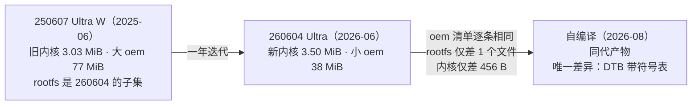
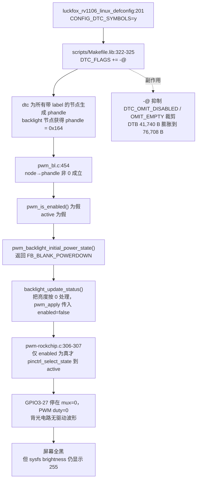
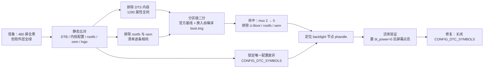

# Luckfox Pico Ultra（eMMC）480×480 RGB 屏点亮：对齐官方 260604 设计规格（Design Spec）

- **日期**：2026-08-23
- **状态**：根因已在实体板上以 A/B 对照闭环验证（§4.2 证据 B、C）；修复方案已实施，设备树层面的正确性已用离线重编逐字节验证（§4.2 证据 F、§6.2），并已完成整机端到端验证
- **分支**：`cursor/luckfox-pico-ultra-emmc-rgb-align-260604`（起点 `dev`）
- **主题**：修复自编译固件在 LP40-480480-ARK RGB 屏上「无背光、全黑」的缺陷，使行为对齐官方 `Luckfox_Pico_Ultra_eMMC_260604`
- **关联代码文件**：`sysdrv/source/kernel/arch/arm/configs/luckfox_rv1106_linux_defconfig`（第 201 行 `CONFIG_DTC_SYMBOLS`）
- **关联计划**：[`docs/superpowers/plans/2026-08-23-luckfox-pico-ultra-emmc-rgb-align-260604.md`](../plans/2026-08-23-luckfox-pico-ultra-emmc-rgb-align-260604.md)

---

## 1. 概述与目标

本仓库 CI 产出的 Luckfox Pico Ultra（eMMC / Buildroot）固件刷入实体板后，官方 LP40-480480-ARK 480×480 RGB 屏**完全不亮**（无背光、无开机画面），而官方预编译固件在同一块板、同一根 FFC、同一块屏上**正常点亮**。本 spec 记录根因定位的结论与依据，并给出修复方案。

**目标**：自编译固件在 Ultra（eMMC）+ LP40-480480-ARK 组合下，执行 `luckfox-config rgb_switch` 后达到与官方 260604 一致的表现——背光点亮、480×480 出画面、`modetest` 可正常设置模式。

**非目标**：镜像字节级对齐官方（官方固件由 Luckfox 内部源码构建，公开仓库无法复现）；720×720 屏回归验证（手上无该屏，列为已知未验证项）；把显示回归纳入 GitHub Actions CI（需物理板，托管 runner 做不到）。

## 2. 背景

### 2.1 硬件与固件

实体板为 Luckfox Pico Ultra W（eMMC），屏为官方 LP40-480480-ARK 套件（含转接板）。参与对比的三份固件见 §3。自编译使用 `BoardConfig-EMMC-Buildroot-RV1106_Luckfox_Pico_Ultra-IPC.mk` + `luckfox_pico_w_defconfig` + `rv1106g-luckfox-pico-ultra.dts`，由本仓 GitHub Actions 产出。

### 2.2 故障现象与迷惑点

屏幕全黑，但软件层面所有指标都「正常」，这是排查耗时的主因：

- `/sys/class/backlight/backlight/brightness` 读数 **255 / 255**
- DRM 连接器 `card0-DPI-1` 为 **connected / enabled**
- `modetest -M rockchip -s 70@66:480x480` 报告 **`setting mode 480x480-59.94Hz` 成功**
- `/etc/luckfox.cfg` 中 480×480 时序完全正确，live DT 中 `hactive=0x1e0`、`pixelclk-active=1`、`linux,cma=disabled` 均已生效

唯一异常信号是背光 PWM 引脚 **GPIO3-27 停在 mux=0（GPIO）**，官方固件上是 mux=2（PWM）。但手动 `iomux 3 27 2` 强制切换后屏幕**依然全黑**，导致引脚复用一度被当作无关线索——它实际是根因的下游症状，单独纠正引脚模式而 PWM 本身未使能（duty 恒为 0）并不足以点亮，详见 §4.1。

## 3. 三份镜像全量对比

| 代号 | 产物 | 定位 |
| --- | --- | --- |
| **250607** | `Luckfox_Pico_Ultra_W_EMMC_250607` | 官方 Ultra W eMMC，2025-06-09 |
| **260604** | `Luckfox_Pico_Ultra_eMMC_260604` | 官方 Ultra eMMC，2026-06-04；**本 spec 的对齐基准** |
| **自编译** | 本仓 CI `BUILD-ID cd1c4a7cf2cb` | 当前 `dev` 分支产物，2026-08-21 |

> 本章所有文件级数据均由解析 ext4 目录树得到，二进制结构数据由解析 FIT / RSCE 头得到。**不要用 `strings | grep` 一类启发式做计数**：它会把二进制内嵌的名字字符串重复计入，在同一批镜像上给出的 `.ko` 数是 114 / 79（真实值 41 / 29）、`.so` 数是 ~654（真实值 27），误差达数量级。
>
> 计数口径：「条目数」= 文件数 + 目录数；`.ko` 数按后缀 `.ko` 统计；`.so` 数按「以 `.so` 结尾或含 `.so.N`」统计（只数 `.so` 结尾会漏掉带版本号的软链与实体，例如 rootfs 会从 998 掉到 708）。

### 3.1 分区镜像

| 分区 | 250607 | 260604 | 自编译 | 说明 |
| --- | ---: | ---: | ---: | --- |
| `env.img` | 32,768 B | 32,768 B | 32,768 B | **三者 SHA256 完全相同**（`2938e689…`） |
| `idblock.img` | 188,416 B | 188,416 B | 188,416 B | 体积同，内容不同 |
| `download.bin` | 268,736 B | 268,736 B | 268,736 B | 体积同，内容不同 |
| `uboot.img` | 262,144 B | 262,144 B | 262,144 B | 体积同，内容不同 |
| `boot.img` | 3,300,864 B | 3,793,408 B | 3,862,528 B | 详见 §3.3 |
| `oem.img` | 81,195,008 B | 39,763,968 B | 39,763,968 B | 260604 与自编译**体积完全相同** |
| `rootfs.img` | 415,162,368 B | 423,559,168 B | 423,493,632 B | — |
| `userdata.img` | 9,999,360 B | 9,999,360 B | 9,999,360 B | 体积同，SHA256 三者互不相同 |
| `update.img` | 510,685,770 B | 478,145,098 B | 478,147,146 B | 260604 与自编译**仅差 2,048 B** |
| ext4 已用（oem） | 77.4 MiB | 37.9 MiB | 37.9 MiB | 由 ext4 超级块 `blocks − free` 算得 |
| ext4 已用（rootfs） | 264.3 MiB | 272.3 MiB | 272.3 MiB | 同上 |

分区布局三者一致：`32K(env),512K@32K(idblock),256K(uboot),32M(boot),512M(oem),256M(userdata),6G(rootfs)`，依次对应 `p1`～`p7`。判定依据是承载分区表的 `env.img` 三者 SHA256 相同；官方两份另附的 `.env.txt` 亦逐字节一致，CI 产物不含该文件，其布局取自 `build_info.txt` 的 `RK_PARTITION_CMD_IN_ENV`，与官方 `blkdevparts` 逐字符相同。

### 3.2 版本与构建信息

| 项目 | 250607 | 260604 | 自编译 |
| --- | --- | --- | --- |
| 内核版本串 | `#13 Mon Jun 9 17:15:47 CST 2025` | `#2 Thu Jun 4 15:51:40 CST 2026` | `#1 Fri Aug 21 15:52:40 CST 2026` |
| 构建者 | `hxj@luckfox-System-Product-Name` | `xt@luckfox-System-Product-Name` | `root@cd1c4a7cf2cb`（CI 容器） |
| 内核 | 5.10.160 | 5.10.160 | 5.10.160 |
| 交叉工具链 | gcc 8.3.0 / ld 2.32（crosstool-NG 1.24.0） | 同左 | 同左 |
| U-Boot（`androidboot.fwver`） | `uboot-06/09/2025` | `uboot-06/04/2026` | `uboot-08/21/2026` |
| Buildroot | 2023.02.6 | 2023.02.6 | 2023.02.6 |

三者**交叉工具链完全一致**，可据此排除工具链差异。内核版本串与工具链版本由 `boot.img` FIT 中 XZ 压缩的内核解压后静态读取，与 ADB 运行时读数吻合；U-Boot 一行的运行时读数亦与 `idblock.img` 内 SPL 自报的构建时间戳吻合（`Jun 09 2025` / `Jun 04 2026` / `Aug 21 2026`），可离线复核。

### 3.3 `boot.img` 内部结构

| 项目 | 250607 | 260604 | 自编译 |
| --- | ---: | ---: | ---: |
| FIT `images` 子节点 | `fdt` / `kernel` / `resource` | 同左 | 同左 |
| **FIT 内 `fdt` 节点数** | **1** | **1** | **1** |
| DTB 体积 | 41,785 B | 41,740 B | **76,708 B** |
| kernel 偏移 / 体积（XZ 压缩后） | `0xac00` / 3,175,432 B | `0xac00` / 3,668,376 B | `0x13400` / 3,667,920 B |
| resource 偏移 / 体积 | `0x312200` / 79,872 B | `0x38a600` / 79,872 B | `0x392c00` / 114,688 B |

`resource` 段是 Rockchip 的 RSCE 容器，三者都恰好包含 3 个条目：

| 条目 | 250607 | 260604 | 自编译 |
| --- | ---: | ---: | ---: |
| `rk-kernel.dtb` | 41,785 B | 41,740 B | 76,708 B |
| `logo.bmp` | 12,936 B | 12,936 B | 12,936 B |
| `logo_kernel.bmp` | 22,364 B | 22,364 B | 22,364 B |

**两张 logo 在三份固件中 SHA256 完全相同**——开机画面资源没有任何差异。三份固件各自的 `rk-kernel.dtb` 与同一固件 FIT 内的 `fdt` **SHA256 相同**，是供 U-Boot 早期阶段自行解析（画 logo、读 panel 时序）的同一份 DTB 副本，而非第二套可切换配置（详见 §10 Q13）。

整个 `boot.img` 的布局完全由 DTB 体积推导，三份镜像逐一验证均严格吻合，因此 DTB 一旦缩回官方尺寸，布局会自动对齐，无需改动打包脚本：

- FIT 头占 `0x800`，`fdt` 固定从 `0x800` 起；`kernel` 与 `resource` 依次按 512 字节块对齐顺延；文件末尾固定补 1,024 字节零。
- `resource` 体积由 RSCE 内部排布决定：头 1 块 + 3 个条目表各 1 块，之后每个文件按 512 字节块对齐，即 `4 + ⌈DTB/512⌉ + ⌈12936/512⌉ + ⌈22364/512⌉` 块。官方 DTB 得 `4 + 82 + 26 + 44 = 156` 块（79,872 B），自编译 DTB 得 `4 + 150 + 26 + 44 = 224` 块（114,688 B）。

### 3.4 设备树关键属性

| 属性 | 250607 | 260604 | 自编译 |
| --- | --- | --- | --- |
| `model` | `Luckfox Pico Ultra W` | `Luckfox Pico Ultra` | `Luckfox Pico Ultra` |
| `__symbols__` | 无 | 无 | **有** |
| **`backlight` 节点 phandle** | **无** | **无** | **有（`0x164`）** |
| `route-rgb` 节点 | 已裁剪 | 已裁剪 | 保留（`status = "disabled"`） |
| 出厂 panel | 720×720 | 720×720 | 720×720 |
| `pixelclk-active`（出厂） | 0 | 0 | 0 |
| `linux,cma`（出厂） | `okay` | `okay` | `okay` |
| backlight `pwms` | `<&pwm1 0 0x186a0 0xc350>` | 同左 | 同左 |

- **两份官方设备树几乎是同一份**：节点集合完全相同（各 293 个），1290 个共有属性中只有 `model` 一项取值不同，另有 250607 独有的 `/wireless-bluetooth` 属性 `BT,wake_host_irq`（蓝牙唤醒中断，与显示无关）。
- **260604 是自编译设备树的子集**：1290 个共有属性取值**全部相同**，官方不存在自编译没有的属性；自编译单方面多出 170 个节点（293 → 463）与 869 个属性，其中包括会改变 `pwm_bl` 初始状态的 `backlight` 节点 `phandle = <0x164>`，以及 `__symbols__` 本体、234 个额外 `phandle`、因符号表而免于裁剪的未引用 / 已 disabled 节点（`route-rgb` 即在其中），拆解见 §6.2。
- 出厂三者都是 720×720；480 时序由 `luckfox-config rgb_switch` 在运行时以 overlay 原地改写，与固件出厂内容无关。

### 3.5 rootfs

| 项目 | 250607 | 260604 | 自编译 |
| --- | ---: | ---: | ---: |
| 条目数 / 文件数 | 4,182 / 3,864 | 4,859 / 4,531 | 4,858 / 4,530 |
| `.so` 数 | 847 | 998 | 998 |
| `/usr/bin/luckfox-config` | 113,078 B | 117,624 B | 117,624 B |
| `/usr/bin/luckfox_switch_rgb_resolution` | 5,360 B | 5,360 B | 5,360 B |
| `/etc/init.d/S99luckfoxconfigload` | 406 B | 166 B | 166 B |
| `/etc/init.d/S99luckfoxcustomoverlay` | 5,828 B | 5,828 B | 5,828 B |
| bluez 用户态 | 有 | 有 | 有 |

- **260604 与自编译只差 1 个文件**：自编译缺 `/bin/zless`，其余 4,858 条路径逐条相同。
- **260604 的 rootfs 是 250607 的严格超集**：仅 260604 有 677 条、仅 250607 有 0 条，新增 dhcpcd、xtables、ca-certificates 等。
- 260604 与自编译 rootfs 内的 `/usr/bin/luckfox-config` 与 `/etc/init.d/S25backlight` 同本仓 overlay 源文件**逐字节相同**（板上取回的副本亦然），rootfs 侧不存在被改动的脚本。250607 的 `luckfox-config` 是更早的 113,078 B 版本，`S25backlight` 则与另两份完全相同。

### 3.6 oem

| 项目 | 250607 | 260604 | 自编译 |
| --- | ---: | ---: | ---: |
| 条目数 / 文件数 / 目录数 | 345 / 321 / 24 | 204 / 192 / 12 | 204 / 192 / 12 |
| `.ko` 数 | 41 | 29 | 29 |
| `.so` 数 | 27 | 27 | 27 |
| WiFi 固件文件数 | 63 | 21 | 21 |
| `/usr/bin/modetest` | 有 | 有（54,936 B） | 有 |
| `/usr/ko/pwm_bl.ko` | 有 | 有（10,056 B） | 有 |
| 蓝牙模块 | `aic8800_bsp` / `_fdrv` / `_btlpm` | 同左 | 同左 |

- **260604 与自编译的 oem 文件路径清单逐条完全一致**（204 个条目全同）。
- **250607 多出 132 个文件**（另多 12 个目录）：`/usr/share/iqfiles/` 下的 ISP IQ 标定 76 个、`/usr/ko/aic_fw/` 下 AIC8800 三个变体（8800 / 8800DC / 8800D80）固件 42 个、其它 WiFi 芯片驱动及其依赖模块（`8188fu` / `8189fs` / `atbm6041` / `ssv6x5x` / `cmac` / `libaes` 等）14 个，`76 + 42 + 14 = 132`。这是**多机型通用打包**，不是 Ultra W 的专属能力。260604 反向多出 3 个（`imx415.ko` / `mia1321.ko` / `rkipc-mia1321-100w.ini`）。
- 「WiFi 固件文件数」只计 `*_fw/` 目录下的文件：250607 为 `aic_fw/` 42 个加 `aic8800dc_fw/` 21 个，另两份只有 `aic8800dc_fw/` 21 个。

### 3.7 三者亲缘关系与基准选择



选 **260604** 而非 250607 作为对齐基准：它与自编译同源同代、差异面最小，而 250607 是更旧的大包，当基准会引入大量与本缺陷无关的噪音。**260604 虽不带 W 但蓝牙能力完备**（三份固件的 BT 内核模块与用户态齐备，板上实测 `hci0 UP RUNNING`），以它对齐不损失功能。

## 4. 根因（已实测闭环）

### 4.1 因果链



关键在于 `pwm_bl` 的这段判定——它把「backlight 节点有 phandle」理解为「有别的驱动会在合适时机点亮背光」，于是自己保持熄灭。但在 RGB panel 这条链路上，并不存在那个会主动点亮它的驱动。

`sysdrv/source/kernel/drivers/video/backlight/pwm_bl.c:453-463`：

```c
	/* Not booted with device tree or no phandle link to the node */
	if (!node || !node->phandle)
		return FB_BLANK_UNBLANK;

	/*
	 * If the driver is probed from the device tree and there is a
	 * phandle link pointing to the backlight node, it is safe to
	 * assume that another driver will enable the backlight at the
	 * appropriate time. Therefore, if it is disabled, keep it so.
	 */
	return active ? FB_BLANK_UNBLANK: FB_BLANK_POWERDOWN;
```

而 Rockchip PWM 驱动只在 PWM 被真正 enable 时才应用 `"active"` 引脚状态（注意 DT 里 `pwm@ff350010` 的 `pinctrl-names` 是 `"active"` 而非 `"default"`，因此内核 probe 阶段不会自动 mux）——`sysdrv/source/kernel/drivers/pwm/pwm-rockchip.c:306-307`：

```c
	if (state->enabled)
		ret = pinctrl_select_state(pc->pinctrl, pc->active_state);
```

这解释了此前两个反直觉现象：手动 `iomux 3 27 2` 无效，是因为引脚模式虽对但 PWM 未 enable、duty 恒为 0；`echo 255 > brightness` 无效，是因为 `props.power != FB_BLANK_UNBLANK` 时 `pwm_bl` 直接按 0 亮度处理。

### 4.2 实测证据

**证据 A —— `backlight` 节点 phandle 差异**（见 §3.4）：两份官方固件的 `backlight` 节点均无 `phandle` 属性，自编译为 `phandle = <0x164>`。

**证据 B —— 分区级 A/B 对照，唯一变量是 boot 分区**。在同一块板上，保持官方 260604 的 U-Boot / rootfs / oem 不动，只用 `dd` 往 `/dev/mmcblk0p4` 轮换写入两份 `boot.img`，各自冷启动后不做任何干预即采样：

| 冷启动后原始状态 | 自编译 `boot.img` | 官方 260604 `boot.img` |
| --- | --- | --- |
| 内核版本串 | `#1 Fri Aug 21 15:52:40 CST 2026` | `#2 Thu Jun 4 15:51:40 CST 2026` |
| `androidboot.fwver`（未变量） | `uboot-06/04/2026` | `uboot-06/04/2026` |
| live DT `backlight` 的 `phandle` | `00 00 01 64` | **该属性不存在** |
| `bl_power` | 4（`FB_BLANK_POWERDOWN`） | **0（`FB_BLANK_UNBLANK`）** |
| `iomux 3 27` | 0（GPIO） | **2（PWM）** |
| `/sys/kernel/debug/pwm` | `duty: 0 ns` | **`requested enabled … duty: 100000 ns`** |
| 分辨率 | 480×480 | 480×480 |
| 屏幕 | 全黑 | **自动点亮** |

其余观测量在两侧完全一致：`brightness` 均为 255 / 255、DRM 连接器 `card0-DPI-1` 均为 connected / enabled、`/etc/luckfox.cfg` 480 时序不变、live DT 的 `hactive=0x1e0` / `pixelclk-active=1` / `linux,cma=disabled` 不变、`hci0` 均 UP RUNNING。**唯一变量是 boot 分区，唯一设备树差异是 `backlight` 有无 phandle，结果一一对应**；U-Boot、rootfs、oem 三者据此排除。

该实验的前提「内核与模块可跨版本互换」已先行核实：两边 `CONFIG_MODVERSIONS`、`CONFIG_MODULE_SIG` 均关闭、`CONFIG_LOCALVERSION=""`，三份固件 `oem` 内 `pwm_bl.ko` 的 vermagic 逐字符相同（`5.10.160 mod_unload ARMv7 thumb2 p2v8`，版本段无 `LOCALVERSION` 后缀），因此官方 `pwm_bl.ko` 在自编译内核上正常加载，不构成干扰。

**证据 C —— 在故障态下直接验证因果**。不重编任何东西，仅执行 `echo 0 > /sys/class/backlight/backlight/bl_power`（把 `props.power` 强制置为 `FB_BLANK_UNBLANK`，即绕过 §4.1 中那个错误判定）：

```
写入前：bl_power = 4   duty: 0 ns          iomux 3 27 = 0
写入后：bl_power = 0   requested enabled   duty: 100000 ns   iomux 3 27 = 2
```

**屏幕随即点亮并显示待机画面**（现场确认）。该操作不持久，断电重插后 `bl_power` 自动回到 4、屏幕重新全黑，再写一次 0 又能点亮——整条因果链在完整冷启动后可反复重放。

**证据 D —— defconfig 显式项的差异面只有一项**。本仓 `luckfox_rv1106_linux_defconfig`（498 项）加 `rv1106-bt.config` 片段（7 项）共显式列出 505 个配置项，逐项对照官方运行中的 `/proc/config.gz`，**仅 `CONFIG_DTC_SYMBOLS` 一项不同**（我们 `=y`，官方未设置），其余 504 项完全一致。

需要注意比对范围：官方 `/proc/config.gz` 展开后共 4,283 项，本比对只覆盖 defconfig 显式列出的 505 项；余下由 Kconfig 默认值推导的项未逐项核对。不过与显示链路直接相关的默认项已单独确认一致——两边 `CONFIG_DTC_OMIT_DISABLED` / `CONFIG_DTC_OMIT_EMPTY` / `CONFIG_ROCKCHIP_MINI_KERNEL` 均为 `y`，`CONFIG_BACKLIGHT_PWM` 均为 `m`。

**证据 E —— 第二份官方固件独立交叉验证**。250607 由另一位构建者、早一年构建，其 DTB 同样没有 `__symbols__`、`backlight` 节点同样没有 phandle，也同样能点亮同一块 480 屏。两份来源相互独立的官方固件在这一点上完全一致，而三者中唯一带 phandle 的自编译固件是唯一点不亮的，构成完整对照。这条证据同时说明缺陷与 Ultra / Ultra W 机型无关。

**证据 F —— 离线重编直接验证修复本身**。用内核自带 dtc 从本仓 DTS 源码编译，加 `-@` 与去掉 `-@` 的产物分别与自编译固件、官方 260604 固件内的 DTB **逐字节相同**（数据见 §6.2）。前五条证据指认根因，这一条则证明所选修复确实能消除根因：不必构建整个内核，就已确认改掉那一行之后本仓源码产出的设备树与官方完全一致。

## 5. 修复方案

### 5.1 方案 A（本期实施）

`sysdrv/source/kernel/arch/arm/configs/luckfox_rv1106_linux_defconfig` 第 201 行：

```diff
-CONFIG_DTC_SYMBOLS=y
+# CONFIG_DTC_SYMBOLS is not set
```

同一区块的 `CONFIG_OF_OVERLAY=y` / `CONFIG_OF_DTBO=y` **保持不动**（官方同样开启，`luckfox-config` 的运行时 overlay 依赖它们）。改动后 `backlight` 节点不再被分配 phandle，`pwm_backlight_initial_power_state()` 走 `FB_BLANK_UNBLANK` 分支，开机即点亮背光；设备树层面已用离线重编逐字节验证（§4.2 证据 F），CI 三组合编译与实体板整机端到端验证均已完成。

### 5.2 方案 B（已批准，本期不实施）

在 `project/cfg/BoardConfig_IPC/overlay/overlay-luckfox-buildroot-rgb/etc/init.d/S25backlight` 中，于 `insmod pwm_bl.ko` 之后补 `echo 0 > /sys/class/backlight/backlight/bl_power`，用启动脚本补偿背光初始状态。

**触发条件**：仅当方案 A 因不可预见原因无法落地（例如关闭 `DTC_SYMBOLS` 引发其它回归且短期无法解决）时才启用。方案 B 治标不治本——它绕过错误判定而非消除它，且只覆盖 Buildroot rootfs，因此不作为首选。

## 6. `CONFIG_DTC_SYMBOLS` 与 `-@` 详解

### 6.1 这个开关做什么

`CONFIG_DTC_SYMBOLS` 是 Rockchip 在内核里加的选项，`sysdrv/source/kernel/drivers/of/Kconfig:15-20`：

```
config DTC_SYMBOLS
	bool "Enable dtc generation of symbols for overlays support"
	depends on DTC && ARCH_ROCKCHIP
	help
	  Set DTC_FLAGS += -@
	  Android OS must enable this option.
```

它唯一的作用是给设备树编译器加 `-@`，`sysdrv/source/kernel/scripts/Makefile.lib:322-325`：

```make
# Generation of symbols for Android
ifeq ($(CONFIG_DTC_SYMBOLS),y)
DTC_FLAGS += -@
endif
```

`-@` 是 dtc 自身的开关（长选项 `--symbols`，见 `scripts/dtc/dtc.c:69`），语义是：在 DTB 根节点下生成 `__symbols__` 节点，把所有带 label 的节点记录成「标签名 → 完整路径」查找表；对 `/plugin/` overlay 还会生成 `__fixups__` / `__local_fixups__`。它存在的唯一理由是支持**标签式 overlay**——overlay 里写 `target = <&i2c1>` 时，内核 OF resolver 需要查这张表，否则报 `OF: resolver: no symbols in root of device tree`。

### 6.2 为什么它同时让 DTB 膨胀

Rockchip 另有两个精简选项，同在 `drivers/of/Kconfig`：

| 选项 | 作用 | dtc 参数 | 默认值 |
| --- | --- | --- | --- |
| `DTC_OMIT_DISABLED` | 删除未被引用且 `status = "disabled"` 的节点 | `-Wnode_disabled` | `= ROCKCHIP_MINI_KERNEL` |
| `DTC_OMIT_EMPTY` | 删除空节点 | `-Wnode_empty` | `= ROCKCHIP_MINI_KERNEL` |

我们与官方都是 `CONFIG_CPU_RV1106=y` → `ROCKCHIP_MINI_KERNEL` 默认 `y` → 这两项两边都开着（官方 `/proc/config.gz` 里两项均为 `y`）。但自编译 DTB 里 `route-rgb`（`status = "disabled"`）等节点仍在，官方的被删干净——因为 `-@` 与裁剪在实现上直接冲突，`scripts/dtc/checks.c` 的 `fixup_omit_unused_nodes()` 开头就是「若开了符号表且该节点有 label 则直接返回」，于是所有带 label 的节点一律免删，两个 OMIT 选项形同失效。

用内核自带 dtc（含上述 Rockchip 补丁；`-Wnode_disabled` / `-Wnode_empty` 是它的私有检查，上游 dtc 直接报 `Unrecognized check name`）对 `rv1106g-luckfox-pico-ultra.dts` 做三组编译，即可把差异完整拆开。下表只列关键参数，其余 `-b 0` / `-i` / `-Wno-*` 按 `scripts/Makefile.lib` 原样给出：

| 关键 dtc 参数 | DTB 体积 | 节点数 | 说明 |
| --- | ---: | ---: | --- |
| `-@ -Wnode_disabled -Wnode_empty` | 76,708 B | 463 | 当前 CI 配置；产物 SHA256 与 CI `boot.img` 内 `fdt` 完全相同，可证复现流程等价 |
| `-Wnode_disabled -Wnode_empty` | 41,740 B | 293 | 关闭 `DTC_SYMBOLS` 后的形态；产物 SHA256 与官方 260604 的 DTB 完全相同 |
| 三个参数都不加 | 44,351 B | 312 | 仅用于把两类效应分离的中间量 |

据此得到两部分贡献：

| 组成 | 字节数 | 算式 |
| --- | ---: | --- |
| `__symbols__` 节点（365 条）、`-@` 多分配的 233 个 `phandle`（本行口径为同一节点集合内；§3.4 以官方 DTB 为基准计 234 个，差的 1 个在下一行被裁剪的节点上），以及 150 个因带 label 而免于 `/omit-if-no-ref/` 删除的 pinctrl 节点 | 32,357 | 76,708 − 44,351 |
| 被 `-@` 挡住、未能由两个 OMIT 选项删除的 19 个 disabled / empty 节点（`route-rgb` 在其中） | 2,611 | 44,351 − 41,740 |
| 合计 | **34,968** | 76,708 − 41,740 |

**这一个开关解释了全部 DTB 差异**：关掉它之后，本仓源码编出的 DTB 与官方 260604 的 DTB 逐字节相同（SHA256 `60e69283…`），463 个节点也收敛回官方的 293 个。

### 6.3 关闭它是否安全，是否该「开发开、生产关」

本仓随固件出货的 `luckfox-config`（19 段 `/plugin/;`、共 29 处目标节点引用）与 `S99luckfoxcustomoverlay` 内置段（1 段、1 处）全部使用路径式 `&{/syscon@ff000000/rgb}` 写法，标签式 `&label` 出现 **0** 次。内核树里 `drivers/of/unittest-data/` 下确有用标签式 target 的 overlay，但那要 `CONFIG_OF_UNITTEST` 才编译，两边都未开启。路径式 overlay 不依赖符号表，但仍依赖 target 路径在裁剪后存在；核查时应对每个板型分别编译带 `-@` 与不带 `-@` 的两组 DTB，反编译后 diff 节点路径集合，再将被裁剪路径与 overlay target 清单逐项比对。`S99luckfoxcustomoverlay` 的 `luckfox_load_dynamic_dts()` 还会遍历 `/mnt/cfg/dtbo/*.dts`，允许用户编译并经 configfs 加载自定义 overlay；用户自定义的标签式 `target = <&i2c3>` 会因根 DTB 无符号表而报 `OF: resolver: no symbols in root of device tree`，这与官方固件行为一致。路径式 target 及其路径存在性均已满足，因此官方固件关闭符号表后 `rgb_switch`、`pwm`、`i2c`、`spi`、`uart`、`sdmmc` 等功能仍全部可用。

**不采用「开发开、生产关」的分离策略**，理由有二：其一，本次缺陷本身就属于「自编译与官方构建差异」这一类，再人为引入一类「dev 与 prod 的 DTB 不同」只会增加同类风险；其二，`rgb_switch` 会原地改写 boot 分区的 FDT，改写后剩余的安全余量直接取决于 DTB 体积（官方 240 字节 vs 自编译 88 字节，口径见 §9），dev/prod 用不同余量意味着开发机上通过、生产上未必。两份来源独立的官方固件均未开启符号表且功能全部可用，是此选择的主要实证依据；`luckfox_rv1106_linux_tb_defconfig` 是未开启 `CONFIG_OF_OVERLAY` / `CONFIG_OF_DTBO` 的 FASTBOOT 精简配置，其未开启符号表仅可作旁证。若将来确需标签式 overlay 做临时调试，单独执行下面这条即可，无需改 defconfig：

```bash
make ARCH=arm CROSS_COMPILE=arm-rockchip830-linux-uclibcgnueabihf- DTC_FLAGS=-@ dtbs
```

### 6.4 影响半径

`luckfox_rv1106_linux_defconfig` 被 **13 个 BoardConfig 共用**（Pico / Mini / Plus / WebBee / Pro Max / Ultra / Zero / Pi / 86Panel，横跨 SD_CARD、SPI_NAND、EMMC），因此这处改动是全板级的：

- **显示相关的受影响面很窄**：Luckfox 板型的 dts / dtsi 中只有 `rv1106-luckfox-pico-ultra-ipc.dtsi` 与 `rv1106-luckfox-pico-86panel-ipc.dtsi` 带有 label 化的 `backlight:` 节点（`arch/arm/boot/dts` 下另有大量 Rockchip 通用 EVB 文件也带该节点，但它们不被上述任何 BoardConfig 引用），即只有 Ultra 与 86Panel 会走到本 spec 描述的 phandle 判定路径。86Panel 应同样受益，但无实物、不做验证承诺。
- **其余板型不含 `backlight` 节点，不走 `pwm_bl` 判定路径**；其中 Mini、Plus、WebBee、Pico、Pi、Pro Max、Zero 的 `/syscon@ff000000/rgb` 节点会随 disabled 且未被引用的子树一并裁剪。`luckfox-config` 的 RGB 入口按板型门禁，只有 `Luckfox Pico Ultra` 与 `Luckfox Pico Ultra W` 显示高级选项菜单中的 `7 "RGB"`，命令行 `luckfox-config rgb_switch` 对非 Ultra 机型报 `This Luckchip Pico Model does not support RGB switch.`，因此这 7 个板型没有指向该节点的可达路径，也无功能影响。

| 板型 DTS | 带 `-@` | 不带 `-@` | `rgb` 节点 |
| --- | ---: | ---: | --- |
| `rv1103g-luckfox-pico-mini` | 72,514 B | 36,136 B | 被裁剪 |
| `rv1103g-luckfox-pico-plus` | 72,526 B | 36,148 B | 被裁剪 |
| `rv1103g-luckfox-pico-webbee` | 72,428 B | 36,050 B | 被裁剪 |
| `rv1103g-luckfox-pico` | 73,988 B | 37,040 B | 被裁剪 |
| `rv1106g-luckfox-pico-pi` | 73,668 B | 38,484 B | 被裁剪 |
| `rv1106g-luckfox-pico-pro-max` | 72,713 B | 36,749 B | 被裁剪 |
| `rv1106g-luckfox-pico-zero` | 74,444 B | 39,020 B | 被裁剪 |
| `rv1106g-luckfox-pico-86panel` | 73,199 B | 37,591 B | 保留 |
| `rv1106g-luckfox-pico-ultra` | 76,708 B | 41,740 B | 保留 |

- **CI 三个组合都会重编**（Pico Max SD_CARD、Pico Max SPI_NAND、Ultra EMMC），三者编译全绿是构建级验收条件之一。

## 7. 产物变化（CI 实测）

| 项目 | 修复前（自编译） | 修复后（CI 实测） | 官方 260604 |
| --- | ---: | ---: | ---: |
| DTB 体积 | 76,708 B | 41,740 B | 41,740 B |
| kernel 偏移 | `0x13400` | `0xac00` | `0xac00` |
| resource 体积 | 114,688 B | 79,872 B | 79,872 B |
| `boot.img` 总体积 | 3,862,528 B | 3,793,408 B | 3,793,408 B |

四项均已用 CI run `32616072092` 的 Ultra EMMC 产物核对：DTB 为 41,740 B 且与官方逐字节相同（§6.2），`kernel` 偏移为 `0xac00`，resource 为 79,872 B，`boot.img` 总体积为 3,793,408 B。实际 kernel 为 3,668,136 B，按 512 字节对齐后 resource 从预推的 `0x38a400` 顺延至 `0x38a600`，最终总体积比计划预推值多 512 B，并与官方 260604 完全一致；完整输出见 plan「验证证据」。

升级时推荐使用 `update.img` 整包升级，使 rootfs 中 `RGB_HACTIVE` 与 boot 分区 DTB 的分辨率同步回到出厂 720×720；若只单刷 `boot.img`，配置仍记着 480×480 而 DTB 为 720×720 时，第一次 `rgb_switch` 会走「480 → 720」分支，需要执行两次才能回到 480×480。本改动使 `rgb_switch` 原地改写 FDT 的安全余量从 88 字节恢复至官方的 240 字节。

## 8. 验证方案

**构建级判据**：CI 三个组合全部编译成功，`./build.sh` 退出码 0 且 `IMAGE/` 下产生新存档。

**板级判据**：Ultra EMMC 固件刷入实体板后执行 `luckfox-config rgb_switch` + 重启，达成以下全部条件——

| 检查项 | 期望值 | 采集命令 |
| --- | --- | --- |
| 背光电源状态 | `bl_power = 0` | `cat /sys/class/backlight/backlight/bl_power` |
| PWM 已使能 | `requested enabled … duty: 100000 ns` | `cat /sys/kernel/debug/pwm` |
| 背光引脚复用 | `mux get (GPIO3-27) = 2` | `iomux 3 27` |
| DTB 中无 phandle | `/sys/firmware/devicetree/base/backlight/` 下**不含** `phandle` | `ls /sys/firmware/devicetree/base/backlight/` |
| DTB 体积 | 41,740 B | 解析 `boot.img` FIT 头 `fdt/data-size` |
| 分辨率 | `480x480 … 16500` | `modetest -M rockchip` 输出的 `#0` 行 |
| **屏幕实际表现** | **背光亮 + 出画面**（人工确认，不可省略） | 目视 |

最后一项必须人工确认：本次排查已充分说明「软件层全绿」与「屏幕真的亮」是两回事，`modetest` 成功不能作为点亮的证据。

**已知未验证项**：其一，720×720 屏在修复后的行为——理论上该改动只影响 `backlight` 节点是否带 phandle、与分辨率无关，但手上无该屏；其二，86Panel 板型的实际表现，无实物。

## 9. 排除项：曾被怀疑并已证伪

这些结论来自实测，记录在此以免日后重复调查：

| 曾经的怀疑 | 证伪依据 |
| --- | --- |
| DTS 内容有差异（`model` / 时序 / CMA） | 1290 个共有属性取值全部相同（§3.4） |
| `model` 必须是 `"Luckfox Pico Ultra W"` | 260604 的 `model` 是 `"Luckfox Pico Ultra"`，照样点亮；它与 250607 的设备树只差这一个字符串 |
| `route_rgb` 需要改成 `okay` | 官方是把该节点整个裁掉（等价于 disabled），我们是保留并标记 disabled，两者语义一致 |
| 官方 `boot.img` 内有「480 + 720 双 DTB」 | 三份固件的 FIT 都只有 1 个 `fdt` 节点；被误认作第二套的 `offset 3222016` 是 `resource` 内的 `rk-kernel.dtb` 副本（§10 Q13） |
| 自编译无开机 logo 是 logo 资源或 `route_rgb` 的问题 | 两张 logo 三份固件 SHA256 完全相同（§3.3）；看不到是因为背光根本没亮 |
| 自编译的 480 时序 / CMA 改不到位 | `rgb_switch` 的两个 overlay 在两边都能正确应用（§2.2） |
| `rgb_switch` 写回 FDT 时溢出覆盖内核 | `luckfox-config` 的溢出判据是「`kernel` 偏移 − `fdt` 偏移」是否小于改写后的 DTB，该空间官方为 41,984 B、自编译为 76,800 B；本地跑 `fdtoverlay` 实测两个 overlay 合计只让 DTB 增长 **4 字节**（三份 DTB 上均为 4），改写后分别仍余 240 B 与 88 B，均未溢出 |
| Buildroot 未打包 `luckfox_switch_rgb_resolution` | 三份 rootfs 都有该文件，且都是 5,360 B |
| U-Boot 的 `rv1106-luckfox-rgb-reset.config`（`CONFIG_LUCKFOX_EXECUTE_CMD` → `gpio set 1 1`） | 二分第 1 轮保持官方 U-Boot 不变即复现故障，与 U-Boot 无关 |
| 250607 的大 `oem`（77.4 MiB）是 Ultra W 专属能力 | 多出的 132 个文件是 ISP IQ 标定与多款 WiFi 芯片固件/驱动，属多机型通用打包；260604 的 rootfs 反而是 250607 的严格超集 |
| 上游有更新的提交可以拉取 | 上游 `LuckfoxTECH/luckfox-pico` 的 `main` HEAD 就是本仓的 `824b817f8`（2026-03-22），无更新的公开提交；260604 rootfs 的 `/etc/os-release` 里 `VERSION=-g824b817f8`，官方该版固件正是从这个提交构建的 |
| rootfs / oem 里的脚本被改过 | 板上取回、以及直接从 260604 与自编译 rootfs 镜像提取的 `/usr/bin/luckfox-config`（117,624 B）与 `/etc/init.d/S25backlight`（160 B），同仓库 overlay 源文件逐字节相同 |
| 硬件或 FFC 问题 | 同一硬件下官方 250607 与 260604 均能点亮 |

## 10. QA（设计决策记录）

- **Q1 成功判据**：以「屏幕实际点亮、行为与 260604 一致」为验收门槛；`boot.img` 结构 / DTB 体积对齐是同一处改动顺带达成的副产品，不单独设门槛；镜像字节级对齐不可能达成，不列入目标。
- **Q2 定位方法**：采用分区级二分实验而非「按假设改一版重编」。依据是成本比——CI 全量编译约 76 分钟且未必命中，而单轮分区替换只需 1～2 分钟。实际第 1 轮即命中。
- **Q3 修复落点范围**：允许改 SDK 源码 / BoardConfig / defconfig（方案 A）与 rootfs overlay 补偿脚本（方案 B），本期计划只实现 A。明确排除「在自编译固件里混入官方预编译分区」——那会破坏「整仓可从源码复现」这一前提。
- **Q4 覆盖范围**：仅覆盖 Ultra（eMMC）+ 480×480 屏这一条链路；720 屏因无实物列为已知未验证项；显示回归不进 CI（需物理板）。
- **Q5 / Q11 实验前提**：跳过「先复刷完整自编译确认故障仍复现」，直接以能点亮的 260604 为基线做替换实验。实践证明该取舍成立——第 1 轮替换即观测到 mux 由 2 变 0，故障当场复现。
- **Q6 二分手段与顺序**：以 260604 为基线，用 `adb push` + `dd` 在线覆盖单个分区后重启（`boot`=`p4`、`oem`=`p5`、`uboot`=`p3`、`idblock`=`p2` 均可在线写，仅 `rootfs` 需回 Maskrom）。顺序为 boot → uboot+idblock → oem → rootfs，先测 boot 是因为它是唯一已知存在实质差异的分区。实际只用了第 1 轮。
- **Q7 命中 `boot.img` 后的细分策略**：先手工拆分（互换 DTB 与内核）分清是 DTB 还是内核二进制，再动手改配置重编。实际因证据 C 直接锁定到 `backlight` 节点 phandle，无需再拆。
- **Q8 若命中 U-Boot 的处置**：先做配置级排查（重点是 `rv1106-luckfox-rgb-reset.config`），走不通再退到兜底。未触发。
- **Q9 方案 B 的表达方式**：在 spec 中单列一节并写明触发条件（见 §5.2），避免将来重新论证。
- **Q10 交付方式**：新开分支 `cursor/luckfox-pico-ultra-emmc-rgb-align-260604` 并走 PR，沿用本仓既有惯例；spec / plan 放在 PR 的最后一次提交。
- **Q12 非预期分支的统一规则**：命中 oem / rootfs 则在分区内继续细分到文件级；四轮全亮则改从反方向二分（以完整自编译为底逐个换入官方分区）；刷到无法启动则 Maskrom 全刷 260604 恢复基线。总预算为单分区 4 轮 + 分区内细分 4 轮，累计超 8 轮未定位就停下重新评估。未触发。
- **Q13 关于「双 DTB」**：分四点回答。
  - **本 SDK 与官方固件都不存在双 DTB**。三份固件的 FIT `images` 下都只有 `fdt` / `kernel` / `resource` 三个节点，`fdt` 只有一个。曾被当作「第二套 DTB」的 `offset 3222016`，实为 250607 的 `resource` 段（起始 `0x312200`）内第 4 扇区处的 `rk-kernel.dtb`，`3219968 + 2048 = 3222016` 正好吻合，且其 SHA256 与 FIT 内 `fdt` 完全相同——是同一份 DTB 的副本，作用是让 U-Boot 早期阶段能独立解析设备树以初始化显示、绘制 `logo.bmp`，而非第二套可切换配置。
  - **若真要做多 DTB，技术上有三条路**：其一，FIT 的 `configurations` 下放多个 conf，各自绑定不同 `fdt-N`，由 bootloader 依据 SoC ID / EEPROM / GPIO 选择；其二，主 DTB + 多个 `.dtbo`，U-Boot 侧 `fdt apply` 或内核侧 configfs 运行时叠加；其三，即 Luckfox 实际采用的做法——**单 DTB + 运行时原地改写**：`luckfox-config rgb_switch` 把 boot 分区的 DTB `dd` 出来，用 `fdtoverlay` 应用两个路径式 overlay（3 个 status + 13 个 timing 属性），再 `dd` 写回并同步更新 FIT 头的 `data-size` 与 sha256。
  - **当前不需要实现双 DTB**。根因是 `backlight` 节点的 phandle，与 DTB 套数完全无关；260604 单 DTB 已实测能点亮 480 屏。引入双 DTB 需要改 FIT 打包脚本、`luckfox-config` 切换逻辑与 boot 分区布局，且与上游背离，属于 YAGNI。
  - **多 DTB 的适用场景**：同一份固件要覆盖多种硬件变体、且变体**无法在运行时可靠探测**（例如同一镜像刷不同板型、不同屏幕），或变体差异大到 overlay 难以表达时，多 conf / 多 dtbo 才有价值。若差异只是少量属性（如本例的 panel 时序），overlay 更轻量、boot 分区更省、维护成本更低——这也是 Luckfox 的选择。

## 11. 附：诊断路径


