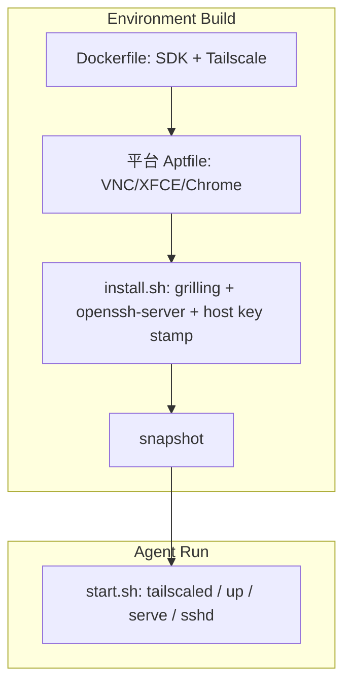

# Luckfox Pico Cloud Agent Tailscale 远程接入设计规格（Design Spec）

- **日期**：2026-08-30
- **状态**：已实施（实现 plan 见 [`2026-08-30-luckfox-cloudagent-tailscale.md`](../plans/2026-08-30-luckfox-cloudagent-tailscale.md)。V4/V6/完整 V10 待过）
- **分支**：`cursor/luckfox-cloudagent-tailscale-spec-5ff8`（起点 `dev`）
- **主题**：在 luckfox-pico Cloud Agent 环境中以 kernel 模式持久化 Tailscale，支持从本地 Mac 经 tailnet 访问 Agent 的 SSH 与 noVNC，并保留 Agent 经 tailnet 访问私网资源的能力
- **关联代码文件**：`.cursor/environment.json`、`.cursor/Dockerfile`、`.cursor/Dockerfile.luckfox_pico`、`.cursor/install.sh`、`.cursor/start.sh`、`AGENTS.md`
- **关联规格**：[`2026-07-13-luckfox-cloudagent-env-design.md`](2026-07-13-luckfox-cloudagent-env-design.md)
- **参考文档**：[Cursor Cloud Environment Setup — Running Tailscale](https://cursor.com/docs/cloud-agent/setup#running-tailscale)、[Secrets & Network](https://cursor.com/docs/cloud-agent/security-network)、[Tailscale Machine Names](https://tailscale.com/docs/concepts/machine-names)

---

## 1. 概述与目标

本规格在既有 Luckfox Pico Cloud Agent 交叉编译环境（Ubuntu 24.04 自建 Dockerfile）之上，追加 **Tailscale kernel networking**，达成两类用途：

1. **入站（Mac → Agent）**：经 tailnet 从本地 Mac SSH 登录 Agent、浏览器打开 noVNC 桌面，无需依赖 Cursor 客户端中继。
2. **出站（Agent → 私网）**：Agent 内进程（编译脚本、curl、git 等）经 SOCKS5/HTTP 代理访问 tailnet 或私网服务（与 Cursor 官方 Tailscale 文档一致）。

**不在本规格范围**：修改 `./build.sh` 编译逻辑、板上固件、Tailscale ACL 管理 UI，以及修改 exec-daemon 的协议或鉴权、主动为其配置 Serve、将其作为用户入口；kernel 模式下 exec-daemon 的通配地址监听端口经 tailnet 天然可达属于既有平台行为，仍按 §2.8 的暴露边界处理。

## 2. 设计决策

### 2.1 Kernel 模式 vs Userspace 模式

Tailscale 在 Linux 上支持两种网络模式：

| | Kernel 模式（目标态） | Userspace 模式（仅对比 / 回退，`--tun=userspace-networking`） |
| --- | --- | --- |
| 工作原理 | 创建 `tailscale0` TUN 网卡，内核直接转发 IP 包 | 无 TUN 网卡，`tailscaled` 进程内用 gVisor netstack 库处理 |
| 路由层级 | L3（IP 层），端到端 TCP/UDP | L4（TCP/UDP），终结再重建（类似代理） |
| 性能 | 最佳（内核态） | 可接受（用户态多一轮缓冲） |
| TCP | 端到端（MSS/窗口/拥塞控制保留） | 代理重建（两段独立 TCP） |
| ICMP | 全支持 | 仅 ping（重建） |
| SCTP 等 | 全支持 | 不支持 |
| 出站路由 | **透明**（内核自动路由到 tailnet，无需设代理） | 需手动设 `HTTP_PROXY` / `ALL_PROXY` |
| 1054/1055 代理 | 仍可用；按启动参数仅监听 `127.0.0.1`，另由 Serve 暴露到 Tailscale IP | 按启动参数仅监听 `127.0.0.1` |
| 成熟度 | 稳定 | 较新（[参考](https://tailscale.com/docs/reference/kernel-vs-userspace-routers)） |

**决策**：目标态仅采用 **kernel 模式**（不带 `--tun` 参数）。实测（2026-08-30）`/dev/net/tun` 存在、`CAP_NET_ADMIN` 有、`tailscale0` 可创建、ping 连通、Serve 正常、出站代理正常。Userspace 模式不属于目标态，仅作为与 Cursor 官方推荐路径的对比项，以及 kernel 模式遇到平台兼容问题时的回退方案。

> ⚠️ Cursor [官方文档](https://cursor.com/docs/cloud-agent/setup#running-tailscale) 仍推荐 `--tun=userspace-networking`，本设计选择偏离官方推荐。若遇到平台兼容问题，可回退到 userspace 模式。
>
> **connmark warning**（`Extension connmark revision 0 not supported, missing kernel module?`）：容器内无 `/lib/modules/`、`modprobe` 不可用，内核 `6.12.94+` 未编译 `xt_connmark`。Tailscale 1.102.3 源码明确说明 [`AddConnmarkSaveRule`](https://github.com/tailscale/tailscale/blob/53a0d659afa51835dd7a9283873cca44261454f8/util/linuxfw/iptables_runner.go#L536-L540) 会在 `mangle/PREROUTING` 与 `mangle/OUTPUT` 保存、恢复连接标记，用于 exit node 和 subnet router 的正确路由表查找。当前环境 `rp_filter` 全部为 0，且 kernel 基础连通、Serve 与出站代理实测正常，这些证据仅能确认基础路径未受影响；subnet / exit node 数据面是否受 connmark 缺失影响尚未验证。

### 2.2 tailscaled 启动命令

`.cursor/start.sh` 在两个 Secret 校验通过后、启动 `tailscaled` 前必须启用 IP forwarding（[Tailscale subnet router 官方要求](https://tailscale.com/docs/features/subnet-routers?tab=linux#enable-ip-forwarding)）；Build 只保存磁盘状态，不保存内核 sysctl 运行值，因此每个 Agent Run 都需重新加载：

```bash
echo 'net.ipv4.ip_forward = 1' | tee /etc/sysctl.d/99-tailscale.conf
echo 'net.ipv6.conf.all.forwarding = 1' | tee -a /etc/sysctl.d/99-tailscale.conf
sysctl -p /etc/sysctl.d/99-tailscale.conf
```

```bash
tailscaled \
  --outbound-http-proxy-listen=localhost:1054 \
  --socks5-server=localhost:1055
```

不显式传入 `--state` / `--statedir`，使用 Tailscale 在 Linux 上的默认持久状态目录，避免把节点身份状态写入 `/var/run` 运行时目录；同时省略默认的 `--socket=/var/run/tailscale/tailscaled.sock`，`start.sh` 仍以该路径检查 LocalAPI 就绪。

`tailscale` CLI 只对 LocalAPI 发 RPC，**不启动** `tailscaled`。必须先以后台 kernel `tailscaled`（含 1054 HTTP / 1055 SOCKS5 参数、不带 `--tun=userspace-networking`）提供 Unix socket，再执行 `tailscale up`。

kernel 模式下出站路由透明（无需设代理即可访问 tailnet），但仍保留 1054/1055 代理参数以兼容需要显式代理的场景。VM 内显式使用代理时：

```bash
export ALL_PROXY=socks5h://localhost:1055/
export HTTP_PROXY=http://localhost:1054/
export HTTPS_PROXY=http://localhost:1054/
```

### 2.3 持久化分工：Dockerfile / install / start

| 层 | 内容 |
| --- | --- |
| **Dockerfile** | 活动镜像 `.cursor/Dockerfile` 使用官方 Ubuntu 24.04 Noble stable apt 仓库；备选镜像 `.cursor/Dockerfile.luckfox_pico` 使用官方 Ubuntu 22.04 Jammy stable apt 仓库。apt 取舍见 §2.3.1。两者均执行未锁版本的 `apt-get install -y --no-install-recommends tailscale`，安装当时的稳定版（不在 build 期 `tailscale up`），并加入 `ubuntu` 免密 sudo |
| **平台 Aptfile** | Cursor 在 Environment Build 中、Dockerfile 之后按 `/usr/local/share/vnc-desktop.Aptfile` 安装 TigerVNC / XFCE / Chrome / 字体等；不写入本仓 Dockerfile。完整包数、耗时与命令时间表见 plan「Environment Build install 流水」 |
| **`.cursor/install.sh`** | `environment.json.install` 为 `bash .cursor/install.sh`。脚本下载 `grilling` skill，再以 `DEBIAN_FRONTEND=noninteractive` 与 `apt-get install -y -o Dpkg::Options::=--force-confold openssh-server` 装包（Build 期安装，host key 进入 Build 快照而非公开镜像层）。仅 `DEBIAN_FRONTEND` 不够：备选 FROM 已含被改过的 `/etc/ssh/sshd_config`（含 `Include sshd_config.d/*.conf`，且显式 `PermitRootLogin yes`），升级 `openssh-server` 会在 conffile 提问处挂起；`--force-confold` 保留该文件，`start.sh` 的 drop-in 仍因 Include 在前而先生效。装包后若 `/etc/ssh/.cursor-hostkeys-generated` 不存在，则删除现有 `ssh_host_*`、执行 `ssh-keygen -A` 并以 0644 写入该 stamp：同一快照上 install 再跑时指纹不变，备选 FROM 已烘焙的共享 host key 也在私有快照中被替换。允许 apt 安装 `libpam-systemd`/logind provider、`ncurses-term`、`ssh-import-id`、`xauth` 等推荐包及其依赖，以保留 Ubuntu 默认的 OpenSSH 配套能力；不得把 OpenSSH 安装挪进 Dockerfile；`start.sh` 不做 host key 缺失检测或重新生成 |
| **`.cursor/start.sh`** | `environment.json.start` 为 `bash .cursor/start.sh`。启动任何服务前校验 `TAILSCALE_AUTHKEY` 与 `SSH_AUTHORIZED_KEYS` 均存在且非空，否则立即以非零状态退出 → 按 §2.5 解析 hostname（bcId 最多等待 30 秒）→ 写入 `/etc/sysctl.d/99-tailscale.conf` 并以 `sysctl -p` 启用 IPv4/IPv6 forwarding → 后台启动 `tailscaled`（含 proxy 参数）→ 最多等待 30 秒，直至 `/var/run/tailscale/tailscaled.sock` 为 Unix socket 且 `tailscale status --json` 可经 LocalAPI 响应 → `tailscale up --timeout=60s --auth-key=$TAILSCALE_AUTHKEY --hostname="cursor-agent-${agent_suffix}" --ssh=false --advertise-routes=172.30.0.0/24 --advertise-exit-node` → 清空并重建目标 `tailscale serve` 配置 → 创建 `/home/ubuntu/.ssh` 并以 0600 写入 `authorized_keys` → 配置 sshd → `install -d -m 0755 -o root -g root /run/sshd` 重建运行时目录 → `sshd -t` 校验后启动 sshd。每个大步骤完成后用英文 `printf` 打一行进度（stdout），失败打 stderr；禁止 `set -x` 与打印 Secret 值；不直接写 `/tmp/cursor/start-user/start-user.log`（由平台捕获 stdout/stderr）。命令自身的 stdout 照常显示。`tailscale up` 成功后打印一行摘要（hostname、BackendState、IPv4、MagicDNS、`tailscale0`），再打印 `tailscale version`、daemon version 与短表 `tailscale status`；`status --json` 只用于脚本内抽字段，不得把 JSON 全文打到 stdout。LocalAPI 超时、`tailscaled` 提前退出或 `tailscale up` 失败时向 stderr 附 `/var/log/tailscaled.log` 末 50 行 |
| **Cursor Secrets** | `TAILSCALE_AUTHKEY`、`SSH_AUTHORIZED_KEYS` |

装配顺序：Environment Build 只落盘（Dockerfile → 平台桌面 Aptfile → `install.sh` → snapshot），不保留进程；每个 Agent Run 再执行 `start.sh` 拉起 `tailscaled` 与 sshd。平台桌面（TigerVNC / XFCE / Chrome 等）由 Cursor 在 Build 期按 Aptfile 安装，不写入本仓 Dockerfile。



完整命令时间表、磁盘增量与各层包数见 plan「Environment Build install 流水」。Build 日志止于 snapshot，不含 `start.sh`；`install` 只落盘，Build 内 `policy-rc.d` 禁止启动 sshd。`start.sh` 只在每个 Agent Run 拉起进程。

Cursor Environment Build 在各仓库 **default branch** 上 clone 再执行 `install`，随后只保存磁盘快照；功能分支 Agent 复用当前 active Build 的磁盘再 checkout 目标分支。因此在本变更合入 default branch 并产生新的 active Build 之前，Dockerfile 层不会出现在普通 Agent 的启动镜像中。对本分支 Dockerfile / `install.sh` 的验收必须用 `refs` 指向本分支的 draft Build；若验收 Agent 启动自旧 Build，则在运行 `start.sh` 前于该 VM 执行与 Dockerfile 相同的 Tailscale 与 sudoers 安装命令。User Secrets 只在 Agent 启动时注入，Build 阶段不可用。

不在 `install.sh` 启动 tailscaled 或 sshd：`install` 在 Build 期运行且无 tailnet 上下文，Build 只保存磁盘状态而不保留运行进程；`start.sh` 在每次 Agent 启动时显式启动两项服务。

每次调用 `tailscale up` 都完整写入 hostname、禁用 Tailscale SSH、subnet route 与 exit node 宣告，不再用后续 `tailscale set` 修改这些偏好；避免同一 Agent 再次启动时因遗漏已有非默认 flag 而被 CLI 拒绝。

`start.sh` 使用 fail-fast 串行链路：Secret 校验、hostname 解析（bcId 最多等待 30 秒）、IP forwarding 加载、LocalAPI 就绪等待或 `tailscale up` 任一步失败时均以非零状态结束，不执行后续 Serve 配置、公钥注入与 sshd 启动，避免生成表面可用但未加入 tailnet、不能转发或缺少登录凭据的半初始化 Agent。Cursor 在每个 Agent Run 开始时执行一次 `start`；本设计不要求在同一 Run 内手工重复执行完整启动链，单项收敛验证只重跑对应的可重复子流程。bcId 等待超时向 stderr 打印 `CURSOR_CONVERSATION_ID or /run/agent-store-fuse/self-store-id was not available within 30 seconds`；LocalAPI 等待超时打印 `tailscaled LocalAPI was not ready within 30 seconds`。

#### 2.3.1 Dockerfile apt 取舍

apt 分「需要哪些包」和「Dockerfile `RUN` 写哪些名字」两步，互不混用。

**需求集合**（本仓要具备的能力）沿用 [`2026-07-13-luckfox-cloudagent-env-design.md`](2026-07-13-luckfox-cloudagent-env-design.md) §5/§8/§10：官方《SDK 镜像编译》apt 清单（活动镜像含 `python-is-python3`，由它带上 `python3`，不靠平台 Aptfile 的 `python3-numpy`），加上 buildroot 硬需（`wget`/`patch`/`bzip2`/`xz-utils`/`perl` 等），再加上 Cloud Agent 交叉编译与本规格需要的 `sudo`/`curl`/`ca-certificates`/`locales`、`iproute2`（`ss`）、`jq`、`tcpdump`（V10 抓包）、`htop`/`neofetch`（排查 CLI）。SDK/工具 RUN 与 Tailscale 层均使用 `--no-install-recommends`：`neofetch` 否则会拉上 imagemagick/w3m/chafa 等推荐包。不把平台桌面 Aptfile（XFCE/VNC/字体等）并入需求集合。禁止把包名 `which` 或虚包 `gnu-which` 写入任一份 Dockerfile 的 apt 清单（命令已由 FROM 的 `debianutils` 提供；24.04 上写 `which` 会装上 `gnu-which` 且退出 0，22.04 上则 `Unable to locate package which` 退出 100）。该禁写是设计约束，不另加 CI 或 Dockerfile 静态 grep。`openssh-server` 属于需求但不进公开 Dockerfile，由 `install.sh` 写入私有 Build 快照（§2.3–§2.4）。

**写入集合**（`RUN apt-get install` 出现的包名）只看当前 `FROM` 锁定 digest 的 dpkg：需求集合里该 digest 没有的必须显式安装；已经在 FROM 里的不写。**不得**按「平台 Aptfile 已有就不写」省略或去重；`/usr/local/share/vnc-desktop.Aptfile` 只作 Cloud Agent 运行时记录，不是 Dockerfile apt 的取舍依据。Ubuntu/Luckfox 都没有与 digest 绑定的官方默认包文档；复核命令为 `docker run --rm --entrypoint dpkg-query <image@digest> -W`。当前环境若无 docker CLI，按环境 spec [`2026-07-13` §2.3](2026-07-13-luckfox-cloudagent-env-design.md) 在本 VM 临时安装嵌套 Docker，禁止把 Docker 引擎写入本仓 Dockerfile。Dockerfile 顶部 Aptfile 注释框只作运行时记录。

因此同一需求集合在两份 FROM 上写出不同 RUN。活动 `ubuntu:24.04@sha256:4fbb8e6a8395de5a7550b33509421a2bafbc0aab6c06ba2cef9ebffbc7092d90` 需自装 SDK 缺项与 buildroot 硬需，FROM 已有的 `passwd`/`gzip`/`tar`/`findutils`/`sed`/`procps` 不写。备选 `luckfoxtech/luckfox_pico:1.0@sha256:915d44588085826cbeda4b969dbbe7d5e54bf779ba36cda3c5072ee9533e0417` 已含 SDK 清单与 `wget`/`patch`/`ca-certificates`/`procps`/`vim`/`less`/`file`/`openssh-server`，只补 FROM 没有的 `sudo`/`curl`/`locales`/`iproute2`/`jq`/`tcpdump`/`htop`/`neofetch`。

### 2.4 OpenSSH 安全约束

| 决策 | 理由 |
| --- | --- |
| **`install.sh` 装 `openssh-server` 并旋转 host key** | 不在 Dockerfile 装——避免 host key 烘焙进公开基础镜像层。装包后若无 `/etc/ssh/.cursor-hostkeys-generated`，删除 `ssh_host_*` 并以 `ssh-keygen -A` 写入本 Build 私有快照的密钥，再落 stamp。活动路径的 postinst 密钥与备选 FROM 的烘焙密钥均被替换。`start.sh` 不重新生成 |
| `PasswordAuthentication no` | 仅公钥 |
| `PermitRootLogin no` | Root 禁止 SSH 登录 |
| SSH 登录用户 | **`ubuntu`**（公钥登录 → 免密 `sudo` 提权） |
| 公钥来源 | Cursor Secret `SSH_AUTHORIZED_KEYS` → `start.sh` 创建 `/home/ubuntu/.ssh` 并写入 `/home/ubuntu/.ssh/authorized_keys` |

`start.sh` 以 root 执行以下步骤，确保全新环境中目录存在，并满足 OpenSSH 默认启用的 [`StrictModes`](https://manpages.ubuntu.com/manpages/noble/man5/sshd_config.5.html) 对用户文件属主和权限的检查：

```bash
install -d -m 0700 -o ubuntu -g ubuntu /home/ubuntu/.ssh
printf '%s\n' "$SSH_AUTHORIZED_KEYS" > /home/ubuntu/.ssh/authorized_keys
chown ubuntu:ubuntu /home/ubuntu/.ssh/authorized_keys
chmod 0600 /home/ubuntu/.ssh/authorized_keys
```

Ubuntu Noble 的 `ssh.service` 通过 [`RuntimeDirectory=sshd`](https://launchpad.net/ubuntu/noble/%2Bsource/openssh/%2Bchangelog) 创建 `/run/sshd`；Cloud Agent 不由 systemd 启动 sshd，且 `/run` 属于运行时目录，不能依赖 Build 快照或 `openssh-server` postinst 保留该目录。因此 `start.sh` 写入配置和公钥后必须先执行 `install -d -m 0755 -o root -g root /run/sshd`，再以 `sshd -t` 校验语法、启动 sshd 并确认 `0.0.0.0:22` 已监听；有效配置以 `sshd -T` 输出的 `passwordauthentication no`、`permitrootlogin no` 为准。

### 2.5 Auth Key 与 Hostname

**Auth Key**：Reusable + 非 Ephemeral（同一 key 可认证多个新 Agent；节点离线后不自动消失，便于 Agent 睡眠后重新上线；存入 Cursor Secrets `TAILSCALE_AUTHKEY`）。

> ⚠️ **Auth key 与 node key 是两套生命周期**：[Tailscale auth key 最长有效期 90 天](https://tailscale.com/docs/features/access-control/auth-keys)（默认也是 90 天），过期后不能再用于新节点认证或既有节点的重新认证，但不会立即撤销已经认证的节点；已认证节点继续有效，直至其 node key 到期。用户身份节点的 node key 默认 180 天到期，届时必须重新认证；由于原 Auth key 通常已经过期，重新认证前需生成新 Auth key 并更新 Cursor Secret，或提前在 Admin Console 关闭该节点的 node key expiry。本设计不依赖 tagged device 默认关闭 node key expiry 的行为。非 Ephemeral 的 Reusable key 会累积离线节点（旧 Agent 关闭后节点不自动消失），可在 Admin Console 手动清理或通过 Tailscale API 自动化。

**hostname 策略**：`start.sh` 为 Bash。先取 `CURSOR_CONVERSATION_ID`；若未注入或为空，再读取 `/run/agent-store-fuse/self-store-id`（平台内部文件，实测与 bcId 相同）。两者皆空时每秒重试，最多 30 秒；超时向 stderr 打印 `CURSOR_CONVERSATION_ID or /run/agent-store-fuse/self-store-id was not available within 30 seconds` 并以非零退出，且不得进入 forwarding 或启动 `tailscaled`。再移除 `bc-` 前缀并取 UUID 第一段，得到 `cursor-agent-${agent_suffix}`。

| 设计要素 | 说明 |
| --- | --- |
| 唯一性来源 | Cloud Agent Run 的 bcId（如 `bc-f8492029-7bd9-45d9-9b69-a77035a15ff8`）。Agent 会话环境变量为 `CURSOR_CONVERSATION_ID`；平台 PID 1 / `start` 阶段不注入该变量，改用 `/run/agent-store-fuse/self-store-id` |
| 平台 `start` 工作树 | git 装配为 `reuse_then_checkout`：`start` 执行 Build snapshot 工作树中的 `.cursor/start.sh`，随后才 `git reset --hard FETCH_HEAD`。验收平台自动 start 必须使用 snapshot 已含当前等待循环的 draft Build |
| 睡眠/唤醒 | **同一 Agent** 睡眠再唤醒后 bcId 不变 → hostname 不变 → tailnet 节点身份持续 |
| 新建 Agent | 新 Agent 获得新 bcId → 新 hostname → 不会与旧节点冲突 |
| 碰撞概率 | 8 位 hex = 2³² ≈ 43 亿种可能；birthday paradox 下约需 77,163 个并行 Agent 才有 50% 碰撞（实际不可能） |
| 实测验证 | 同仓库 5 个 Agent 的前 8 位全部不同：`f8492029`、`568d81df`、`f5fffb60`、`eadd9d6c`、`c4e7ba04`。另在 `bc-b4243925-…` 与 `bc-76f962b6-…` 上确认 `self-store-id` 与会话 `CURSOR_CONVERSATION_ID` 字节相同 |
| SSH 连接 | `ssh ubuntu@cursor-agent-f8492029`（可在 Agent 日志 / `tailscale status` 查看实际 hostname） |

**为何不用固定名**：Tailscale 官方行为——同名节点自动追加 `-1`、`-2` 后缀（[Machine Names 文档](https://tailscale.com/docs/concepts/machine-names)），且一旦冲突后**不会自动回退**（即使原节点离线后缀仍保留），截至 2026-08 无 `--force-hostname` 官方功能（[Issue #5981](https://github.com/tailscale/tailscale/issues/5981)、[#18921](https://github.com/tailscale/tailscale/issues/18921) 均 duplicate 关闭）。Reusable key + 固定名 = 每次新 Agent 创建 `-1`、`-2`，破坏 MagicDNS 可预测性。

**`tailscale up` 命令**：

```bash
conversation_id=""
bcid_deadline=$(( $(date +%s) + 30 ))
while [[ "$(date +%s)" -lt "$bcid_deadline" ]]; do
  conversation_id="${CURSOR_CONVERSATION_ID-}"
  if [[ -z "${conversation_id}" && -r /run/agent-store-fuse/self-store-id ]]; then
    conversation_id="$(tr -d '\n\r' < /run/agent-store-fuse/self-store-id)"
  fi
  if [[ -n "${conversation_id}" ]]; then
    break
  fi
  sleep 1
done

agent_id="${conversation_id#bc-}"
agent_suffix="${agent_id%%-*}"

tailscale up \
  --timeout=60s \
  --auth-key="$TAILSCALE_AUTHKEY" \
  --hostname="cursor-agent-${agent_suffix}" \
  --ssh=false \
  --advertise-routes=172.30.0.0/24 \
  --advertise-exit-node
```

### 2.6 Tailscale Serve 配置

仅对监听 `127.0.0.1` 的服务配置 Serve（使其经 tailnet 可达）；已监听 `0.0.0.0` 的服务天然可达无需 Serve。

```bash
tailscale serve reset                                      # 清除持久化的旧映射，保证声明式收敛
tailscale serve --bg --tcp 5901 tcp://127.0.0.1:5901   # TigerVNC（仅 127.0.0.1，需 Serve 暴露）
tailscale serve --bg --tcp 1054 tcp://127.0.0.1:1054   # HTTP 代理；Mac 可按需使用 Agent 的网络代理
tailscale serve --bg --tcp 1055 tcp://127.0.0.1:1055   # SOCKS5 代理；Mac 可按需使用 Agent 的网络代理
# 22/26058 已监听 0.0.0.0，tailnet 天然可达，无需 Serve
```

[`tailscale serve reset`](https://tailscale.com/docs/reference/tailscale-cli/serve#reset-tailscale-serve) 会清空当前节点已有的 Serve 配置；本设计的完整目标态只有上述三个 TCP 转发，因此 `start.sh` 每次先 reset 再按顺序重建，并对 reset 与每条配置命令保持 fail-fast。这样既恢复全新或缺失状态，也移除不属于目标态的残留端口或路径；任一步失败时启动整体失败，由下一次执行重新从空配置收敛。

### 2.7 路由宣告

- **保留** `172.30.0.0/24` 子网宣告（Pod 网段；§4.6 扫描证实仅 `.2` 有活主机），但仅将它作为单活动 Agent 的补充 L3 路径。所有 Agent 均可宣告该前缀，本设计不配置 `autoApprovers`；同一时间只能在 [Tailscale Admin Console](https://tailscale.com/docs/features/subnet-routers#enable-subnet-routes-from-the-admin-console) 批准一个 Cloud Agent 的该路由，切换目标 Agent 时先停用旧节点的路由，再批准新节点。同一 Agent 睡眠、唤醒且节点身份持续时沿用既有批准状态。
- **保留** `0.0.0.0/0` / `::/0` exit node 宣告；这是明确需求，即使 Cursor 官方不支持 Cloud Agent 作为 exit node，仍让该节点在 tailnet 中显示 `offers exit node`。每个新 Agent 节点还需由 Admin 在路由设置中[启用 **Use as exit node**](https://tailscale.com/docs/features/exit-nodes#allow-the-exit-node-from-the-admin-console)；宣告本身不等于已获准供客户端选用。

多个 Cloud Agent 的 `172.30.0.0/24` 是地址相同但彼此隔离的 Pod 网络，不是同一底层子网。Tailscale 会把获批且宣告完全相同前缀的多个 subnet router 视为同一网络的 [HA/failover 候选](https://tailscale.com/docs/how-to/set-up-high-availability)，默认只选择一个活动路由器，无法用同一个 `172.30.0.2` 区分不同 Agent；因此普通 IPv4 Subnet 路径不用于多 Agent 并发寻址。SSH、noVNC 与 Serve 的并发访问始终使用各 Agent 独立的 MagicDNS hostname 或 Tailscale IP，不受此限制。

> ⚠️ **两份官方文档存在冲突**：
> - [Cursor 文档](https://cursor.com/docs/cloud-agent/setup#running-tailscale)：「Userspace networking does not let the VM appear as a tailnet exit node.」
> - [Tailscale kernel-vs-userspace 文档](https://tailscale.com/docs/reference/kernel-vs-userspace-routers)：userspace/netstack 模式 **支持** exit node（macOS/Windows/Android 均以此方式运行 exit node）。
>
> Cursor 官方支持路径要求 userspace 模式，并明确该路径不能让 VM 成为 tailnet exit node；本设计采用的 kernel 模式本身也不在 Cursor 官方支持范围内。因此这里只保证发出 exit node 宣告并在 tailnet 中显示 `offers exit node`，不把实际转发成功作为验收承诺。用户知晓该限制，仍明确要求保留宣告；客户端选用后可能无法转发流量。

### 2.8 tailnet 端口暴露与安全边界

kernel 模式下 `tailscale0` 接口拥有 Tailscale IP，**所有监听 `0.0.0.0` / `*` 的端口都对 tailnet 内设备天然可达**（见 §4.2）。Serve 是声明式转发（可将仅 `127.0.0.1` 的服务暴露到 tailnet），但不构成端口隔离边界。

**本设计当前不使用 Tailscale ACL 做端口隔离。** 当前 tailnet 还有其他用户及其设备，用户知晓这一事实但暂不配置 ACL，并明确接受 2375（Docker API 无鉴权）、26053–26055（exec-daemon 需 auth-token，裸访问返回 4xx）等端口对获准连接该节点的 tailnet 设备可达，以及 1054/1055 经 Serve 可被用作 Agent 网络代理的风险。

**后续若信任边界变化或需要收紧访问，应补充 ACL / grants 限制来源设备和目标端口；这不是当前实现的前置条件。**

### 2.9 Tailscale SSH vs OpenSSH

| 方案 | 机制 | 适用 |
| --- | --- | --- |
| Tailscale SSH（`--ssh=true`） | Tailscale 身份认证，零 SSH 配置 | 不需自有公钥场景 |
| **OpenSSH**（采用） | `tailscale up --ssh=false`；sshd 默认监听 `0.0.0.0:22`，经 `tailscale0` 天然可达，不配置 Serve :22 | 需自有公钥 + `ssh ubuntu@<hostname>` |

**决策**：禁用 Tailscale SSH，使用 OpenSSH + 公钥认证。登录用户为 `ubuntu`（非 root），登录后可免密 `sudo` 提权。

## 3. 背景：Cloud Agent 环境实测

### 3.1 VM 拓扑（2026-08-29 会话实测，Run `bc-f8492029-7bd9-45d9-9b69-a77035a15ff8`）

| 项 | 值 |
| --- | --- |
| 区域 | AWS us-east-2 |
| Pod | 单容器单 Agent（`pod-mxjatgisgvhshh6r5qgxxwim7u-f6b5b176`） |
| hostname | `cursor` |
| eth0 | `172.30.0.2/24`，网关 `172.30.0.1` |
| TUN/TAP | `/dev/net/tun` 存在（`crw-rw-rw-`，`10,200`），`CAP_NET_ADMIN` 有；kernel 模式实测可用（§2.1），本设计采用 kernel 模式 |

### 3.2 Unix 用户与权限

| 用户 | UID | Home | Shell | 说明 |
| --- | --- | --- | --- | --- |
| `root` | 0 | `/root` | `/bin/bash` | Agent 实际运行用户（PID 1、编译、Tailscale 等） |
| `ubuntu` | 1000 | `/home/ubuntu` | `/bin/bash` | 平台创建；在 `sudo` 组但密码 **LOCKED**（无法用密码 sudo） |

其余 `nobody`（65534）、`daemon`、`www-data`、`_apt` 等均为 nologin 系统账户。Cloud Agent 核心进程（pod-daemon、exec-daemon、cursor-server）均以 `root` 运行。

**`ubuntu` 的 sudo 问题**：`ubuntu` 在 `sudo` 组，但未配 NOPASSWD，且密码 LOCKED → `sudo` 会要求输入不存在的密码而卡住。**解决**：在 `.cursor/Dockerfile` 与 `.cursor/Dockerfile.luckfox_pico` 中均加入 `echo 'ubuntu ALL=(ALL) NOPASSWD:ALL' > /etc/sudoers.d/ubuntu && chmod 440 /etc/sudoers.d/ubuntu`。

### 3.3 Cursor 平台环境变量

Agent **会话** shell 可见：

| 变量 | 示例值 | 说明 |
| --- | --- | --- |
| `CURSOR_AGENT` | `1` | 标识 Cloud Agent 环境 |
| `CURSOR_CONVERSATION_ID` | `bc-f8492029-…-a77035a15ff8` | Agent Run ID（= bcId） |
| `CURSOR_AGENT_SOCKET` | `/run/cursor/api.sock` | exec-daemon API socket |
| `CURSOR_REQUEST_ID` | `1fe0186c-…-624089444d1b` | 当前请求 ID（会话内变化，不能当 hostname） |
| `CLOUD_AGENT_ALL_SECRET_NAMES` | `SSH_AUTHORIZED_KEYS,TAILSCALE_AUTHKEY` | 已配置 Secret 的名称列表；无 Secrets 的旧快照可能缺此变量 |
| `CLOUD_AGENT_INJECTED_SECRET_NAMES` | `TAILSCALE_AUTHKEY` | 已注入 Runtime Secret 的名称列表 |

平台 **PID 1 / `start` 阶段**不注入 `CURSOR_CONVERSATION_ID`、`CURSOR_AGENT`、`CURSOR_REQUEST_ID`；该阶段有 Secrets（若已配置）、`CURSOR_AGENT_SOCKET`、`CLOUD_AGENT_*` 名称列表，以及 `HOME`/`USER`/`PATH`/`TZ`/`TERM`/`GH_TELEMETRY`/`GIT_LFS_SKIP_SMUDGE`。OS hostname 固定为 `cursor`，环境变量 `HOSTNAME` 未设。

**不存在** `CURSOR_AGENT_ID`、`POD_NAME`、`CURSOR_BC_ID` 等变量。hostname 回退读取 `/run/agent-store-fuse/self-store-id`（非文档化路径，内容与 bcId 相同），不使用 `launch-id`、`boot_id`、`machine-id` 或 `pod-grant`。该 fuse 文件可能晚于平台 `start` 开始出现（Run `bc-3656f5d6-…` 上约 3 秒）；`start.sh` 在 Secret 校验之后、副作用之前对其与 `CURSOR_CONVERSATION_ID` 轮询最多 30 秒。

平台 git 装配为 `reuse_then_checkout`。`start` 读取当时工作树的 `.cursor/start.sh`，发生在 `git reset --hard FETCH_HEAD` 之前，因此执行的是 Environment Build snapshot 里的脚本，而不是随后才落到工作树的功能分支 HEAD。验收平台自动 start 必须把新 Agent 绑到 snapshot 已含当前 `start.sh`（含 bcId 30 秒等待）的 SUCCEEDED draft Build。snapshot 仍是无等待旧脚本时，会在 fuse 出现前以 `CURSOR_CONVERSATION_ID or /run/agent-store-fuse/self-store-id is required` 立即失败（这是无等待循环时 bash `${VAR:?}` 的历史失败串，不是现行 `start.sh` 的超时文案）；现行等待超时串为 `CURSOR_CONVERSATION_ID or /run/agent-store-fuse/self-store-id was not available within 30 seconds`。HEAD 上的等待循环在绑旧 snapshot 时不会运行。不得把等待再内联进 `environment.json.start`。平台 `start` 的退出码与日志在 `/tmp/cursor/start-user/start-user.status` 与 `/tmp/cursor/start-user/start-user.log`，没有扁平的 `/tmp/cursor/start-user.status`。

## 4. 端口与网络实测

### 4.1 1054/1055 不是 Cursor 平台代理

`127.0.0.1:1054`（HTTP）与 `127.0.0.1:1055`（SOCKS5）由 **`tailscaled` 进程**按显式启动参数提供，在 kernel 与 userspace 模式下均可使用。它们是 **Tailscale 出站代理**，供 **VM 内进程**把流量导入 tailnet；本设计另用 Serve 将其开放给 Mac 按需使用 Agent 的网络代理。它们与 Cursor exec-daemon/平台代理 **无关**。

- **1054/1055** = Agent **向外** 走 tailnet（设 `HTTP_PROXY` / `ALL_PROXY`）
- **22 / 26058** = Mac **向内** 访问 Agent 上的 SSH / noVNC（天然可达）
- **5901 / 1054 / 1055** = Mac **向内** 访问仅 `127.0.0.1` 的服务（需 Serve 转发）

**实测**：移除 `tailscaled` 的 `--outbound-http-proxy-listen` / `--socks5-server` 后，`ss -tlnp` **不再**出现 1054/1055；平台端口 26053/26054/26058 仍监听。

### 4.2 TCP 端口全表（ss -tlnp 实测，2026-08-30）

> ⚠️ **tailnet 暴露模型**：kernel 模式下 `tailscale0` 接口拥有 Tailscale IP，**所有监听 `0.0.0.0` / `*` 的端口都对 tailnet 内设备可见**（即使未配置 Serve）。Serve 是声明式入站转发（可转发仅 `127.0.0.1` 的服务），但不是端口隔离边界。下表“基础 tailnet 可达”刻意按 **不含 Serve 配置** 的监听状态记录；最终有效暴露面还需叠加 Serve 列。

| 端口 | 绑定 | 服务 | 归属 | 基础 tailnet 可达（不含 Serve） | Serve | 说明 |
| --- | --- | --- | --- | --- | --- | --- |
| 22 | `0.0.0.0` | OpenSSH 9.6p1（sshd） | 自管 | ✅ 天然可达 | — | `ubuntu` 公钥登录，root 禁止；对应「当前已启用」目标态 |
| 1054 | `127.0.0.1` | Tailscale HTTP 出站代理 | Tailscale | ❌ 仅本地 | ✅ | VM 内进程经 `HTTP_PROXY` 访问 tailnet；Serve 后 Mac 亦可按需使用 |
| 1055 | `127.0.0.1` | Tailscale SOCKS5 出站代理 | Tailscale | ❌ 仅本地 | ✅ | VM 内进程经 `ALL_PROXY` 访问 tailnet；Serve 后 Mac 亦可按需使用 |
| 2375 | `0.0.0.0` | Docker Remote API 29.1.4（无鉴权） | Cursor 平台 | ✅ 天然可达 | — | ⚠️ 当前不配置 ACL；用户知晓 tailnet 还有其他用户及设备并接受风险 |
| 5901 | `127.0.0.1` | TigerVNC（无密码，`SecurityTypes None`） | 平台桌面 | ❌ 仅本地 | ✅ | 经 Serve 暴露，VNC 客户端可从 tailnet 连接 |
| 26053 | `*` | exec-daemon 主 API（shell、工具、MCP） | Cursor 平台 | ✅ 天然可达 | — | 需 Cursor 会话 auth-token，裸访问返回 404 |
| 26054 | `*` | exec-daemon PTY WebSocket（终端交互） | Cursor 平台 | ✅ 天然可达 | — | 需 Cursor 会话 pty-auth-token，裸访问返回 426 |
| 26055 | `0.0.0.0` | cursor-server（VS Code 兼容服务） | Cursor 平台 | ✅ 天然可达 | — | 需 connection-token，裸访问返回 403 |
| 26058 | `0.0.0.0` | noVNC / websockify（浏览器 VNC 网关） | 平台桌面 | ✅ 天然可达 | — | WebSocket → TigerVNC:5901；浏览器直连 |
| 26500 | `0.0.0.0` | pod-daemon / HTTP2（容器生命周期管理） | Cursor 平台 | ✅ 天然可达 | — | 平台内部，进程不可见 |
| 50052 | `0.0.0.0` | 平台注入 HTTP/2 服务 | Cursor 平台 | ✅ 天然可达 | — | 平台内部，进程不可见 |
| 51151 | `100.112.27.124`（本次 IPv4 实测，端口动态） | Tailscale HTTP Peer API | Tailscale | ✅ Tailscale IP 可达 | — | `tailscale status --json` 的 `PeerAPIURL` 明确为 `http://100.112.27.124:51151`；用于 Serve、Taildrive、Taildrop 等节点间功能，不是 WireGuard 数据面；IPv6 Peer API 可使用另一动态 TCP 端口（[Peer API ping 文档](https://tailscale.com/docs/reference/ping-types#peer-api)） |

UDP：`tailscaled` 会打开自动选择的动态 UDP 监听端口，用于 WireGuard 点对点数据通道与 NAT 穿透；端口号可能随 daemon 重启或环境变化，因此不在规格中固化具体数值（[tailscaled `--port` 文档](https://tailscale.com/docs/reference/tailscaled#flags)）。1054/1055 仅在 `tailscaled` 带 `--outbound-http-proxy-listen` / `--socks5-server` 参数时监听。

**2026-09-07 复测**（Run [`bc-a112ace4-78a0-59f8-a6df-9c9237e6ed50`](https://cursor.com/agents/bc-a112ace4-78a0-59f8-a6df-9c9237e6ed50)，draft Build [`bld-20260906-a344b2e4-98f2-411d-86fa-d45b6dfa20cb`](https://cursor.com/dashboard/cloud-agents/builds/bld-20260906-a344b2e4-98f2-411d-86fa-d45b6dfa20cb)，`start-user.status=0`）：与上表一致的有 22、`127.0.0.1:1054/1055`（`tailscaled`）、`0.0.0.0:2375`（平台 Docker Remote API **29.1.4**，本 VM 无 `docker` CLI）、`*:26053`/`*:26054`（exec-daemon）、`0.0.0.0:26500`（pod-daemon）、`0.0.0.0:50052`。Peer API TCP 为 Tailscale IP 上的动态端口（本次 IPv4 `49225`、IPv6 `40281`），不固化。Serve 在 Tailscale IP 额外监听 5901/1054/1055（上表「基础 tailnet 可达」不含 Serve）。平台桌面栈晚于 `start.sh`：`26058` 在 `desktop-init` 之后才出现，且可能随后消失；未见 `127.0.0.1:5901` 的 TigerVNC，也未见 `26055` cursor-server。2375 与 50052 的监听 inode 在容器外，本 PID 命名空间看不到进程名。

**安全边界说明**：本设计当前不使用 Tailscale ACL 做端口隔离。用户知晓 tailnet 还有其他用户及其设备，并明确接受 2375（Docker API 无鉴权）、26053–26055（exec-daemon）等端口对获准连接该节点的 tailnet 设备可达，以及 1054/1055 Serve 可作为 Agent 网络代理；exec-daemon 无 Cursor auth-token 时裸访问返回 4xx。若信任边界变化或需要收紧访问，再补充 ACL / grants。

### 4.3 exec-daemon 架构

exec-daemon 是 Cursor 平台的 Agent 执行运行时（`@anysphere/exec-daemon-runtime`），不是 noVNC，也不是 TigerVNC。

```text
┌─────────────────────────────────────────────────────┐
│ Cursor 客户端 / Web (cursor.com/agents/...)          │
│      ↕ 经 Cursor 云端 (api2.cursor.sh) 鉴权中继       │
├─────────────────────────────────────────────────────┤
│ exec-daemon :26053  ← 主 API（shell、工具、MCP 等）   │
│ PTY WebSocket :26054 ← 终端 WebSocket                │
│ cursor-server :26055 ← VS Code 兼容服务              │
├─────────────────────────────────────────────────────┤
│ noVNC :26058 → TigerVNC :5901 ← 平台 AnyOS 桌面      │
└─────────────────────────────────────────────────────┘
```

**exec-daemon 可经 tailnet 建立 TCP 连接，但不能无凭据使用**：26053/26054/26055 监听 `0.0.0.0` / `*`，kernel 模式下经 Tailscale IP 天然可达；无 Cursor 会话 auth-token 时分别返回 404/426/403。这些端口的设计用途仍是 Cursor 云端 ↔ VM 的控制面，不面向 tailnet 客户端。

### 4.4 VNC / noVNC 桌面栈

| 组件 | 配置 |
| --- | --- |
| 桌面 | XFCE 4，1920×1200，Display `:1` |
| TigerVNC | 端口 5901，仅 `127.0.0.1`（`-localhost`） |
| noVNC | 端口 26058，websockify 代理到 `localhost:5901` |
| VNC 认证 | 无密码（`SecurityTypes None`） |

```text
┌────────┐  HTTP/WebSocket  ┌──────────────────────┐  RFB/VNC  ┌──────────────────────┐
│ 浏览器  │ ──────────────→ │ noVNC/websockify:26058 │ ────────→ │ TigerVNC/Xtigervnc   │
└────────┘                  └──────────────────────┘           │ :5901 → XFCE 桌面 :1  │
                                                               └──────────────────────┘
```

| 组件 | 角色 | 端口 | 协议 |
| --- | --- | --- | --- |
| TigerVNC | VNC 服务端（X 服务器 + 桌面） | 5901 | RFB（经典 VNC） |
| noVNC | Web 前端 + 协议转换（websockify） | 26058 | HTTP/WebSocket → RFB |
| XFCE | 桌面环境 | Display `:1` | — |

VNC 客户端（TigerVNC Viewer 等）连 5901；浏览器连 26058（背后仍走 TigerVNC）。由 Cursor 平台脚本 `/usr/local/share/desktop-init.sh` 启动，不在仓库内。

#### Cursor Remote Desktop vs noVNC

| 路径 | 链路 | 体验 |
| --- | --- | --- |
| Cursor 内置 Remote Desktop | 客户端 → 云端中继(api2.cursor.sh) → exec-daemon → 桌面 | 官方路径；低延迟优化 |
| noVNC（tailnet 天然可达） | Mac → tailnet → `0.0.0.0:26058` → websockify → TigerVNC | 可用但受 RTT 影响 |
| noVNC（Subnet `172.30.0.2:26058`，userspace 历史实测） | Mac → tailnet → netstack → 网关 hairpin → eth0 | userspace/netstack 模式下实测 **更卡**（多一层 hairpin） |

Subnet 行记录的是曾经采用 userspace/netstack 模式时的历史实测路径，不代表当前 kernel 目标态。kernel 模式由 Linux 内核执行 L3 转发，目标态不沿用“必经 `172.30.0.1` 网关 hairpin”的结论，需以实现后的路由与抓包证据重新确认实际路径。

#### 平台脚本 `/usr/local/share/desktop-init.sh`

> - 394 行，SHA-256: `4f8d5598ca29964beb4fa63587d204dda8f9a89a3700eb59a51f7961615df7ad`（2026-08-29 实测，Run `bc-f8492029`）
> - 复现：`sha256sum /usr/local/share/desktop-init.sh`
> - 全文已作为 [PR #8 评论](https://github.com/yuangezhizao/luckfox-pico/pull/8) 留存

关键摘录——TigerVNC 启动参数（第 275–283 行）：

```bash
vnc_output=$(sudoUserIf tigervncserver ${DISPLAY} \
    -geometry ${screen_geometry} \
    -depth ${screen_depth} \
    -rfbport ${VNC_PORT} \
    -dpi ${VNC_DPI} \
    -localhost \
    -desktop AnyOS \
    -SecurityTypes None \
    -xstartup /tmp/anyos-xstartup 2>&1)
```

平台写死 `-localhost`，故 5901 仅 `127.0.0.1` 监听。noVNC 启动（第 326 行）：

```bash
/usr/local/novnc/noVNC-1.2.0/utils/launch.sh --listen ${NOVNC_PORT} --vnc localhost:${VNC_PORT} &
```

### 4.5 网络延迟与 VNC 卡顿根因分析

Mac ↔ Agent Tailscale ping 实测 **~244–262ms**（中美跨洋）。

**卡顿三层叠加**：

1. **地理延迟**（主要因素）：Cloud Agent 在 AWS us-east-2（Ohio），Mac 在国内，RTT ~260ms。noVNC 的 WebSocket + RFB 对每次鼠标/键盘/刷新的 RTT 极敏感。
2. **转发路径**：kernel 目标态下，22/26058 等 `0.0.0.0` 服务经 `tailscale0` 走内核 L3；5901/1054/1055 仍由 Serve 做 TCP 转发。曾经采用的 userspace/netstack Subnet 路径实测多一层 Pod 网关 hairpin（`172.30.0.1`）；kernel 目标态的实际 Subnet 路径尚待实现后重新确认。
3. **分辨率与编码**：1920×1200 24-bit，noVNC 默认 Quality 6 / Compression 2（偏画质），跨洋链路下带宽与延迟叠加。

**Cursor 内置 Remote Desktop 为何流畅**：走 Cursor 云端鉴权的优化中继路径，不经过本设计的 Tailscale + noVNC 路径。

### 4.6 172.30.0.0/24 子网实测

对 `172.30.0.0/24` 全段扫描：

| 地址 | 角色 |
| --- | --- |
| `172.30.0.0` | 网络地址 |
| `172.30.0.1` | 网关 / 平台代理（ARP `c2:a2:9c:d0:28:dc` REACHABLE） |
| `172.30.0.2` | **唯一活跃 Cloud Agent VM**（hostname: `cursor`） |
| `.3–.254` | 无活跃主机（仅 AWS VPC 预配反解 DNS，如 `ip-172-30-0-3.us-east-2.compute.internal`） |

经网关的其他路由（`10.0.0.2`、`172.16.0.0/12`、`192.168.0.0/16`）是 Cursor 平台 overlay，不是同子网邻居。

**对 Subnet 路由的含义**：宣告 `/24` 时 tailnet 认为有 256 个地址可路由，但单个 Pod 内实际仅 `.2` 一台机器，99%+ 的 IP 为空。不同 Cloud Agent Pod 复用同一个 CIDR 和 `.2` 地址，但网络彼此隔离；若同时批准两个以上 Agent 的该前缀，Tailscale 会将它们作为同一路由的 HA 候选，而不会保留 Agent 身份语义。

### 4.7 Serve vs Subnet 路由对比

#### 数据路径

| | Serve | Subnet 路由 |
| --- | --- | --- |
| 访问地址 | `cursor:5901` / `cursor:1054` | `172.30.0.2:port` |
| 流量进入 VM | Tailscale IP → netstack 按端口转发 | kernel 目标态由 Linux 内核 L3 转发；历史 userspace/netstack 实测为网关 `172.30.0.1` hairpin → `eth0` |
| 落到服务 | `127.0.0.1:port` | `172.30.0.2:port`（需 `0.0.0.0` 监听） |
| Admin | 开 Serve 能力（一次） | 所有 Agent 均宣告；同一时间只批准一个 Agent 的该 CIDR |
| 客户端 | 不需接受 subnet routes | [macOS 默认接受 subnet routes](https://tailscale.com/docs/features/subnet-routers#use-your-subnet-routes-from-other-devices)；Linux 默认需 `tailscale set --accept-routes=true` |

kernel 目标态下，Subnet 路由使用内核 L3 转发；Serve 仅对指定端口由 `tailscaled` 做 TCP 转发。两条路径都无法消除跨洋约 250ms RTT；“Subnet 多一层 Pod 网关 hairpin”仅是 userspace/netstack 历史实测结论，不用于推导 kernel 目标态性能。

#### Serve 优缺点

**优点**：按端口暴露最小权限；不用 approve Subnets；直接用 MagicDNS hostname；默认 tailnet 内可见不暴露公网。

**缺点**：每端口单独配置；仅 TCP；仍是 netstack，无法消除跨洋延迟。

[`serve --bg` 配置](https://tailscale.com/docs/reference/tailscale-cli/serve#effects-of-rebooting-and-restarting)会在设备重启或 `tailscale down` / `tailscale up` 后自动恢复。仅重复写入三个目标端口不会删除残留映射，因此 `start.sh` 每次先 `tailscale serve reset`，再重建完整目标配置，使普通重启、全新节点、状态缺失和配置漂移最终都只保留 5901、1054、1055 三个 Serve TCP 转发。

#### Subnet 路由优缺点

**优点**：一次 approve 整段，段内任意 IP:端口可达；不逐个端口配置。

**缺点**：需由 Admin 维护单活动批准状态；用 `172.30.0.2` 不直观且不能区分并行 Agent；暴露整个 `/24` 面更大（VNC 无密码时风险更高）；userspace/netstack 历史实测存在额外网关 hairpin，kernel 目标态路径需重新确认。macOS 默认接受 subnet routes；Linux 客户端需显式启用。

#### 何时仍用 Subnet

- 要访问 Pod 内多个 IP（不止本机）
- 需要 L3 整段路由（ICMP、非 TCP、固定内网 IP 语义）
- 内网服务绑定在 `172.30.0.x` 且不能改到 localhost

上述场景均以同一时间只访问一个获批 Agent 的 Pod 网段为前提。未来若需要并发区分多个使用相同 IPv4 CIDR 的 Pod，应为每个 Agent 分配唯一 site ID 并采用 [4via6](https://tailscale.com/docs/features/subnet-routers/4via6-subnets)；当前没有该需求，不引入其配置与地址管理复杂度。

### 4.8 当前会话 Tailscale 状态（非持久化，2026-08-30）

| 项 | 值 |
| --- | --- |
| 版本 | 1.102.3 |
| 模式 | **kernel**（`tailscale0` TUN 接口） |
| MagicDNS | `cursor-agent-f8492029.tail093f.ts.net` |
| Tailscale IP | `100.112.27.124` |
| Hostname | `cursor-agent-f8492029` |
| `RunSSH` | `false` |
| Serve | `:5901` → `127.0.0.1:5901`；`:1054` → `127.0.0.1:1054`；`:1055` → `127.0.0.1:1055` |
| 出站代理 | `127.0.0.1:1054` + `100.112.27.124:1054`（HTTP）；`127.0.0.1:1055` + `100.112.27.124:1055`（SOCKS5） |
| AdvertiseRoutes | `0.0.0.0/0`、`::/0`（exit node）、`172.30.0.0/24`（Pod 网段） |
| IP forwarding | `net.ipv4.ip_forward=1`、`net.ipv6.conf.all.forwarding=1`（`/etc/sysctl.d/99-tailscale.conf`，[官方要求](https://tailscale.com/docs/features/subnet-routers?tab=linux#enable-ip-forwarding)）；Admin Console approve 路由后 `IP forwarding disabled` 误报已消失 |
| Health warnings | ① connmark 缺失（基础路径未见影响，subnet / exit node 数据面影响未验证，§2.1）；② `accept-routes` false（本节点不需要接受其他节点的路由） |

## 5. 需求

### 5.1 功能需求

| 编号 | 需求 |
| --- | --- |
| F1 | Agent 启动时先校验两个必需 Secret 并加载 IPv4/IPv6 forwarding；`tailscaled` 以 kernel 模式自动运行（不带 `--tun=userspace-networking`，保留 1054/1055），其 socket 与 LocalAPI 在 30 秒内就绪，`tailscale up` 在 60 秒时限内成功加入 tailnet；任一前置步骤失败均不继续配置 Serve 或启动 sshd |
| F2 | Mac 上 `ssh ubuntu@<hostname>` 登录 Agent（公钥认证，免密 sudo 提权） |
| F3 | Mac 浏览器访问 `http://<hostname>:26058` 使用 noVNC |
| F4 | Agent 内设置 proxy 后，curl/git 等可访问 tailnet 内 HTTP(S) 服务 |
| F5 | 配置写入 `.cursor/environment.json` + 活动/备选 Dockerfile，可审计；活动镜像跟随官方 Ubuntu 24.04 Noble stable apt 仓库的当时稳定版，备选官方 22.04 镜像跟随 Jammy stable，均不承诺跨时间安装相同版本 |
| F6 | `ubuntu` 用户可免密 sudo |
| F7 | 节点宣告 `0.0.0.0/0` / `::/0` 并在 tailnet 显示 `offers exit node`；因 Cursor 官方不支持该用途，不承诺实际流量转发成功 |
| F8 | 每个 Agent 均宣告 `172.30.0.0/24`，但同一时间仅批准一个 Agent 的该路由；多 Agent 并发访问使用各自的 MagicDNS hostname 或 Tailscale IP，不使用相同的 Pod IPv4 地址区分节点 |

### 5.2 非功能需求

| 编号 | 需求 |
| --- | --- |
| N1 | Auth key 与 SSH 公钥不进版本库（Cursor Secrets） |
| N2 | 不破坏现有 `./build.sh` 交叉编译能力 |
| N3 | Tailscale 用途、端口表与平台服务边界以本 spec 为准，不在 `AGENTS.md` 重复 |
| N4 | 接受 ~250ms 级跨洋 RTT |

## 6. 目标架构

```text
┌──────────── Mac (tailnet) ──────────────────────────┐
│  ssh ubuntu@cursor-agent-f8492029                    │
│  browser → cursor-agent-f8492029:26058 (noVNC)       │
│  VNC client → cursor-agent-f8492029:5901             │
└──────────────┬───────────────────────────────────────┘
               │ tailnet（天然可达 + Serve）
               ▼
┌──────────── Cloud Agent VM ─────────────────────┐
│ tailscaled (kernel，tailscale0)                  │
│   ├─ Serve :5901 → 127.0.0.1:5901 (TigerVNC)    │
│   ├─ Serve :1054 → 127.0.0.1:1054 (HTTP proxy)  │
│   └─ Serve :1055 → 127.0.0.1:1055 (SOCKS5)      │
│   （22/26058 已 0.0.0.0 监听，天然可达无需 Serve）   │
│                                                  │
│ Cursor 平台（天然可达但需 auth-token）:              │
│   exec-daemon :26053/:26054                      │
│   cursor-server :26055                           │
│   pod-daemon :26500                              │
└──────────────────────────────────────────────────┘
```

## 7. 验证策略

可复现命令见 plan 未完成 Task 4 Step 1–3 与仓库 `.cursor/start.sh`。本节只列通过标准。

| 步骤 | 通过标准 |
| --- | --- |
| V1 启动门禁与 kernel 模式在线 | 缺失或空值 `TAILSCALE_AUTHKEY` / `SSH_AUTHORIZED_KEYS` 时 `start.sh` 立即非零退出，且不得加载 forwarding、启动新的 `tailscaled` 或 sshd。仅缺 `CURSOR_CONVERSATION_ID` 时：30 秒内 `self-store-id` 可读则 hostname 仍按 bcId 生成；30 秒内两者皆空则失败且不得进入 forwarding。正常启动后 IPv4/IPv6 forwarding 均为 1，LocalAPI socket 就绪，`tailscale ip -4` 为 `100.`，存在 `tailscale0` 且命令行不含 `--tun=userspace-networking`。sysctl、LocalAPI 等待或 `tailscale up --timeout=60s` 任一步失败时，不出现目标 Serve 与 sshd 监听 |
| V2 出站代理 | `127.0.0.1:1054` 与 `127.0.0.1:1055` 均由 `tailscaled` 监听；忽略 `NO_PROXY` 经 HTTP 与 SOCKS5 访问 tailnet 中持久存在的 `http://llm` 均成功 |
| V3 Serve 配置 | 注入目标态之外的测试映射后，只重跑 §2.6 的 `serve reset` 与三个目标 `serve --bg`；Serve 只含 5901、1054、1055 三个 TCP 转发 |
| V4 Serve 数据面 | Mac 对 hostname:5901 读到 RFB 握手；经 `${TAILSCALE_HOST}:1054` HTTP 与 `:1055` SOCKS5 访问 tailnet 中持久存在的 `http://llm` 均成功 |
| V5 SSH | `.ssh` 为 `700 ubuntu:ubuntu`，`authorized_keys` 为 `600 ubuntu:ubuntu` 且非空，`/run/sshd` 为 `755 root:root`，`sshd -t` 通过，`PasswordAuthentication no`、`PermitRootLogin no`，`0.0.0.0:22` 监听。Mac 核对 Agent host key 指纹后 `ssh ubuntu@<hostname> true` 成功 |
| V6 noVNC | Mac 浏览器打开 `http://<hostname>:26058` 出现 VNC 页面 |
| V7 编译回归 | 非交互 `lunch` 后 `./build.sh kernel` 退出码 0。`./build.sh check` 不能单独闭合 N2 |
| V8 ubuntu sudo | `su - ubuntu -c 'sudo whoami'` 输出 `root` |
| V9 路由宣告与批准 | 节点已 `--advertise-routes=172.30.0.0/24` 与 `--advertise-exit-node`，`tailscale status` 显示 `offers exit node`。Admin Console 仅批准该节点的 `/24`，且 **Use as exit node** 已启用 |
| V10 Subnet 数据面 | 目标在 `/24` 内且不是 Agent 任一接口本地地址。`http://llm` 是 tailnet MagicDNS，不在 `172.30.0.0/24`，只用于 V2/V4，不能替代本步。当前 Pod 无稳定邻居时，按 plan 用 network namespace 在 `172.30.0.3` 建临时 HTTP 端点。Mac `route -n get` 经 Tailscale 接口且访问成功；Agent 在 `tailscale0` 与 `ip route get` 出口接口同时抓到该流量。访问 `172.30.0.2` 不计通过。macOS 默认接受 subnet routes。connmark 对 exit node 转发的影响不在本验收范围 |

## 8. 风险与约束

| 风险 | 缓解 |
| --- | --- |
| host key 进入 Build 快照 | `install.sh` 装包（非 Dockerfile），无 stamp 时旋转 host key 随私有 Build 快照保存；stamp 使同一快照上再次 install 不改变指纹；不进入公开基础镜像层，不在 `start.sh` 中重新生成 |
| Auth key 最长 90 天过期 | 过期后不能用于新节点认证或既有节点重新认证；在下一次认证前生成新 key 并更新 Cursor Secret |
| 用户身份节点的 node key 默认 180 天过期 | 到期后必须重新认证；重新认证前轮换 Auth key，或提前在 Admin Console 关闭该节点的 node key expiry，本设计不假设 tagged device |
| tailnet 端口暴露 | 用户知晓当前 tailnet 还有其他用户及其设备，暂不配置 ACL；接受 Docker API、平台端口及网络代理暴露风险，信任边界变化时再补 ACL / grants |
| 多 Agent 复用 `172.30.0.0/24` | 相同前缀同时获批会被 Tailscale 视为同一网络的 HA 路由，无法按 `172.30.0.2` 区分隔离 Pod；只批准一个目标 Agent，多 Agent 主路径使用各自 hostname/Tailscale IP，未来确需并发 Subnet 寻址时再采用 4via6 |
| Auth key 泄露 | 仅 Cursor Secrets；不入 git |
| hostname 冲突（Reusable key） | 用 bcId UUID 第一段做后缀（§2.5）；平台 `start` 无 `CURSOR_CONVERSATION_ID` 时读 `self-store-id` |
| 平台 `start` 与 fuse / snapshot 竞态 | PID 1 不注入 bcId；`self-store-id` 可能晚于 `start` 开始出现。`start.sh` 在副作用前轮询最多 30 秒。`reuse_then_checkout` 下平台 `start` 使用 Build snapshot 工作树，验收必须用已含该等待的 draft Build |
| Cursor 受限出站模式 | 使用 `Allow all network access` 时无需额外 allowlist；使用 `Default + allowlist` 或 `Allowlist only` 时，需按 [Tailscale 官方防火墙要求](https://tailscale.com/docs/reference/faq/firewall-ports)放行控制面、动态 DERP、STUN 与点对点通信所需的出站流量，而不是只加入 tailnet 的 MagicDNS 域名。DERP 与对端地址会变化，若 Cursor 网络策略无法覆盖这些动态目标，则不保证 Tailscale 上线、DERP 回退或点对点直连成功 |
| 必需 Secret 缺失或 Tailscale 启动卡住 | `start.sh` 在启动服务前拒绝缺失或空值 Secret；bcId 轮询限时 30 秒，LocalAPI 就绪等待限时 30 秒，`tailscale up` 限时 60 秒，任一步失败均阻断 Serve 与 sshd |
| Tailscale 版本漂移 | 明确不锁定版本；活动镜像由官方 Ubuntu 24.04 Noble stable apt 仓库安装当时稳定版，备选官方 22.04 镜像由 Jammy stable 安装；在验证证据中记录 `tailscale version`，升级导致行为变化时重新验证 |
| 会话调研过时 | 端口/平台行为随 Cursor 升级可能变化；§3–§4 实测注明日期与 Run ID |

## 9. QA 记录

| ID | 问题 | 用户选择 | 备注 |
| --- | --- | --- | --- |
| Q1 | 入站主路径 | ✅ 天然可达（`0.0.0.0`）+ Serve（`127.0.0.1`）；所有 Agent 保留 `172.30.0.0/24` 宣告，但同一时间仅批准一个 Agent，多 Agent 并发访问使用各自 hostname/Tailscale IP；用户知晓 tailnet 还有其他用户及其设备，当前明确不配置 ACL | Subnet 并发约束见 §2.7、§4.6–§4.7、V9–V10 |
| Q2 | OpenSSH 持久化 | ✅ `install.sh` 装包（非 Dockerfile），`DEBIAN_FRONTEND=noninteractive` 且 dpkg `--force-confold`，以免备选 FROM 升级已修改的 `sshd_config` 时在 conffile 提问处挂起。装包后无 `/etc/ssh/.cursor-hostkeys-generated` 则旋转 host key 进入私有 Build 快照，stamp 保证 install 幂等。备选官方 FROM 已含 `openssh-server` 与共享 host key 时同样在 Build 期替换。`start.sh` 以 ubuntu:ubuntu 0700 创建 `.ssh`、以 ubuntu:ubuntu 0600 写入 `authorized_keys`、以 root:root 0755 重建 `/run/sshd`，再校验配置并显式启动服务，不做 host key 缺失检测或重新生成 | 详见 §2.3–§2.4、V5 |
| Q3 | 出站 1054/1055 | ✅ 默认启用（Cursor 文档一致），并保留 Serve，供 Mac 按需使用 Agent 的 HTTP / SOCKS5 网络代理 | 详见 V2、V4。目标为 tailnet 中持久存在的 `http://llm`，不在 Agent 上另起 HTTP；`http://llm` 不在 `172.30.0.0/24`，不能替代 V10 |
| Q4 | Auth key + hostname | ✅ Reusable Auth key。hostname 为 `cursor-agent-<bcId UUID 第一段>`（§2.5）。bcId 优先取 `CURSOR_CONVERSATION_ID`；平台 `start` 未注入时读 `/run/agent-store-fuse/self-store-id`（与 bcId 相同）；两者皆空时轮询最多 30 秒。睡眠/唤醒后不变，新建 Agent 必然不同。用户身份节点的 node key 默认 180 天到期并需要重新认证；实测同仓库 5 个 Agent 前 8 位全部不同：`f8492029`、`568d81df`、`f5fffb60`、`eadd9d6c`、`c4e7ba04`。8 位 hex = 2³² ≈ 43 亿种可能，碰撞概率可忽略。验收平台自动 start 必须使用 snapshot 已含当前 `start.sh` 的 draft Build（`reuse_then_checkout`）。 | Auth key 与 node key 生命周期见 §2.5；平台 `start` 环境见 §3.3 |
| Q5 | Exit node 宣告 | ✅ 保留 `0.0.0.0/0` / `::/0`。Cursor 官方只支持 userspace 路径，并明确该路径不能让 VM 成为 tailnet exit node；本设计采用的 kernel 模式也不在 Cursor 官方支持范围。新节点需由 Admin 启用 **Use as exit node**；用户知晓功能可能不可用，仍要求节点宣告并显示 `offers exit node`，实际流量转发成功不作为当前验收承诺。 | 详见 §2.7、V9 |
| Q6 | noVNC / VNC 暴露 | ✅ noVNC 天然可达（`0.0.0.0`）；TigerVNC Serve 5901 | 详见 V4、V6 |
| Q7 | SSH 公钥来源 | ✅ Cursor Secret `SSH_AUTHORIZED_KEYS` → `/home/ubuntu/.ssh/authorized_keys` | 当前公钥：`yuangezhizao@MacMini.local`（ssh-rsa）；登录用户 `ubuntu`（非 root） |
| Q8 | start / install 脚本 | ✅ 抽到 `.cursor/start.sh` 与 `.cursor/install.sh`；`environment.json` 只保留 `bash .cursor/start.sh` 与 `bash .cursor/install.sh`。脚本使用 Bash（`#!/bin/bash`，`set -euo pipefail`），不依赖 git 可执行位。`start.sh` 每个大步骤完成后英文 `printf` 一行进度（stdout），失败 stderr；`tailscale up` 后打印一行摘要（hostname/BackendState/IPv4/MagicDNS/`tailscale0`）再打印 version 与短表 `tailscale status`，不得把 `status --json` 全文打到 stdout；LocalAPI 或 `up` 失败时附 daemon 日志末 50 行；禁止 `set -x` 与打印 Secret。bcId 超时原文见 §2.5。 | 详见 §2.2–§2.3 |
| Q9 | Dockerfile apt 取舍 | ✅ 需求集合仍按 2026-07-13（SDK 官方清单含 `python-is-python3` + buildroot 硬需 + 本规格工具包）；写入 Dockerfile 的包名只看锁定 digest 的 FROM dpkg。**不得**按平台 Aptfile「已有就不写」去重或省略。FROM 已有的不写，FROM 没有且本仓需要的必须显式装。不把桌面 Aptfile 栈写进镜像。禁止写入包名 `which` / `gnu-which`，不另加静态 grep。SDK/工具 RUN 与 Tailscale 层均 `--no-install-recommends`。 | 详见 §2.3.1 |
| Q10 | Environment Build 的 install 日志是否包含 `start.sh` | ✅ 否。Build 只到 snapshot；`start.sh` 在 Agent Run。分层职责见 §2.3，实测时间表见 plan「Environment Build install 流水」 | Cursor 官方：`install` 在创建 Build 时运行，`start` 在每次 Agent 启动时运行 |

---

## 10. 后续

§9 QA 全部闭合；实现步骤、Build 流水与验收顺序见 [`2026-08-30-luckfox-cloudagent-tailscale.md`](../plans/2026-08-30-luckfox-cloudagent-tailscale.md)。V4、V6 与完整 V10 待过。
